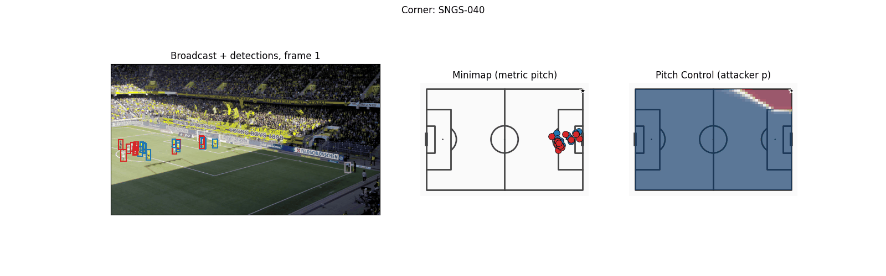

# soccernet-setpiece-vision

**Pitch Control from Broadcast Video: A Computer Vision Pipeline for Set-Piece Analysis**

Master's Final Project, MSc AI Applied to Sports, Sports Data Campus

Author: Moritz Philipp Haaf, BSc MA

[](https://www.python.org/)
[](https://docs.astral.sh/uv/)
[](https://pytorch.org/)
[](https://github.com/ultralytics/ultralytics)
[](tests/)
[](LICENSE)

<table>
<tr>
<td width="100%"></td>
</tr>
<tr>
<td><sub>Pipeline output overlaid on the original broadcast feed (corner kick, SNGS-040)</sub></td>
</tr>
</table>

**Results at a glance**: 

33 set-piece clips (corners + direct free kicks), 21 validated against SoccerNet GSR ground truth (651 PC frames after ball-position filtering): ICC(2,1) = **0.89–0.93** across all five Pitch Control metrics, clip-level bias confirmed via bootstrap CI + Wilcoxon signed-rank test. All committed numbers are bit-reproducible on CPU with fixed seeds (`_pipeline_core.set_deterministic`).

---

## Overview

Reproducible pipeline that derives Pitch Control from broadcast video without proprietary tracking hardware or ground-truth pitch annotations. Targets set-piece situations (corners, direct free kicks) where broadcast cameras are near-static, and all relevant players are in frame.

**Pipeline stages (single video pass per clip, frames 1–250):**
1. Player + Referee detection — Soccana (YOLOv11n, football-finetuned), conf=0.25, TTA, agnostic NMS; classes 0 (Player) and 2 (Referee)
2. Ball detection - Soccana class=1, conf=0.15; gap interpolation up to 5 frames; frame-1 priority for set-piece resting position
3. Multi-object tracking - ByteTrack for persistent IDs; separate tracker instances for players and ball
4. Team assignment - global KMeans (k=3) on per-track mean HSV across 250-frame fitting window; cross-frame mode consensus per `track_id`; referees assigned `team=-1`
5. Camera calibration - TVCalib (Theiner & Ewerth, WACV 2023), autonomous homography; pitch-bounds filtering [0–105 m × 0–68 m]
6. Pitch Control - Laurie Shaw time-to-intercept model (zero-velocity, static-frame); 60×40 grid on 105 m × 68 m pitch; frames 1–31 only

**Validation:** Distributional comparison (KS test, histogram overlap) plus per-frame paired statistics against SoccerNet GSR ground-truth annotations on 33 set-piece clips.

---

## Repository Structure

```
soccernet-setpiece-vision/
├── notebooks/                    # Four CRISP-DM phases
│   ├── 01_business_and_data_understanding.ipynb
│   ├── 02_modeling_pitch_control.ipynb
│   ├── 03_evaluation_and_validation.ipynb
│   └── 04_deployment_visualizations.ipynb
├── scripts/                      # Pipeline reproduction scripts
│   ├── _pipeline_core.py         # Shared module (detection, tracking, team assignment, PC model)
│   ├── download_soccernet.py     # Data download (idempotent)
│   ├── run_tvcalib_batch.py      # Homography computation (requires TVCalib sibling env)
│   ├── run_optimized_pipeline.py # Single-pass: detections + ball + team assignment (Fixes 2–4)
│   ├── dump_gt_setpieces.py      # GT player detections for all 33 clips
│   ├── dump_gt_ball.py           # GT ball positions (annotation-derived, public)
│   ├── run_pc_soccana_tvcalib.py # Pitch control (pipeline)
│   ├── run_pc_gt_full.py         # Pitch control (GT reference; uses GT ball)
│   ├── ks_table_tvcalib.py       # Frame-level distributional validation table + figure
│   ├── compute_icc.py            # ICC(2,1) + effective sample size per PC metric
│   ├── clip_level_validation.py  # Clip-level paired validation: bias + bootstrap CI + Wilcoxon (n=21)
│   ├── diagnose_pc_in_third.py   # pc_in_third Simpson's-paradox diagnostic: stratified r by set-piece type
│   ├── validation_extras.py      # Bland-Altman, skill vs baseline, density, box confusion, temporal stability
│   ├── spatial_pc_error.py       # Per-cell PC error heatmap (pipeline detections in, aggregate out)
│   ├── render_cohort_funnel.py   # Cohort-attrition funnel figure (33 clips → 21 ball-position → 651 PC frames)
│   ├── render_gantt.py           # CRISP-DM Gantt timeline figure (report Section 4.2, Figure 1)
│   ├── render_annotated_clips.py # Team-coloured player + orange referee bbox overlays to MP4
│   └── render_pc_overlay.py      # PC heatmap overlay on broadcast frames
├── tests/                        # pytest unit + property-based tests (hypothesis)
├── outputs/                      # Public numeric parquets committed; private video-derived ones gitignored
│   ├── *.parquet                 # Committed (public): PC surfaces, validation, ICC, GT detections,
│   │                             #   GT ball, spatial error, set-pieces. Gitignored (video-derived,
│   │                             #   Soccana detections, pipeline ball positions, homographies
│   └── figures/                  # Committed analysis/validation figures (PNG) plus 2 representative
│                                 #   annotated clips (gif/mp4/still, annotated/, overlay/); SoccerNet
│                                 #   confirmed short fair-use clips in writing, see Data & Licensing
├── pyproject.toml                # Project metadata + all dependencies (uv)
├── uv.lock                       # Fully pinned, platform-aware lockfile
├── .python-version               # Python 3.11
├── .env.example                  # Template for SOCCERNET_PASSWORD / SOCCERNET_LOCAL_DIR
├── CITATION.cff
└── LICENSE
```

> The full report (`report.md`, plus its DOCX export) is a local drafting helper, not tracked in this repo. The formatted PDF/DOCX and the project proposal are delivered separately as the closed university submission. Only the TVCalib setup notes under `docs/tvcalib-setup/` are tracked here, since they document the external calibration step.

---

## Prerequisites

- **Python 3.11** - install via any Python version manager
- **[uv](https://docs.astral.sh/uv/getting-started/installation/)** - fast Python package manager (`curl -LsSf https://astral.sh/uv/install.sh | sh`)
- **SoccerNet GSR data** (~35 GB local copy) - only needed for full reproduction from raw video
- **Internet** - first run downloads Soccana weights from HuggingFace (~5 MB, cached)

**Note on homographies and other video-derived parquets.** Three parquets are derived directly from the NDA-protected video frames and inherit the leagues' video copyright, so they are **not** in this public repo (gitignored, closed-submission only): `homographies_tvcalib.parquet`, `detections_soccana_tvcalib.parquet`, and `ball_positions.parquet` (see Data & Licensing below). They are required only for the full raw-video path. **You do not need them, the raw video, or TVCalib to reproduce the public analysis** - notebooks 02–03 and the validation/ICC scripts read the committed Pitch Control parquets directly. TVCalib is needed only to regenerate `homographies_tvcalib.parquet` from scratch (see below).

---

## TVCalib Setup (only needed to regenerate homographies)

TVCalib runs in a separate sibling directory with its own Python environment. Expected layout:

```
parent-dir/
├── soccernet-setpiece-vision/   ← this repo
└── tvcalib/                     ← TVCalib repo
```

### 1. Clone TVCalib

```bash
cd ..
git clone https://github.com/MM4SPA/tvcalib
```

### 2. Create TVCalib environment

```bash
cd tvcalib
python3.11 -m venv .venv
source .venv/bin/activate    # Windows: .venv\Scripts\activate
pip install torch==2.1.* torchvision kornia==0.8.2 pytorch-lightning==2.6.1
pip install SoccerNet==0.1.62 opencv-python numpy
```

### 3. Apply PyTorch 2.x compatibility patches

Two small patches are required for TVCalib to run with PyTorch 2.x:

**`tvcalib/tvcalib/sncalib_dataset.py` — line 13:**
```python
# Replace:
from torch._six import string_classes
# With:
string_classes = (str, bytes)
```

**`tvcalib/run_inference.py` — line 89:**
```python
# Replace:
checkpoint = torch.load(path)
# With:
checkpoint = torch.load(path, weights_only=False)
```

### 4. Download segmentation checkpoint

Download `train_59.pt` from the [TVCalib releases](https://github.com/MM4SPA/tvcalib/releases) and place it at:

```
tvcalib/data/segment_localization/train_59.pt
```

### 5. Verify setup

```bash
# From soccernet-setpiece-vision/
uv run python scripts/run_tvcalib_batch.py
# Expected: "discovered 33 set-piece clips" → stages frames → runs TVCalib → saves parquet
```

---

## How to Run

There are two reproduction paths. **Path A** verifies all published results from the committed parquets and needs no raw video, no TVCalib, and none of the private video-derived parquets. **Path B** reproduces everything end-to-end from the raw SoccerNet GSR video (a local copy of the dataset).

Why two paths: the three video-derived parquets (`detections_soccana_tvcalib`, `ball_positions`, `homographies_tvcalib`) are derived from league-copyrighted video and not in the public repo (see Data & Licensing). Their *committed* downstream outputs (`pitch_control_*`, validation, ICC, spatial error) are public, so the analysis layer reproduces without them.

> **Thesis submission (offline ZIP, all parquets included).** The university submission is a folder that bundles **every** parquet, including the three video-derived ones, but no raw video (too large, NDA). Graders need no raw video, no `.env`, and no internet beyond `uv sync`. The committed Pitch Control parquets are the authoritative results; the chain below re-derives every validation table, ICC, diagnostic, and the spatial error map from them and reproduces the committed outputs byte-for-byte:
>
> ```bash
> uv sync
>
> # Re-derive both Pitch Control surfaces from the included parquets
> uv run python scripts/run_pc_soccana_tvcalib.py   # from detection + ball parquets
> uv run python scripts/run_pc_gt_full.py           # from GT detections + GT ball parquet
>
> # Validation, ICC, supplementary analyses, spatial error
> uv run python scripts/ks_table_tvcalib.py
> uv run python scripts/compute_icc.py
> uv run python scripts/clip_level_validation.py
> uv run python scripts/diagnose_pc_in_third.py
> uv run python scripts/validation_extras.py
> uv run python scripts/spatial_pc_error.py
>
> # Notebooks (run straight from the parquets, no raw video)
> uv run jupyter nbconvert --to notebook --execute notebooks/02_modeling_pitch_control.ipynb --inplace
> uv run jupyter nbconvert --to notebook --execute notebooks/03_evaluation_and_validation.ipynb --inplace
> ```
>
> The two `run_pc_*` steps regenerate `pitch_control_soccana_tvcalib.parquet` and `pitch_control_gt_full.parquet` from their inputs and reproduce the committed surfaces exactly. The GT side uses the GT ball (`gt_ball_positions.parquet`, annotation-derived and public), not the pipeline ball, so the reference stays independent of pipeline error.
>
> Only the raw-video stages stay un-runnable and are pre-computed for you: detection/tracking (`run_optimized_pipeline.py`), calibration (`run_tvcalib_batch.py`), GT player/ball extraction (`dump_gt_setpieces.py`, `dump_gt_ball.py`), and the broadcast-overlay renders (nb04 render cells, `render_*.py`). Their outputs are already in the committed parquets / figures. Notebook 01 is also pre-run; its outputs (`setpieces.parquet`, `gt_spatial_benchmarks.parquet`) are included.

### Path A - Verify from committed parquets (no raw video)

Copy-paste, runs in a few minutes:

```bash
uv sync

# Analysis notebooks (read committed PC parquets)
uv run jupyter nbconvert --to notebook --execute notebooks/02_modeling_pitch_control.ipynb --inplace
uv run jupyter nbconvert --to notebook --execute notebooks/03_evaluation_and_validation.ipynb --inplace

# Validation, ICC, and the supplementary analyses (all read committed PC parquets)
uv run python scripts/ks_table_tvcalib.py
uv run python scripts/compute_icc.py
uv run python scripts/clip_level_validation.py
uv run python scripts/diagnose_pc_in_third.py
uv run python scripts/validation_extras.py
```

Notebook 04 also runs without raw video, but its broadcast-overlay render cells skip cleanly (no figures) without the SoccerNet video frames + private detections. `spatial_pc_error.py`, `run_pc_soccana_tvcalib.py`, and the pipeline/GT-extraction scripts are **not** in Path A: they consume the private video-derived parquets and only run in Path B (or in the offline submission, where every parquet is bundled). `run_pc_gt_full.py` is the exception - it now reads the public `gt_ball_positions.parquet`, so it runs from committed parquets.

### Path B - Full reproduction from raw video (SoccerNet GSR dataset required)

Copy-paste, end-to-end (~45+ min; TVCalib must be set up, see below):

```bash
uv sync

# Configure .env (SOCCERNET_PASSWORD, SOCCERNET_LOCAL_DIR), then download:
uv run python scripts/download_soccernet.py

# nb01 -> setpieces.parquet + gt_spatial_benchmarks.parquet (public)
uv run jupyter nbconvert --to notebook --execute notebooks/01_business_and_data_understanding.ipynb --inplace

# Homographies first - run_optimized_pipeline loads them (needs ../tvcalib env)
uv run python scripts/run_tvcalib_batch.py

# Pipeline single pass -> detections_soccana_tvcalib.parquet + ball_positions.parquet
uv run python scripts/run_optimized_pipeline.py

# GT player + GT ball extraction (annotation-derived, public parquets)
uv run python scripts/dump_gt_setpieces.py
uv run python scripts/dump_gt_ball.py
# Pitch Control surfaces (soccana from pipeline ball; gt from GT ball)
uv run python scripts/run_pc_soccana_tvcalib.py
uv run python scripts/run_pc_gt_full.py

# Validation + ICC + supplementary + spatial error
uv run python scripts/ks_table_tvcalib.py
uv run python scripts/compute_icc.py
uv run python scripts/clip_level_validation.py
uv run python scripts/diagnose_pc_in_third.py
uv run python scripts/validation_extras.py
uv run python scripts/spatial_pc_error.py

# Notebooks (04 renders broadcast overlays from SoccerNet video frames)
uv run jupyter nbconvert --to notebook --execute notebooks/02_modeling_pitch_control.ipynb --inplace
uv run jupyter nbconvert --to notebook --execute notebooks/03_evaluation_and_validation.ipynb --inplace
uv run jupyter nbconvert --to notebook --execute notebooks/04_deployment_visualizations.ipynb --inplace

# Optional: rendered annotated clips / PC overlays (video media; only the 2
# representative clips (SNGS-040, SNGS-066) are committed, see Data & Licensing)
uv run python scripts/render_annotated_clips.py --clip SNGS-040
uv run python scripts/render_annotated_clips.py --clip SNGS-066
uv run python scripts/render_pc_overlay.py --clip SNGS-040
uv run python scripts/render_pc_overlay.py --clip SNGS-066
```

If you already have the private `homographies_tvcalib.parquet` locally, skip `run_tvcalib_batch.py` (and the TVCalib setup). Per-step detail follows below.

---

## Path B - Step-by-step detail

Per-step explanation of the full raw-video reproduction above.

### 1. Environment setup

```bash
uv sync
```

This installs all dependencies from `pyproject.toml` into a managed `.venv` using the pinned `uv.lock` lockfile. The lockfile resolves identically on Windows and macOS; OS-specific wheels (e.g. Apple-Silicon `torch`/`hf-xet`, Windows `pywinpty`) are selected automatically via environment markers.

### 2. Configure data paths

Create `.env` in the project root:

```env
SOCCERNET_PASSWORD=your_password_here
SOCCERNET_LOCAL_DIR=/path/to/soccernet-gsr
```

### 3. Download SoccerNet GSR data

```bash
uv run python scripts/download_soccernet.py
```

### 4. Run notebook 01 — Business & Data Understanding

```bash
uv run jupyter nbconvert --to notebook --execute notebooks/01_business_and_data_understanding.ipynb --inplace
```

Produces: `outputs/setpieces.parquet`, `outputs/gt_spatial_benchmarks.parquet`.

### 5. Compute TVCalib homographies

```bash
# Stages frames 1–31 per clip into /tmp, runs TVCalib (~15 min, SoccerNet video required)
# Requires TVCalib set up in ../tvcalib/ — see scripts/run_tvcalib_batch.py docstring
uv run python scripts/run_tvcalib_batch.py
```

Produces: `outputs/homographies_tvcalib.parquet` (private, gitignored). Skip this step only if you already have that parquet locally. It is not committed, so a fresh clone must regenerate it here.

### 6. Run the pipeline (Soccana + TVCalib)

```bash
# Single-pass: player detection, ball detection, team assignment (~30 min, SoccerNet video required)
# Outputs: detections_soccana_tvcalib.parquet + ball_positions.parquet (both private)
uv run python scripts/run_optimized_pipeline.py

# GT player + GT ball extraction (reads GSR labels from the SoccerNet dataset; both outputs public)
uv run python scripts/dump_gt_setpieces.py
uv run python scripts/dump_gt_ball.py

# Compute pitch control surfaces
#   run_pc_soccana_tvcalib: private detections + pipeline ball
#   run_pc_gt_full:         public GT detections + public GT ball (gt_ball_positions)
uv run python scripts/run_pc_soccana_tvcalib.py
uv run python scripts/run_pc_gt_full.py

# Generate validation tables + ICC + clip-level + pc_in_third + extras + spatial error
uv run python scripts/ks_table_tvcalib.py
uv run python scripts/compute_icc.py
uv run python scripts/clip_level_validation.py
uv run python scripts/diagnose_pc_in_third.py
uv run python scripts/validation_extras.py
uv run python scripts/spatial_pc_error.py   # needs pipeline detections; output is an aggregate
```

### 7. Run notebook 02 — Pitch Control

```bash
uv run jupyter nbconvert --to notebook --execute notebooks/02_modeling_pitch_control.ipynb --inplace
```

### 8. Run notebook 03 — Evaluation & Validation

```bash
uv run jupyter nbconvert --to notebook --execute notebooks/03_evaluation_and_validation.ipynb --inplace
```

### 9. Run notebook 04 — Visualizations

```bash
uv run jupyter nbconvert --to notebook --execute notebooks/04_deployment_visualizations.ipynb --inplace
```

Requires the SoccerNet GSR dataset (reads broadcast frames for overlays).

### 10. (Optional) Render annotated broadcast clips

```bash
uv run python scripts/render_annotated_clips.py
uv run python scripts/render_pc_overlay.py
```

---

## Coordinate Systems

| System | Convention |
|---|---|
| StatsBomb | 120 yards × 80 yards, origin top-left |
| Pipeline / mplsoccer | 105 m × 68 m, origin top-left |
| SoccerNet GSR `bbox_pitch` | centred origin (±52.5 m, ±34 m) |

Conversions: `x_m = x_sb × (105/120)`, `y_m = y_sb × (68/80)`. 

GSR → Pipeline: `x_m = x_gsr + 52.5`, `y_m = y_gsr + 34`.

---

## Citations

See [CITATION.cff](CITATION.cff) for machine-readable citation metadata.

- Somers et al. (2024). SoccerNet Game State Reconstruction. CVPRW 2024.
- Theiner & Ewerth (2023). TVCalib: Camera Calibration for Sports Field Registration in Soccer. WACV 2023.
- Shaw, L. (2020). Pitch Control model. Friends of Tracking Data. Commit `21f4c2d`.
- Zhang et al. (2022). ByteTrack: Multi-Object Tracking by Associating Every Detection Box. ECCV 2022.
- Jocher et al. (2023). Ultralytics YOLO.
- Adit Jain. Soccana: YOLOv11n football detector. HuggingFace: `Adit-jain/soccana`.
- StatsBomb (2024). StatsBomb Open Data.
- Spearman, W. (2018). Beyond Expected Goals. MIT Sloan Sports Analytics Conference.

---

## Data & Licensing

The code in this repository is MIT-licensed. Data redistribution follows guidance the SoccerNet team provided in writing (2026-06-01):

- **SoccerNet GSR annotations** (`Labels-GameState.json`, `bbox_pitch`) are annotated by the SoccerNet team and open source ("do whatever you want with them"). Outputs derived solely from them - GT player detections, GT ball positions (`gt_ball_positions.parquet`), validation, ICC, set-pieces - are committed freely.
- **Raw video-derived parquets are private and not in this repo.** `detections_soccana_tvcalib.parquet`, `ball_positions.parquet`, and `homographies_tvcalib.parquet` are produced directly from the NDA-protected video frames. SoccerNet confirmed (2026-06-01) that content derived from the copyrighted video carries the same copyright and may not be redistributed, so these three are gitignored and ship only in the closed university thesis submission.
- **Aggregate Pitch Control outputs are committed** (`pitch_control_*`, `spatial_pc_error`). These are heavily transformed summary surfaces, shared for academic, non-commercial use only; they let the public analysis layer reproduce without the private inputs.
- **Raw video is not redistributable** and is never committed. **Rendered annotated clips** (overlaying pipeline output on broadcast frames) are a narrower case: SoccerNet confirmed in writing (2026-06-01) that short (~5 s) academic, non-commercial clips are fair use. Two representative clips (`SNGS-040`, `SNGS-066`, ~4-5 s each) are committed in `outputs/figures/` as gif/mp4/still/annotated/overlay; the other 31 clips are not, to keep repo size reasonable.

Use is academic and non-commercial. See `LICENSE` for the code license.

---

## License

[MIT License](LICENSE) (code only - see Data & Licensing above for data terms).
