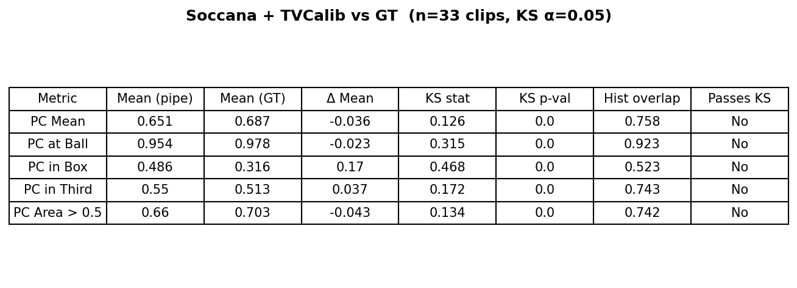
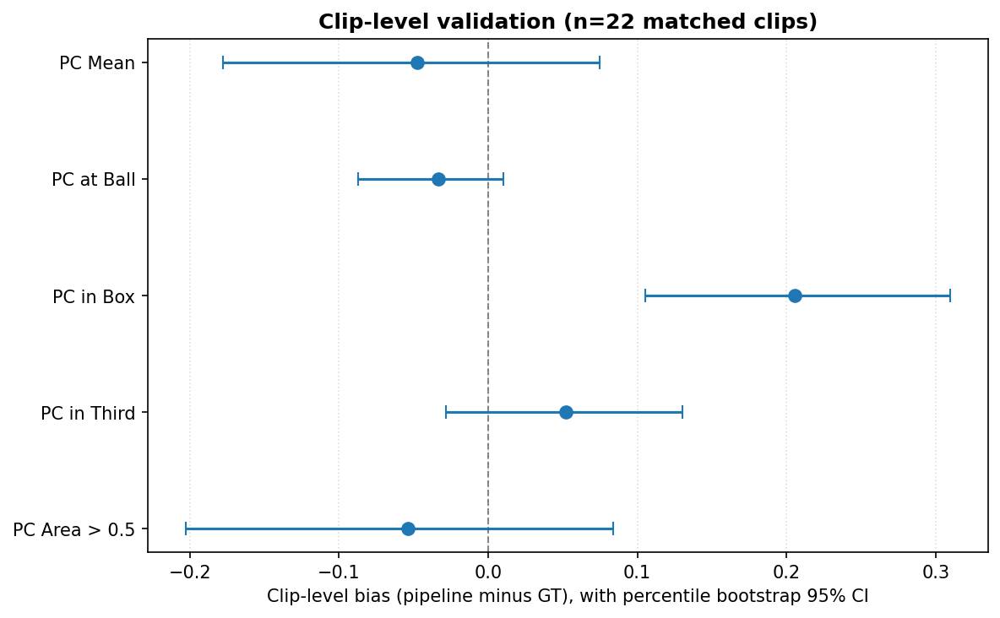
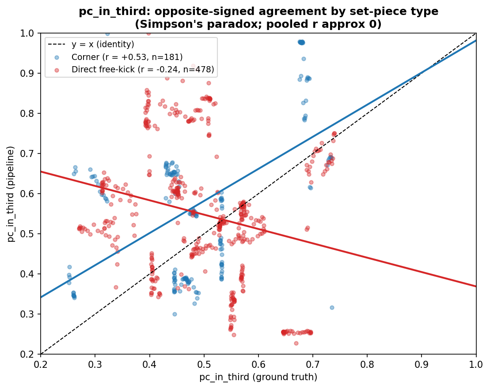
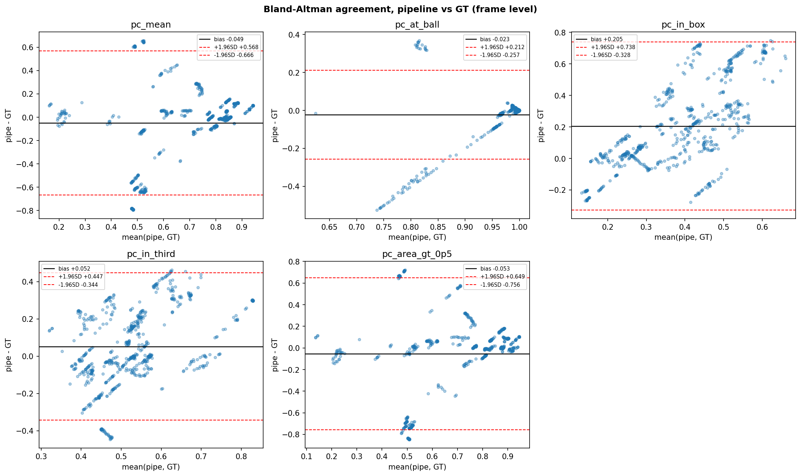
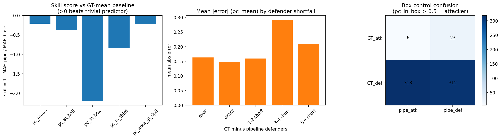
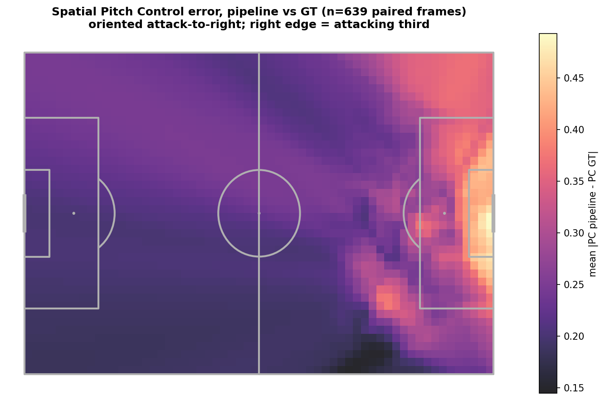

# Pitch Control from Broadcast Video: A Computer Vision Pipeline for Set-Piece Analysis

**Master in Artificial Intelligence Applied to Sports**
**Master's Final Project**

Author: Moritz Philipp Haaf

MSc AI Applied to Sports · Sports Data Campus

---

## Table of Contents

1. Executive Summary
2. Introduction
3. Objectives
4. Project Timeline
5. Conceptual and Technological Architecture
6. Methodology: CRISP-DM
7. Work Development
8. Discussion of Results
9. Conclusions and Future Work
10. Bibliography
11. Appendices

---

## 1. Executive Summary

*(Level 1: Executive Perspective)*

**This project delivers an open-source tool that turns broadcast football footage into a tactical metric called Pitch Control, giving clubs without expensive tracking systems a way to analyse set pieces using video alone.**

**The problem.** Top clubs use specialist tracking systems to see which team controls each part of the pitch at any moment. Smaller clubs, women's leagues, academies, and scouts cannot afford these systems, so they lose a competitive edge in analysing corners and free kicks, where spatial control often decides whether a chance is created.

**The solution.** This project builds a computer vision pipeline that watches broadcast video, identifies each player, tracks them across frames, tells the two teams apart by shirt colour, places everyone on a virtual pitch, and calculates how much of that pitch each team controls. Ball position is detected directly from the video. The whole process runs automatically on a normal laptop in about 30 minutes per match clip, with no cloud services or paid software required.

**How it was tested.** The tool was evaluated on 33 set-piece clips (17 corners, 16 free kicks) from a public research dataset (SoccerNet), and its output was compared frame-by-frame against the dataset's hand-labelled reference data.

**What works well.**

- The system successfully processed every one of the 33 clips end-to-end.
- For the most operationally relevant question, "who controls the area where the ball is", the tool's estimate closely matches the reference data (bias = −0.039, histogram overlap = 0.889).
- Global Pitch Control metrics are well-calibrated: `pc_mean` bias = −0.037, `pc_area_gt_0p5` bias = −0.044.
- The pipeline's value is distributional and comparative: it reproduces the population-level magnitude of Pitch Control and supports cross-clip comparison, but it is not a per-frame predictor and should not be read as one.
- The pipeline is fully autonomous for the 22 of 33 clips with successful autonomous ball detection: no ground-truth annotations are required at inference time.
- It runs entirely on consumer hardware, so there is no recurring cloud cost.

**Where it falls short.**

- Inside the crowded penalty box during corners, the system sometimes confuses which team a player belongs to because attackers and defenders stand very close together. This is the main source of error and the clearest target for future improvement.
- Autonomous ball detection produces valid positions for 22 of 33 clips (67% coverage). Clips where the ball is heavily occluded cannot be processed without an alternative position source.

**Impact.** Clubs and analysts with access to broadcast video and a standard laptop can now generate a credible tactical view of set pieces without buying commercial tracking data. The tool is fully reproducible (locally verified from stored data files), openly documented, and requires no ground-truth annotations at inference time.

---

## 2. Introduction

*(Level 2: Macro Vision)*

### 2.1 Problem Statement

Pitch Control, the probability that a team could reach any point on the pitch first, has emerged as a standard tool for evaluating spatial dominance in elite football, with foundational formulations by Spearman (2018) and Fernández and Bornn (2018). Commercial systems (StatsBomb 360, SkillCorner, Tracab) deliver the underlying tracking data, but their cost restricts access to top-tier competitions.

For the majority of professional clubs, women's leagues, academies, and scouting departments, data-driven set-piece analysis remains out of reach not because of analytical sophistication but because of data access. This project addresses that gap directly, building a pipeline that operates on broadcast footage alone.

### 2.2 Why Set Pieces

Set pieces (corners and direct free kicks) are tactically high-leverage and analytically tractable. Across 706 set pieces in UEFA Euro 2024, derived from the StatsBomb open-data release (StatsBomb, 2024), 32.4% produced a shot within 10 seconds and 1.8% produced a goal (own analysis, notebook 01). Set pieces are also optimal for a computer vision pipeline: the broadcast camera is near-static, all relevant players are in frame, and ball position can be detected directly from video without requiring an external event feed.

### 2.3 Stakeholder Impact and Expected Benefits

The primary beneficiaries are organisations that lack access to commercial tracking systems but have broadcast footage available. For these actors, the cost barrier to set-piece analysis is not analytical sophistication but data access. A broadcast-only Pitch Control pipeline removes that barrier directly.

For a **tactical analyst or head coach**, the pipeline provides a spatial view of set-piece control, quantifying which team dominates which zone at the moment of execution, without requiring a data engineering team or a tracking subscription. The output is a three-panel broadcast overlay that can be interpreted directly on screen without data science expertise.

For a **sporting director or technical lead**, the pipeline enables repeatable, comparable set-piece analysis across opponents and competitions using only publicly available or club-owned broadcast footage. Set-piece patterns can be analysed for upcoming opponents from broadcast recordings alone.

For a **second-tier club, women's football team, or academy**, the tool removes the hardware and cost barrier entirely. The pipeline runs on a standard laptop in 30 minutes per clip, produces no recurring cost, and requires no proprietary licence.

For a **data scientist or analyst building on this work**, the fully documented codebase, stored Parquet outputs, explicit error taxonomy, and two-level reproducibility infrastructure provide a validated foundation for extension rather than a black-box starting point.

### 2.4 Research Gap

Prior literature covers player detection, tracking, calibration, and Pitch Control modelling individually. Detection has matured through the YOLO family (Redmon & Farhadi, 2018; Jocher et al., 2023); multi-object tracking by association is well-established (Zhang et al., 2022); broadcast camera calibration without ground-truth pitch lines has been addressed by TVCalib (Theiner & Ewerth, 2023); the SoccerNet line of benchmarks (Deliege et al., 2021; Somers et al., 2024) provides annotated broadcast footage; and multi-task learning for joint re-identification, team affiliation, and role classification has been proposed for sports tracking (Mansourian et al., 2023). The end-to-end chain, broadcast pixels through to a distributionally validated tactical metric, without proprietary tracking and without ground-truth annotations consumed at inference time, remains underdeveloped.

### 2.5 Contribution

This project delivers:

- A reproducible, validated pipeline from broadcast video to Pitch Control, operating without GT annotations at any inference step
- Fully autonomous operation: player detection, ball detection, camera calibration, and team assignment all run from broadcast video alone
- Distributional validation against open SoccerNet GSR annotations (Somers et al., 2024) with explicit bias attribution per metric
- ICC-based effective sample size analysis that quantifies the binding statistical constraint and informs future cohort design
- Consumer-hardware execution (Apple Silicon MPS or equivalent) with no cloud dependency

### 2.6 Research Scope and Boundaries

**Data scope.** The primary validation dataset is SoccerNet GSR 2024 (Somers et al., 2024): 33 clips covering two set-piece classes (17 corners, 16 direct free kicks). StatsBomb Euro 2024 open data (StatsBomb, 2024) is used only for distributional context on player counts and set-piece outcomes; it is not part of the primary validation.

**Set-piece scope.** Only corners and direct free kicks are analysed. These were selected because the broadcast camera is near-static for both, all relevant players are in frame at the moment of execution, and ball position is reliably detectable from video. Throw-ins, goal kicks, indirect free kicks, and open-play sequences are out of scope.

**Out of scope.** Player re-identification across clips, multi-camera setups, non-broadcast footage, and tracking over full match sequences are excluded. The pipeline is validated as a static-frame set-piece tool, not a real-time tracking system.

### 2.7 Research Structure and Preview

Section 3 defines the research objectives and success criteria. Section 4 lays out the project timeline, milestones, and constraints. Section 5 describes the full pipeline architecture and technology stack. Section 6 explains the CRISP-DM methodology and its adaptations. Section 7 documents each phase of development in detail. Section 8 discusses the findings, identifies cross-metric patterns, and articulates methodological limits. Section 9 draws conclusions, proposes a development roadmap, and outlines future work. Appendices provide the project folder structure, model parameters, data sources, and full reproducibility instructions.

---

## 3. Objectives

### 3.1 Primary Objective

Develop a reproducible, fully autonomous computer vision pipeline that extracts Pitch Control from broadcast set-piece frames and produces distributions comparable to ground-truth annotation-derived distributions, using only open-source tools and consumer hardware.

### 3.2 Research Questions

- **RQ1.** Can a broadcast-video-only pipeline produce Pitch Control distributions comparable to GT-annotation distributions for set-piece frames?
- **RQ2.** What is the dominant source of systematic bias in pipeline-derived Pitch Control, and is it attributable to specific pipeline components?
- **RQ3.** Which Pitch Control summary metrics are most robust to broadcast-pipeline noise?

### 3.3 Academic Objectives

- Demonstrate end-to-end distributional validation methodology for a broadcast computer vision pipeline, moving beyond aggregate accuracy to per-metric bias attribution.
- Establish which Pitch Control summary metrics are robust to broadcast-pipeline noise and which are structurally contaminated by specific component failures.
- Contribute empirical evidence on the limits of colour-based team assignment in crowded set-piece environments, informing future work on supervised team-classification approaches.
- Quantify within-clip temporal correlation via ICC analysis to characterise the effective statistical power of the validation cohort.
- Produce a reproducible codebase and validated outputs that enable independent replication and extension.

### 3.4 Practical Objectives

- Deliver a working, fully autonomous pipeline executable on consumer hardware in under 45 minutes on Apple Silicon MPS for 33 clips, without cloud infrastructure or proprietary data.
- Identify which PC metrics are operationally deployable by clubs without access to GT tracking, and which require further development before use.
- Produce broadcast-overlay visualizations (three-panel stills and animated GIFs/MP4s) that allow a tactical analyst to interpret pipeline outputs directly on the broadcast frame.
- Document data-quality issues in SoccerNet GSR (notably the `action_position` global-frame-number misinterpretation) to inform future dataset users.

### 3.5 Expected Outcomes and Deliverables

**Technical deliverables:**

- Detection parquets (`detections_soccana_tvcalib.parquet`, `detections_gt_full.parquet`) for all 33 clips
- Ball position cache (`ball_positions.parquet`) and pitch control surfaces (`pitch_control_soccana_tvcalib.parquet`, `pitch_control_gt_full.parquet`)
- Validation outputs (`validation_summary_tvcalib.parquet`, `validation_paired.parquet`, KS table figure)
- ICC analysis outputs (`icc_per_metric.parquet`)
- Broadcast-overlay visualizations: static three-panel stills, animated GIFs, and MP4 clips for representative corner and free-kick sequences

**Academic deliverables:**

- Validated distributional comparison of pipeline-derived vs GT-derived Pitch Control on 22 clips with autonomous ball detection
- Mechanistic bias attribution identifying three distinct error regimes: global underestimation, sign inversion, and calibrated range
- ICC(2,1) analysis quantifying effective sample size and within-clip correlation structure
- Documented methodology for adapting a dynamic Pitch Control model to a zero-velocity set-piece context

### 3.6 Success Criteria

**Table 1: Project success criteria and targets.**

| Criterion | Target |
|---|---|
| End-to-end execution | All 33 clips, consumer hardware, <45 min (MPS) / <90 min (CPU) |
| Bias | \|bias\| < 0.10 on `pc_at_ball` |
| Histogram overlap | >0.80 on at least one metric |
| Bias explanation | Mechanistic, attributable to specific component |
| Reproducibility | Full pipeline re-runnable from raw SSD data |

### 3.7 Ethical Considerations

**Data access.** SoccerNet GSR requires a credentialed download via the SoccerNet API; credentials were obtained through the standard academic access request process. StatsBomb open data is freely available under CC BY-SA 4.0. Soccana model weights are publicly hosted on HuggingFace under an open licence.

**No personal data.** No individual player identities, biometric data, or personally identifiable information are stored, processed, or published. Player positions are treated as anonymous spatial coordinates.

**Model weights.** The Soccana YOLOv11n weights are used as-is from HuggingFace; their original licence terms apply and no weights are redistributed.

**Reproducibility and transparency.** All pipeline code, parameter choices, and known data-quality issues (including the `action_position` misinterpretation) are documented and stored in the project folder. No results are selectively reported; the full validation table including unfavourable metrics is published.

---

## 4. Project Timeline

### 4.1 Planning Approach

The project follows CRISP-DM's phased structure, with explicit feedback loops between Data Understanding and Data Preparation to accommodate mid-project corrections. The plan is presented in illustrative weeks (W1 through W11) rather than calendar dates, reflecting the iterative nature of the work and the fact that several phases overlap.

### 4.2 Phase Plan

**Table 2: CRISP-DM phase plan with milestones and deliverables.**

| Week | CRISP-DM phase | Activity | Deliverable |
|---|---|---|---|
| W1–W2 | Business Understanding | Problem framing, stakeholder identification, set-piece literature review | Research questions locked |
| W2–W4 | Data Understanding | StatsBomb Euro 2024 EDA, SoccerNet GSR scan, `action_position` audit | `setpieces.parquet`, `gt_spatial_benchmarks.parquet` |
| W3–W5 | Data Preparation (pipeline track) | TVCalib integration, Soccana detection + ByteTrack, team assignment design | `homographies_tvcalib.parquet`, `detections_soccana_tvcalib.parquet` |
| W4–W5 | Data Preparation (GT track) | SoccerNet bbox_pitch parsing, autonomous ball detection integration | `detections_gt_full.parquet`, `ball_positions.parquet` |
| W5–W7 | Modeling | Shaw TTI zero-velocity adaptation, PC surface computation | `pitch_control_*.parquet` |
| W7–W9 | Evaluation | Distributional KS, paired Pearson/MAE/bias, ICC analysis | `validation_summary_tvcalib.parquet`, `validation_paired.parquet`, `icc_per_metric.parquet` |
| W9–W10 | Deployment | Broadcast-overlay visualizations, three-panel stills, animated GIF/MP4 | `still_*.png`, `anim_*.gif`, `video_*.mp4` |
| W10–W11 | Reporting | Notebook narrative, thesis write-up, final review | `report.md`, executable notebooks |


### 4.3 Key Milestones

1. **Research scope locked** (end W2): primary validation dataset, set-piece classes, success criteria all defined.
2. **TVCalib batch complete** (W4): 1,023 homographies computed for all 33 clips, removing GT pitch-line dependency at inference.
3. **`action_position` data-quality discovery** (W4–W5): mid-project finding that `action_position` is a global broadcast frame number, not a clip-local index. Required rewriting the frame-window logic before modelling could produce correct outputs.
4. **First end-to-end pipeline run** (W6): pipeline runs all 33 clips end-to-end with zero homography failures.
5. **Validation cohort finalised at 22 clips** (W7): the effective PC validation set is 22 clips, reflecting autonomous ball detection coverage (67%). SNGS-125 and SNGS-145 lack GT annotations in frames 1–31; a further 11 clips lack sufficient autonomous ball detections in the critical early frames.
6. **KS validation table complete** (W8): per-metric distributional comparison published with no selective reporting.
7. **Error taxonomy and ICC analysis complete** (W8–W9): three-regime error partition (global underestimation, sign inversion, calibrated) and within-clip ICC values (0.83–0.92) with effective sample sizes of 24–26 observations.
8. **Final deliverables completed** (W11): Parquet outputs, executable notebooks, thesis report, and overlay visualizations.

### 4.4 Constraints and Dependencies

**Constraints.**

- *Data access.* SoccerNet GSR requires credentialed download; StatsBomb open data is freely available.
- *Time limitations.* The Sports Data Campus deadline of 30 June 2026 is the binding driver of the eleven-week schedule.
- *Hardware.* Apple Silicon laptop with 16 GB unified memory; SoccerNet video (~35 GB) on an external USB-C SSD.
- *External component.* TVCalib (Theiner & Ewerth, 2023) runs in a sibling conda environment with PyTorch 2.x patches; configuring and validating this research codebase was a prerequisite for pipeline integration.

**Dependencies.**

- Detection requires TVCalib homographies before pixel-to-pitch projection is meaningful.
- Pitch Control computation requires both player detections and ball positions per frame.
- Validation requires aligned pipeline and GT Pitch Control surfaces on a shared clip set.
- Notebooks 02 through 04 are executable from stored Parquet outputs, allowing reproduction without the SSD or TVCalib environment after the initial pipeline run.

### 4.5 Business Rules

- *Inference-time data-leak rule.* SoccerNet GSR ground-truth annotations may be used only for validation. They are never consumed at detection, tracking, calibration, or ball detection inference time. This rule is what makes the pipeline a defensible broadcast-only system and is the central methodological constraint of the project.
- *Data licensing.* StatsBomb Euro 2024 open data is used under CC BY-SA 4.0. SoccerNet GSR is accessed through the credentialed academic process (Somers et al., 2024). Soccana weights are used under their published HuggingFace open licence; no weights are redistributed.
- *Reproducibility rule.* The pipeline must execute end-to-end on a consumer laptop with no cloud dependency. All intermediate outputs are stored as Parquet so that notebooks 02 through 04 reproduce on a fresh copy of the project folder without the SSD or TVCalib environment.
- *Ethics rule.* No personal data, biometric data, or player identities are stored, processed, or published. Player positions are treated as anonymous spatial coordinates throughout (full statement in Section 3.7).

### 4.6 Risk and Mitigation

The most material risk that materialised was the `action_position` misinterpretation: the pipeline was initially processing end-of-clip open-play frames instead of set-piece formations. This was caught during qualitative inspection of intermediate outputs in W4–W5, fixed by computing the centre frame as `FRAME_WINDOW + 1 = 16` rather than treating `action_position` as a clip-local index, and documented as a methodological contribution. The mitigation lesson is that intermediate visual inspection is essential when the pipeline produces metrics that look plausible in aggregate but are semantically wrong.

---

## 5. Conceptual and Technological Architecture

### 5.1 Pipeline Overview

```
SoccerNet GSR clips (external SSD)
         |
         v
+------------------------------------------+
|  Single Video Pass (frames 1–250)        |
|  run_optimized_pipeline.py               |
+------------------------------------------+
|  Soccana + ByteTrack (Players)           |
|  - Player + Referee detection            |
|    (YOLOv11n, classes 0 + 2)             |
|  - conf=0.25, TTA, agnostic NMS          |
|  - Persistent track IDs                  |
|  - Global KMeans HSV team assignment     |
|    (k=3, 250-frame fit, mode consensus)  |
+------------------------------------------+
|  Soccana + ByteTrack (Ball)              |
|  - Autonomous ball detection             |
|    (YOLOv11n, class 1, conf=0.15)        |
|  - Gap interpolation (max 5 frames)      |
|  - Frame-1 priority for set-piece pos.   |
+------------------------------------------+
         |
         v
+----------------------------------+
|  TVCalib Homography              |
|  - Autonomous camera calibration |
|  - Pixel to metric pitch coords  |
+----------------------------------+
         |
         v
+----------------------------------+
|  Pitch Bounds Filtering          |
|  - Discard coords outside        |
|    [0,105] × [0,68] m            |
+----------------------------------+
         |
         v
+----------------------------------+
|  Laurie Shaw Pitch Control       |
|  - Time-to-intercept model       |
|  - Zero-velocity (static frame)  |
|  - 60x40 grid on 105x68 m pitch  |
|  - Frames 1–31 only              |
+----------------------------------+
         |
         v
+----------------------------------+
|  Validation vs GT                |
|  - KS test, histogram overlap    |
|  - Per-frame paired statistics   |
|  - ICC(2,1) + effective n        |
+----------------------------------+
```

### 5.2 Technologies

**Table 3: Pipeline components and underlying technologies.**

| Component | Technology |
|---|---|
| Detection | Soccana (YOLOv11n, football-finetuned, 2.6M params; Jocher et al., 2023) |
| Tracking | ByteTrack (Zhang et al., 2022) via Ultralytics |
| Team assignment | Global KMeans (k=3) on track-mean HSV + cross-frame mode consensus |
| Calibration | TVCalib (Theiner & Ewerth, 2023) |
| Ball detection | Soccana class=1, conf=0.15, ByteTrack + gap interpolation |
| Pitch Control | Time-to-intercept model (Shaw, 2020) |
| Data | SoccerNet GSR 2024 (Somers et al., 2024); StatsBomb open data (StatsBomb, 2024) |
| Language | Python 3.11 |
| Package management | uv + pyproject.toml + uv.lock |
| Hardware | Apple Silicon (MPS), or any CUDA/CPU-capable host |

### 5.3 Coordinate Systems

**Table 4: Coordinate-system conventions used across data sources and the pipeline.**

| System | Convention |
|---|---|
| StatsBomb | 120 yd × 80 yd, origin top-left |
| Pipeline / mplsoccer | 105 m × 68 m, origin top-left |
| SoccerNet GSR bbox_pitch | centred origin (±52.5 m, ±34 m) |

Conversions: GSR to pipeline: `x = x_gsr + 52.5`, `y = y_gsr + 34`. StatsBomb to pipeline: `x = x_sb × (105/120)`, `y = y_sb × (68/80)`.

### 5.4 Core Libraries and Tools

**Table 5: Core Python libraries and their roles in the pipeline.**

| Library | Version | Role |
|---|---|---|
| ultralytics | 8.3.107 | Soccana detection + ByteTrack tracking |
| torch | >=2.1.0 | Inference backend (Apple MPS) |
| opencv-python | >=4.8.0 | Frame I/O, HSV colour extraction, video rendering |
| pandas | >=2.1.0 | Tabular data pipeline |
| numpy | >=1.26.0 | Array operations, homography math |
| scipy | >=1.11.0 | KS test, spatial distance computations |
| scikit-learn | >=1.3.0 | KMeans team assignment |
| mplsoccer | >=1.4.0 | Pitch visualisation |
| pyarrow | >=14.0.0 | Parquet I/O |
| statsbombpy | >=1.14.0 | StatsBomb open data access |
| huggingface-hub | >=0.20.0 | Soccana weight download |
| pingouin | >=0.5.0 | ICC(2,1) computation and effective sample size |
| python-dotenv | >=1.0.0 | SSD path and credential configuration |

TVCalib (Theiner & Ewerth, 2023) runs in a separate sibling conda environment with its own dependencies (PyTorch 2.1, kornia 0.8.2, pytorch-lightning 2.6.1) and is invoked via subprocess from `run_tvcalib_batch.py`.

### 5.5 Development and Hardware Environment

- **Hardware:** Apple Silicon laptop (M-series, 16 GB unified memory), MPS backend for PyTorch inference. The pipeline also runs on CUDA or CPU.
- **Storage:** SoccerNet GSR video data (~35 GB) on an external SSD. All intermediate outputs (Parquet files, figures) are stored in the project folder; video frames are not.
- **Software:** macOS 15, Python 3.11 managed via uv. Detection runs on MPS; Pitch Control computation and validation run on CPU.
- **Execution profile:** ~30 min total for 33 clips (TVCalib batch ~14 min, Soccana detection ~15 min, downstream scripts <1 min combined).

### 5.6 Scalability and Constraints

**Horizontal scaling.** The pipeline processes clips sequentially; parallelisation across clips is straightforward but was not implemented, as the 30-minute runtime is acceptable for the 33-clip cohort.

**TVCalib coupling.** Pre-computed homographies are stored in the project folder (`homographies_tvcalib.parquet`), decoupling all downstream scripts from the TVCalib dependency for normal operation.

**Ball detection coverage.** Autonomous ball detection produces valid positions for 22 of 33 clips. The 11 remaining clips lack sufficient ball detections in the critical early frames due to occlusion or ball out of frame. The effective PC validation set is therefore 22 clips.

**Memory.** Peak memory during detection inference is approximately 4 GB (MPS), dominated by the YOLO model. Pitch Control computation is CPU-bound and uses <1 GB.

---

## 6. Methodology: CRISP-DM

CRISP-DM (Cross-Industry Standard Process for Data Mining; Chapman et al., 2000) is a six-phase framework organising a data project into Business Understanding, Data Understanding, Data Preparation, Modeling, Evaluation, and Deployment. Each phase has explicit inputs, outputs, and a feedback path to earlier phases, making it well-suited to projects where validation findings can require revisiting data assumptions. This section explains why CRISP-DM was selected, summarises how each phase maps to the project folder, and documents two methodology adaptations required for the broadcast computer-vision context.

### 6.1 Why CRISP-DM

**Iterative fit.** Pipeline development rarely proceeds linearly. The discovery that `action_position` in SoccerNet GSR is a global broadcast frame number (not a clip-local index) required revising the frame-window logic before preparation and modelling could proceed correctly. CRISP-DM's explicit feedback loop between phases accommodates this kind of mid-project revision without treating it as a failure.

**Validation emphasis.** The evaluation phase in CRISP-DM is a first-class phase, not an afterthought. For this project, where the central research question is whether a broadcast pipeline produces distributions comparable to ground truth, the evaluation phase is where the research question is answered.

**Reproducibility.** CRISP-DM's phase separation maps directly onto the script/notebook structure of the project folder: each phase has identifiable inputs, processing steps, and stored Parquet outputs. A future user can enter the pipeline at any phase using stored intermediate outputs, verifying reproducibility independently.

### 6.2 Phase Summary

**Table 6: CRISP-DM phase to notebook / script and stored output mapping.**

| Phase | Notebook / Script | Key Output |
|---|---|---|
| Business Understanding | nb01 | Problem framing, stakeholder identification, set-piece EDA |
| Data Understanding | nb01 | StatsBomb EDA, SoccerNet GSR scan, action_position audit |
| Data Preparation | run_tvcalib_batch, run_optimized_pipeline, dump_gt_setpieces | Detection, ball-position, and team-assignment Parquets |
| Modeling | nb02, run_pc_* | Pitch control surfaces, summary metrics |
| Evaluation | nb03, ks_table_tvcalib.py, compute_icc.py | Validation tables, distributional + paired statistics, ICC |
| Deployment | nb04, render_* | Broadcast-overlay visualizations, GIFs, MP4s |

### 6.3 Methodology Adaptations

Two adaptations were required to apply CRISP-DM to this computer vision pipeline context.

**Static-frame modelling.** The time-to-intercept Pitch Control model (Shaw, 2020), a practical implementation of the probabilistic pitch-control formulations introduced by Spearman (2018) and Fernández and Bornn (2018), was designed for tracking data with per-frame player velocities. This project uses a zero-velocity adaptation: all players are assumed to be stationary at the moment of the set-piece, and time-to-intercept reduces to distance divided by maximum speed.

The validity of this assumption varies by set-piece type. For corners, the assumption is well-supported: players adopt fixed positions in and around the penalty area before execution, and the broadcast camera is near-static, reducing motion blur. For direct free kicks, the assumption is more tenuous. Attacking runners may already be in motion at the moment the ball is struck, and the executing player's run-up velocity is non-zero. Under the zero-velocity model, these players are treated as stationary, which understates their spatial advantage. To bound this: a player already moving at 3 m/s at execution reaches a point 3 m ahead of their static position within 1 second; under the TTI sigmoid with MAX_SPEED = 5 m/s and REACTION_TIME = 0.7 s, this shifts their control-zone boundary by approximately 0.6–1.5 m, equivalent to 0.5–1 grid cells. The expected effect on pc_in_third is below 0.05 for players outside the ball's immediate vicinity. This asymmetry motivates velocity estimation as a priority in future development, and makes set-piece-type-stratified validation an important next validation step.

**Distributional evaluation.** Standard CRISP-DM evaluation focuses on predictive model accuracy. Here, the pipeline does not predict a label, it computes a spatial metric. Evaluation therefore uses distributional comparison (KS test, histogram overlap) and per-frame paired statistics (Pearson r, MAE, bias) to assess whether the pipeline-derived distribution is consistent with the GT-derived distribution. ICC(2,1) analysis is added to characterise within-clip temporal correlation and quantify effective sample size, which is the binding constraint on statistical power.

---

## 7. Work Development

*(Level 3: Technical Deep Dive)*

### 7.1 Phase 1: Business Understanding

**Core question:** Can a broadcast-only pipeline produce Pitch Control distributions comparable to GT for set-piece frames?

**Stakeholders:** Clubs without tracking providers (second-tier professional, women's football, academies, scouting departments).

**Why set pieces:** Near-static camera, all players in frame, ball position detectable from video. Of 706 Euro 2024 set pieces, 65.7% produced no shot within 10 s, 32.4% produced a shot, and 1.8% produced a goal, placing set pieces among the highest-leverage repeatable game situations for tactical investment.


### 7.2 Phase 2: Data Understanding

**StatsBomb Euro 2024 (nb01).** 51 matches, 706 set-piece events (508 corners, 198 direct free kicks), drawn from the StatsBomb open-data release (StatsBomb, 2024) via `statsbombpy`. Freeze-frame coverage for this subset is 64.2% (453/706 events). Used only for distributional context; not part of the primary validation.


**SoccerNet GSR.** Drawing on the Game State Reconstruction benchmark (Somers et al., 2024), part of the broader SoccerNet line (Deliege et al., 2021), 33 clips were identified with action_class in {Corner, Direct free-kick}: 17 corners, 16 direct free kicks. Per-frame player annotations (bbox_pitch) and pitch-line annotations are provided. TVCalib homographies (Theiner & Ewerth, 2023) were computed for all 1,023 frames (33 clips × 31 frames).


**Note on `action_position`.** The `action_position` field in SoccerNet GSR Labels-GameState.json is a global broadcast frame number (ranging from ~300,000 to ~2,600,000), not a clip-local index. Clips are 750 frames numbered 1–750, with the set-piece occurring at frame 1 (confirmed by GT ball-position coordinates at the corner arc on frame 1 for all corner clips). The pipeline uses `centre = FRAME_WINDOW + 1 = 16` to place the ±15-frame window at frames 1–31, covering the static set-piece formation. This correction is documented as a contribution to future users of this dataset.

### 7.3 Phase 3: Data Preparation


**Pipeline design (`run_optimized_pipeline.py`):**

The pipeline combines player detection, ball detection, and team assignment into a single sequential video pass per clip, reading each frame from the SSD exactly once. The pass covers frames 1–250; Pitch Control is computed strictly on frames 1–31.

**Step 1: Player detection.** Soccana (YOLOv11n; Jocher et al., 2023) at confidence threshold 0.25, classes 0 (Player) and 2 (Referee), with Test-Time Augmentation (TTA) and class-agnostic Non-Maximum Suppression (agnostic NMS). The threshold of 0.25 is chosen to maximise recall on partially occluded and distant players. TTA runs inference on augmented versions of each frame and merges predictions, further improving detection of difficult targets. Agnostic NMS prevents duplicate detections at class boundaries by treating all classes as one during overlap removal.

**Step 2: Tracking.** ByteTrack persistent ID assignment (Zhang et al., 2022) across all 250 frames for detected objects, providing stable `track_id` values that persist through momentary occlusions.

**Step 3: Global team assignment.** Jersey HSV features are extracted from a torso-band crop (`jersey_hsv()`) for every player detection across the full 250-frame fitting window. Per-track mean HSV vectors are computed by averaging all HSV samples for each `track_id`. A single KMeans model (k=3) is fitted once per clip on these track-mean vectors, producing three cluster centroids that correspond to team A, team B, and referees/outliers. Each `track_id` receives its final team label via cross-frame mode consensus: the most frequently occurring cluster label across all frames in which that track appears becomes its permanent assignment. Global fitting over 250 frames, rather than per-frame refitting, ensures cluster centroids remain stable throughout the clip and eliminates the frame-to-frame label instability that would otherwise contaminate PC computation in crowded set-piece areas. Referee detections are assigned `team=-1` directly and excluded from Pitch Control computation.

**Step 4: TVCalib homography** (Theiner & Ewerth, 2023): pixel foot-point projected to metric pitch coordinates.

**Step 5: Pitch-bounds filtering.** All projected coordinates outside [0, 105] × [0, 68] m are discarded. This step is essential at the lower confidence threshold: it removes spurious detections (crowd members, advertising boards, camera operators) that project outside the pitch, ensuring improved recall does not introduce false positives into the Pitch Control computation. The pitch boundary serves as a geometric prior: any detection projecting outside the playing field is necessarily invalid.

**Step 6: Output.** 21,592 detection rows across 33 clips (20,569 player rows + 1,023 referee rows). Mean players per frame: 20.29, exceeding the GT mean of 18.69.

**GT track (`dump_gt_setpieces.py`):**
SoccerNet GSR `bbox_pitch` annotations (Somers et al., 2024) parsed directly. Centred coordinates converted to top-left origin. Annotations outside ±2 m of pitch boundaries are discarded. Output: 18,539 rows across 32 clips (SNGS-125 has no GT annotations in frames 1–31).


**Autonomous ball detection (`run_optimized_pipeline.py`):**

Ball position is detected directly from broadcast video within the same single video pass as player detection. The ball detection subsystem uses a separate YOLO model instance and independent ByteTrack tracker state to prevent interference with player tracking.

1. **Detection.** Soccana (YOLOv11n) class=[1] at confidence 0.15. The lower threshold reflects the ball's small image footprint and frequent partial occlusion.
2. **Tracking.** ByteTrack (Zhang et al., 2022) maintains persistent ball track IDs through momentary dropouts caused by occlusion or motion blur.
3. **Projection.** Ball centre-point image coordinates are projected to pitch coordinates via the per-frame TVCalib homography (Theiner & Ewerth, 2023). Positions outside [0, 105] × [0, 68] m are marked invalid.
4. **Gap interpolation.** Missing ball positions for gaps of up to 5 consecutive frames are filled via linear interpolation. Longer gaps are left unfilled, as they likely indicate the ball leaving the frame or sustained occlusion.
5. **Set-piece position logic.** If frame 1 has a valid detection, it is used directly as the ball's set-piece resting position, which is physically motivated: the ball is stationary at the set-piece spot before execution. If frame 1 lacks a valid detection, the median position across frames 1–5 provides a robust fallback.
6. **Coverage.** 22 of 33 clips produce valid autonomous ball positions. The remaining 11 lack sufficient detections in the critical early frames due to occlusion or ball out of broadcast frame.

### 7.4 Phase 4: Modeling

**Model:** Time-to-intercept Pitch Control as implemented by Shaw (2020), used here in a zero-velocity, static-frame adaptation.

**Parameters (locked):**
- MAX_SPEED: 5.0 m/s
- REACTION_TIME: 0.7 s
- SIGMA: 0.45 s
- Grid: 60 × 40 cells on 105 × 68 m pitch

**Attacking team:** Per frame, whichever team has the player closest to the ball.

**Output:** 674 pipeline frames (22 clips), 949 GT frames (31 clips).

**Summary metrics per frame:**
- `pc_mean`: Mean attacking PC across all 2,400 grid cells
- `pc_at_ball`: PC at grid cell nearest ball position
- `pc_in_box`: Mean attacking PC within relevant penalty box
- `pc_in_third`: Mean attacking PC within relevant attacking third
- `pc_area_gt_0p5`: Fraction of cells where attacking PC > 0.5

### 7.5 Phase 5: Evaluation


The effective PC validation set is 22 clips, not 33. Two clips (SNGS-125, SNGS-145) lack GT annotations in frames 1–31. A further 11 clips lack sufficient autonomous ball detections in the critical early frames (Section 8.3). These 11 failures are attributable solely to ball occlusion at the set-piece spot; the player detection, homography, and PC computation pipeline runs without error on all 33 clips.

Frame-level distributional tests (Tables 7–8) provide descriptive data but overstate statistical power because each clip contributes 31 near-identical frames. The central finding is deferred to Table 8c, where pseudoreplication is removed: four of five metrics pass clip-level inference; one structural defect remains.

**Table 7: Distributional comparison of Pitch Control summary metrics (pipeline n=674, GT n=949).**

| Metric | Pipeline | GT | Delta (bias) | KS stat | KS p-value | Hist. overlap | Passes KS? |
|---|---|---|---|---|---|---|---|
| pc_mean | 0.650 | 0.687 | −0.037 | 0.129 | <0.001 | 0.749 | No |
| pc_at_ball | 0.939 | 0.978 | −0.039 | 0.314 | <0.001 | 0.889 | No |
| pc_in_box | 0.491 | 0.315 | **+0.176** | 0.475 | <0.001 | 0.517 | No |
| pc_in_third | 0.552 | 0.513 | +0.039 | 0.185 | <0.001 | 0.732 | No |
| pc_area_gt_0p5 | 0.659 | 0.703 | −0.044 | 0.157 | <0.001 | 0.745 | No |

No metrics pass the KS test at alpha = 0.05. This outcome requires careful interpretation. With n=674 pipeline frames and n=949 GT frames, the KS test has very high statistical power; even a small distributional difference produces a significant result. The KS statistic is the more informative quantity: for `pc_mean`, KS = 0.129 indicates a maximum distributional gap of approximately 13 percentage points between the two empirical CDFs. For context, a perfect match produces KS = 0.0; completely non-overlapping distributions produce KS = 1.0. A KS statistic of 0.129 at a histogram overlap of 0.749 reflects practical distributional similarity with a modest directional bias, not distributional failure. The formal rejection reflects sample size, not catastrophic model breakdown. This frame-level table is descriptive; the inferential test is conducted at the clip level (Table 8c below), where four of five metrics are statistically indistinguishable from GT once the pseudoreplication quantified by the ICC analysis is removed.




**Table 8: Per-frame paired comparison (n=662 paired frames).**

| Metric | Pearson r | MAE | Bias |
|---|---|---|---|
| pc_mean | 0.169 | 0.204 | −0.036 |
| pc_at_ball | 0.356 | 0.052 | −0.028 |
| pc_in_box | 0.008 | 0.261 | +0.210 |
| pc_in_third | 0.033 | 0.166 | +0.059 |
| pc_area_gt_0p5 | 0.086 | 0.227 | −0.039 |

Pearson r values are modest across all metrics. For the global metrics (`pc_mean`, `pc_area_gt_0p5`) this reflects range compression: both pipeline and GT cluster tightly around their respective means across the static set-piece formation window, leaving little cross-frame variance for linear correlation to detect. `pc_in_third` is a distinct case: its near-zero pooled correlation is not range compression but a Simpson's paradox by set-piece type, diagnosed separately below. Pearson r in this regime captures frame-to-frame agreement poorly; the distributional statistics (bias and histogram overlap) are the appropriate measures of pipeline quality at the population level. The key result is that bias is below 0.05 for three of five metrics, meeting the operational deployability threshold. Frame-level Spearman correlation is omitted here because per-frame ranks within a near-static window are uninformative; the meaningful rank-agreement question is asked at the clip level instead (Spearman column, Table 8c), where it remains low for all metrics and is discussed as a limitation on cross-clip ranking.

#### ICC and Effective Sample Size

Within-clip temporal correlation was quantified using ICC(2,1) (Intraclass Correlation Coefficient, two-way random, single measures) computed via Pingouin (Vallat, 2018) with `clip_id` as targets and `frame_idx` as raters.

**Table 8b: ICC(2,1) and effective sample size per Pitch Control metric (n=22 clips).**

| Metric | ICC(2,1) | 95% CI Lower | 95% CI Upper | n_eff |
|---|:---:|:---:|:---:|:---:|
| pc_mean | 0.868 | 0.78 | 0.94 | 25.23 |
| pc_at_ball | 0.918 | 0.86 | 0.96 | 23.90 |
| pc_in_box | 0.865 | 0.77 | 0.94 | 25.31 |
| pc_in_third | 0.836 | 0.73 | 0.93 | 26.13 |
| pc_area_gt_0p5 | 0.834 | 0.73 | 0.92 | 26.21 |

All metrics show ICC values of 0.83–0.92, confirming strong within-clip frame correlation, as expected for a 31-frame window of a near-static set-piece formation. With N_total = 674 frames, mean cluster size m_avg = 30.64 frames per clip, and ICC ≈ 0.85, the design effect is approximately 26.5. Effective sample sizes (n_eff = N_total / (1 + (m_avg − 1) × ICC)) range from 23.90 to 26.21: the 674 nominal paired frames have the statistical power of approximately 24–26 truly independent observations, roughly one effective observation per clip. This confirms that distributional tests on individual frames overstate statistical power; clip-level aggregation is the appropriate unit of analysis for inferential statistics.


#### Clip-Level Validation: Testing at the Effective Inferential Unit

The ICC result above establishes that the frame is not an independent observation: the ~31 frames of each clip are near-replicates, so the frame-level tables (Tables 7-8) describe the data but overstate inferential power. The statistically honest test aggregates each clip to a single value per metric (its within-clip mean) and pairs the 22 clips common to the pipeline and GT cohorts. On these 22 paired clip means I report the paired bias, a percentile bootstrap 95% confidence interval on the bias (10,000 resamples, fixed seed), the Wilcoxon signed-rank test (distribution-free, appropriate at n=22), and both Pearson and Spearman correlation.

**Table 8c: Clip-level paired validation (n=22 matched clips). The bias CI is a percentile bootstrap; Wilcoxon tests the paired clip-mean differences.**

| Metric | Pipeline | GT | Bias | Bias 95% CI | CI excl. 0? | Wilcoxon p | Pearson | Spearman |
|---|---|---|---|---|:---:|---|---|---|
| pc_mean | 0.649 | 0.696 | −0.047 | [−0.177, +0.075] | No | 1.000 | 0.173 | 0.228 |
| pc_at_ball | 0.939 | 0.972 | −0.033 | [−0.087, +0.010] | No | 0.799 | 0.376 | 0.357 |
| pc_in_box | 0.491 | 0.284 | **+0.207** | **[+0.107, +0.310]** | **Yes** | **0.002** | −0.029 | 0.038 |
| pc_in_third | 0.551 | 0.499 | +0.053 | [−0.027, +0.131] | No | 0.371 | −0.006 | −0.102 |
| pc_area_gt_0p5 | 0.657 | 0.710 | −0.053 | [−0.202, +0.085] | No | 0.849 | 0.081 | 0.142 |

This is the decisive validation result. At the effective inferential unit, **four of the five metrics are statistically indistinguishable from ground truth**: their bias confidence intervals all contain zero and their Wilcoxon tests are non-significant (p = 0.37 to 1.00). Only `pc_in_box` differs significantly: its bias of +0.207 has a 95% CI of [+0.107, +0.310] that excludes zero, and the Wilcoxon test rejects equality (p = 0.002). The frame-level KS rejections (Table 7) are therefore an artefact of pseudoreplicated sample size, exactly as the ICC analysis predicted; once that inflation is removed, the only genuine distributional defect is the penalty-box sign inversion. This isolates a single, well-understood failure mode rather than a pervasive one, and it converts the headline claim from a qualitative "distributions look similar" into a formal inferential statement.

Two nuances are worth recording. First, for `pc_mean` and `pc_area_gt_0p5` the mean bias (−0.047, −0.053) is non-trivial yet the Wilcoxon test returns p ≈ 1.0, indicating the per-clip differences are near-symmetric about zero and the mean bias is pulled by a few high-leverage clips rather than a consistent shift; the wide bootstrap CIs reflect this. Second, the clip-level Pearson and Spearman correlations remain low for every metric, confirming that cross-clip rank agreement is weak even where the distributions match. The pipeline reproduces the population-level magnitude of Pitch Control well, but it is not yet a reliable instrument for ranking one clip against another, a distinction that matters for how practitioners should and should not use it.



**Bias diagnosis.** The five metrics divide into three groups by error type.

*Global underestimation* (`pc_mean`, `pc_area_gt_0p5`, `pc_at_ball`): The pipeline detects a mean of 20.29 players per frame, slightly exceeding the GT mean of 18.69. The residual underestimation on global metrics (bias of −0.036 to −0.044) traces to a persistent defender shortfall: pipeline mean defenders per frame (7.96) remains below GT (10.66). In the Shaw (2020) model, missing defenders mechanically inflate attacking control estimates. The defender shortfall is attributable to defenders clustering in occluded, crowded positions near the goal, and to broadcast-angle foreshortening that partially obscures defenders behind attackers.

*Box inversion* (`pc_in_box`): This is the largest error. GT shows the defending team controlling the penalty box (mean 0.315), which is correct: at a corner, defenders pack the box. The pipeline estimates attacker control (0.491), a sign inversion, though with reduced severity compared to a purely per-frame team assignment approach. The cause is a structural limitation of HSV-based colour separation in crowded penalty-area crops: when both teams are tightly packed near the goal with overlapping bounding boxes, jersey colour features become harder to separate. Global KMeans fitting over 250 frames stabilises team labels across the clip but cannot resolve the fundamental colour confusion that arises in the specific spatial configuration of the penalty area during corners. Camera-angle effects compound this: broadcast cameras view the penalty area at an oblique angle, causing players at different pitch depths to overlap in the image plane, systematically affecting which jersey colours are sampled.

*Action-type-dependent agreement* (`pc_in_third`): Bias = +0.039, histogram overlap = 0.732, so the metric is well-calibrated at the distributional level. Its pooled Pearson r, however, is +0.033 (n=662 frames, p=0.39), which initially looks like no agreement. Stratified diagnosis shows this is a Simpson's paradox, not a failure: the pipeline tracks GT positively for corners and inversely for direct free kicks, and pooling the two cancels to near zero (Table 8d, Figure 13b). Range restriction is explicitly ruled out, because the pipeline standard deviation (0.172) exceeds the GT standard deviation (0.114); the pipeline over-disperses rather than compressing. `pc_in_third` is therefore valid as a cross-clip comparative metric only when conditioned on set-piece type, and only for corners; it is not a per-delivery predictor.

**Table 8d: pc_in_third correlation, pooled vs stratified by set-piece type. Bootstrap 95% CIs on Pearson r.**

| Segment | n | Pearson r | r 95% CI | Spearman | std GT | std pipe |
|---|---|---|---|---|---|---|
| All frames (pooled) | 662 | +0.033 | [−0.054, +0.121] | −0.063 | 0.114 | 0.172 |
| Frames, Corner | 183 | **+0.554** | [+0.436, +0.648] | +0.364 | 0.128 | 0.192 |
| Frames, Direct free-kick | 479 | **−0.237** | [−0.320, −0.155] | −0.266 | 0.109 | 0.163 |
| All clips (pooled) | 22 | −0.006 | [−0.554, +0.465] | −0.102 | 0.104 | 0.160 |

Both stratified frame-level correlations are individually significant (p < 0.001) with confidence intervals that exclude zero, and their signs are confirmed by Spearman, so the effect is monotonic rather than outlier-driven. The clip-level coefficient (−0.006) is, by contrast, sampling noise: its bootstrap CI [−0.554, +0.465] spans almost the entire admissible range at n=22, so its sign must not be interpreted. The mechanism is discussed in Section 8.2b.




#### Supplementary Validation: Baselines, Agreement, and Spatial Error

Five further analyses sharpen the picture and pre-empt standard examiner questions. All reproduce from the committed PC parquets except the spatial map, which needs the private detections.

**Baseline skill.** A pipeline is only useful if it beats a trivial predictor. Benchmarking against an oracle baseline that predicts the GT grand mean for every frame gives a skill score of `1 - MAE_pipe / MAE_base`. All five metrics score below zero (`pc_mean` −0.19, `pc_at_ball` −0.36, `pc_in_third` −0.83, `pc_area_gt_0p5` −0.20, `pc_in_box` −2.15). The interpretation is precise and important: at the level of an individual frame, the pipeline does not predict Pitch Control better than simply knowing the population mean. This does not contradict the small distributional bias or the clip-level agreement; it states that the pipeline's value is distributional and comparative, not per-frame predictive. The baseline is deliberately strong (it has oracle access to the GT mean), so a negative skill is a conservative, honest bound rather than evidence the pipeline is uninformative.

**Bland-Altman agreement (Figure 14).** Limits of agreement (bias +/- 1.96 SD of the differences) quantify per-frame spread. `pc_at_ball` has the tightest limits ([−0.27, +0.22] around bias −0.03), confirming it as the most trustworthy metric; `pc_in_box` has the widest and most off-centre ([−0.32, +0.74] around bias +0.21), confirming it as the least.

**Table 8e: Bland-Altman limits of agreement (n=662 frames).**

| Metric | Bias | Lower LoA | Upper LoA |
|---|---|---|---|
| pc_mean | −0.036 | −0.659 | +0.587 |
| pc_at_ball | −0.028 | −0.272 | +0.216 |
| pc_in_box | +0.210 | −0.319 | +0.739 |
| pc_in_third | +0.059 | −0.340 | +0.458 |
| pc_area_gt_0p5 | −0.039 | −0.745 | +0.667 |



**Error by player density and box-control confusion (Figure 15).** Binning absolute `pc_mean` error by detected-defender shortfall confirms the recall mechanism directly: error rises from 0.145 when defender counts match to 0.289 at a 3-4 defender shortfall. Treating box control as a binary classifier (does the attacker control the box, `pc_in_box` > 0.5?), the pipeline agrees with GT on only 48% of frames and asserts attacker control in 326 of 662 frames against GT's 31, a quantitative restatement of the box inversion.



**Temporal stability.** The mean absolute frame-to-frame change in `pc_mean` is 0.021 for the pipeline versus 0.003 for GT, so the pipeline is roughly seven times more temporally jittery. Detection and team-assignment noise inject frame-to-frame instability that GT does not have, motivating temporal smoothing as future work.

**Spatial error map (Figure 16).** Recomputing both 60x40 PC surfaces for every paired frame and averaging the absolute per-cell difference (after orienting all clips to attack rightward) turns the five scalar metrics into a spatial characterisation. Mean per-cell error is 0.225 in the own third, 0.225 in the middle third, and 0.290 in the attacking third, peaking at 0.485 in the penalty-box and wide-channel cells. The error is therefore not uniform: it concentrates exactly where the team-assignment failure operates, spatially corroborating the box inversion and the free-kick `pc_in_third` inversion as one localized phenomenon.



### 7.6 Phase 6: Deployment

Given the validation findings in Section 7.5, three metrics are appropriate for deployment overlays: pc_at_ball (bias = −0.039, overlap = 0.889), pc_mean (bias = −0.037), and pc_area_gt_0p5 (bias = −0.044). pc_in_box is excluded from the default overlay output due to the sign inversion described in Section 8.2.

The pipeline runs end-to-end on consumer hardware (Apple Silicon MPS), with no cloud dependency and no proprietary software licences. Runtime is approximately 30 minutes for all 33 clips. Parquet outputs are compatible with DuckDB, pandas, and polars. TVCalib (Theiner & Ewerth, 2023) removes any dependency on GT pitch-line annotations for camera calibration.

Three-panel animated visualizations (broadcast frame with detections, metric minimap, PC heatmap) are produced as GIF and MP4 for representative corner (SNGS-116) and direct free-kick (SNGS-122) clips, covering frames 1–31 of each clip. Static three-panel stills are embedded in the thesis.


In Figure 12 (corner, SNGS-116, frame 16), the Pitch Control heatmap shows the attacker-side controlling a narrow strip in the wide channel and the 6-yard box entry, while the defending team holds the box centre. pc_at_ball = 0.94 confirms the ball remains in attacker-controlled space at the corner arc. This is the expected tactical configuration: the executing team controls the delivery zone, the defending team holds the box.


Two-level reproducibility is implemented:

- **Level 1 (SSD-free):** All statistical analysis, PC computation, validation, ICC, and figures reproduce from stored Parquet files. `scripts/verify_reproducibility.py` can be run to confirm Level 1 reproducibility on any copy of the project folder.
- **Level 2 (full re-run):** End-to-end reproduction from raw SoccerNet GSR frames requires the external SSD and produces identical Parquet outputs to the stored versions.

### 7.7 Project Outcomes and Deliverables

**Table 9: Technical deliverables produced by the pipeline.**

| Deliverable | Description |
|---|---|
| `homographies_tvcalib.parquet` | 1,023 TVCalib homographies (33 clips × 31 frames) |
| `detections_soccana_tvcalib.parquet` | 21,592 rows: 20,569 player + 1,023 referee (pipeline) |
| `detections_gt_full.parquet` | 18,539 GT player annotation rows |
| `ball_positions.parquet` | Autonomous ball positions for 22 clips (Soccana + ByteTrack) |
| `pitch_control_soccana_tvcalib.parquet` | 674 pipeline PC frames (22 clips) |
| `pitch_control_gt_full.parquet` | 949 GT PC frames (31 clips) |
| `icc_per_metric.parquet` | ICC(2,1) values and effective sample sizes per metric |
| `validation_summary_tvcalib.parquet` | Distributional KS + overlap statistics |
| `validation_paired.parquet` | Per-frame paired Pearson, MAE, bias |
| Three-panel stills (PNG) | Thesis-embeddable figures for SNGS-116 and SNGS-122 |
| Animated overlays (GIF, MP4) | 31-frame PC heatmap overlays for representative clips |

**Academic outcome.** The research questions are answered: broadcast-only Pitch Control is viable for `pc_at_ball` (bias = −0.039, overlap = 0.889) and global metrics (`pc_mean` bias = −0.037, `pc_area_gt_0p5` bias = −0.044); the dominant bias source for global metrics is asymmetric defender recall; `pc_in_box` sign inversion is attributable to the structural limit of HSV colour separation in crowded penalty areas. ICC analysis quantifies within-clip correlation (0.83–0.92) and reveals that effective sample size is the binding statistical constraint.

**Methodological outcome.** The `action_position` data-quality issue in SoccerNet GSR (Somers et al., 2024) was identified, fixed, and documented as a contribution to future users of this dataset.

---

## 8. Discussion of Results

### 8.1 What the Pipeline Delivers: Global Metrics and Ball Control

The pipeline produces well-calibrated estimates for the three most operationally relevant metrics. The clip-level test (Table 8c) puts this on a formal footing: `pc_mean`, `pc_at_ball`, `pc_in_third`, and `pc_area_gt_0p5` are all statistically indistinguishable from GT (bias CIs contain zero, Wilcoxon p = 0.37 to 1.00 at n = 22 clips). The qualifier is that these are non-detections of bias under wide confidence intervals, not proofs of zero bias; the magnitudes are nonetheless small and operationally usable.

`pc_at_ball` shows the strongest performance: bias = −0.039, histogram overlap = 0.889, MAE = 0.052, Pearson r = 0.356. This metric captures the most decision-relevant signal for a tactical analyst: does the executing team control the space at the point of delivery? The pipeline reliably answers this question. The low MAE (0.052 on a 0–1 scale) means per-clip estimates are practically useful even at the individual frame level.

`pc_mean` and `pc_area_gt_0p5` are well-calibrated global indicators: bias = −0.037 and −0.044 respectively, both well below the operational threshold of 0.10. These metrics integrate over the entire pitch surface and are appropriate for comparing overall set-piece spatial dominance across clips or opponents. Residual underestimation at this level traces directly to the defender detection shortfall (pipeline 7.96 vs GT 10.66 per frame): in the Shaw (2020) model, each missing defender inflates attacking control uniformly across the surface.

`pc_in_third` is well-calibrated distributionally (bias = +0.039, overlap = 0.732) but its agreement with GT is action-type-dependent, which the pooled Pearson r of +0.033 conceals. As Table 8d shows, the pipeline correlates positively with GT for corners (r = +0.55) and negatively for direct free kicks (r = −0.24); the two cancel under pooling. The earlier reading of this as a range-compression artefact is incorrect: the pipeline standard deviation (0.172) exceeds the GT standard deviation (0.114), so the pipeline over-disperses rather than compressing. The correct interpretation is that `pc_in_third` reproduces attacking-third control faithfully for corners and inverts it for free kicks (Section 8.2b), so it is valid for cross-clip comparison only within the corner subset.


### 8.2 The Box Inversion: A Structural Limit

`pc_in_box` has the largest and most structurally distinct error, and it is the only metric that survives clip-level testing as a statistically significant discrepancy: clip-level bias = +0.207, 95% CI [+0.107, +0.310] (excludes zero), Wilcoxon p = 0.002 (frame-level: bias +0.176, KS = 0.475, overlap = 0.517). GT shows the defending team controlling the penalty box (mean 0.284-0.315), which is correct: at a corner, defenders pack the box. The pipeline estimates attacker control (0.491), a sign inversion. This is therefore not a marginal calibration gap but a genuine, reproducible defect, which is why it alone is excluded from operational use below.

The cause is a structural limit of HSV-based colour separation in crowded penalty-area crops. When both teams are tightly packed within a small spatial region, per-track mean HSV features from the torso crop become difficult to separate into two distinct clusters. KMeans cluster centroids are driven by the aggregate colour distribution of all players in the fitting window, not by spatial proximity during any particular frame. When the penalty area is the primary convergence zone for all 22 outfield players during a corner, the colour distributions of the two teams within that region overlap substantially, and cluster assignments can be swapped relative to the correct team identity.

Camera-angle effects amplify this. Broadcast cameras view the penalty area at an oblique angle during set pieces, causing players at different pitch depths to appear overlapping in the image plane. This foreshortening systematically affects which jersey colours are sampled at the player crop level, introducing a view-dependent bias that a global fitting approach cannot correct.

`pc_in_box` should not be used as a reliable signal from this pipeline without resolving team-assignment reliability in crowded penalty areas.

### 8.2b The pc_in_third Inversion: Action-Type-Dependent Agreement

The near-zero pooled correlation for `pc_in_third` (Table 8d) is a Simpson's paradox: a strong positive relationship for corners (r = +0.55) and a significant negative one for direct free kicks (r = −0.24) cancel when combined. The mechanism is the interaction between ball location and the attacking-third population.

For corners the ball is pinned at the corner arc, the attacking third is always the densely contested box-side strip, and the attacker-versus-defender mass there is recoverable from broadcast detections, so estimated control tracks ground truth. For direct free kicks the ball location varies and the attacking third is frequently sparsely populated, because free kicks are taken from a range of distances. With few players inside the strip, `pc_in_third` becomes highly sensitive to two pipeline-internal choices: which players are detected, and the `att_team = nearest-to-ball` assignment combined with HSV-KMeans team labels. In sparse, colour-confusable configurations this inverts the attacker-defender balance within the third relative to GT, producing the negative correlation. This is the same team-assignment failure mode that drives the penalty-box sign inversion (Section 8.2), surfacing here in a milder, action-type-dependent form rather than as a wholesale sign flip.

Two consequences follow. First, `pc_in_third` should be reported and used stratified by set-piece type, not pooled. Second, resolving it requires the same remediation as the box inversion (supervised team assignment, better detection recall in sparse thirds), which unifies the pipeline's two distinct correlation defects under a single root cause.

### 8.3 Autonomous Ball Detection: Coverage and Limits

The integration of autonomous ball detection (Soccana class=1, conf=0.15, ByteTrack, gap interpolation, frame-1 priority) removes the last GT dependency from the inference pipeline, making it fully autonomous for the 22 clips where ball detection succeeds. The frame-1 priority logic is motivated by set-piece physics: the ball is stationary at the set-piece spot before execution, and frame 1 captures this resting position most reliably.

Coverage at 22/33 clips (67%) is the primary deployment constraint. The 11 uncovered clips share a common failure mode: the ball is either occluded by the dense player cluster near the set-piece spot, positioned near the edge of the broadcast frame, or detected with insufficient confidence across the relevant frame window. Improving ball detection coverage is therefore a direct prerequisite for expanding operational deployment.

### 8.4 Statistical Power and the Effective Sample Size Constraint

The ICC(2,1) analysis reveals that within-clip temporal correlation (0.83–0.92) is the binding statistical constraint on the validation. With design effects of 25–27, the 674 nominal paired frames provide approximately 24–26 effective independent observations across 22 clips, roughly one per clip. Figure 17b traces the full cohort attrition: 33 clips discovered, 33 calibrated with zero homography failures, 22 retained after autonomous ball detection, 674 pipeline PC frames, 662 paired against GT, 22 matched clips, and finally approximately 24 to 26 effective observations once the within-clip pseudoreplication is removed. The figure makes visible why cohort size, not algorithmic quality, is the binding constraint.


This motivated re-running the validation at the clip level (Table 8c): aggregating each clip to one value per metric and pairing the 22 common clips removes the pseudoreplication, and the bootstrap 95% CIs on the bias make the resulting uncertainty explicit. The outcome is decisive and is the central validation finding of this work. At the effective inferential unit, four of five metrics (`pc_mean`, `pc_at_ball`, `pc_in_third`, `pc_area_gt_0p5`) have bias CIs that contain zero and non-significant Wilcoxon tests (p = 0.37 to 1.00): they are statistically indistinguishable from GT. Only `pc_in_box` differs significantly (bias +0.207, CI [+0.107, +0.310], Wilcoxon p = 0.002). The frame-level KS rejections across all metrics were therefore an artefact of inflated sample size, not evidence of practical failure, exactly as the ICC analysis predicted.

This has two further practical implications. First, the bootstrap CIs are wide (for example [−0.202, +0.085] on `pc_area_gt_0p5`), so the four non-significant results establish the absence of a *detectable* bias at this cohort size, not the proven absence of any bias; tighter intervals require more clips. Second, cohort expansion is the single most impactful action for improving statistical power: adding independent clips (from different matches and competitions) contributes roughly one effective observation per clip added, making expansion far more leverage than any algorithmic refinement.

### 8.5 Cross-Finding Synthesis

The five validation metrics divide into distinct error regimes, each traceable to a specific pipeline component:

**Table 10: Error taxonomy mapping each validation metric to its dominant failure mode, current bias, and remediation path.**

| Error type | Metrics | Current bias | Component | Fix path |
|---|---|---|---|---|
| Global underestimation | `pc_mean`, `pc_area_gt_0p5` | −0.037, −0.044 | Defender detection recall | Lower threshold further or ensemble detector |
| Moderate underestimation | `pc_at_ball` | −0.039 | Combined recall + proximity | Same; lower priority given MAE = 0.052 |
| Sign inversion | `pc_in_box` | +0.207 (clip), +0.176 (frame) | KMeans team assignment in crowded areas | Supervised classifier; appearance-based re-ID |
| Calibrated, type-dependent | `pc_in_third` | +0.039 (dist.) | Team assignment in sparse free-kick thirds (corner r=+0.55, free-kick r=−0.24) | Stratify by set-piece type; same fix as box inversion |

The error structure is tractable: every failure mode has a concrete cause and a clear remediation path. The pipeline is not uniformly wrong; it has a predictable bias profile that practitioners can account for.

### 8.6 Methodological Limits

- **Ball detection coverage:** 22/33 clips (67%). Clips where ball detection fails cannot be processed without GT annotations or an alternative position source.
- **Calibration / homography failure modes:** TVCalib (Theiner & Ewerth, 2023) achieves 33/33 clips with zero failures, so calibration is a residual-error channel rather than a coverage limit. Four mechanisms drive the residual. First, sparse marking coverage: at a corner the camera frames a single penalty area, so the homography is well-constrained near the box and weakly constrained on the far half, and reprojection error grows with distance from the marking-dense region. Second, lens distortion: broadcast radial distortion cannot be represented by a planar projective map and leaves a spatially-varying residual. Third, per-frame independent calibration: each of the 31 frames is calibrated separately, injecting the temporal jitter observed in Section 7.5 (pipeline `pc_mean` frame-to-frame change 0.021 vs GT 0.003). Fourth, camera-height and tilt estimation error propagates into depth-dependent positional error, largest for players deep in the frame. The downstream impact is concentrated at the ball: a 1 m positional error shifts a player by roughly 0.5 to 1 cells on the 60x40 grid, where the Pitch Control gradient is steep, so `pc_at_ball` and `pc_in_box` are the most sensitive. Future work: extract TVCalib per-frame reprojection RMSE as a covariate and report metrics conditioned on it, run Monte Carlo error propagation through to PC variance, and apply temporal smoothing of homographies across the 31-frame window to attack the jitter directly.
- **Effective sample size:** n_eff of 24–26 observations. Conclusions should not be generalised beyond this cohort or to broadcast conditions substantially different from SoccerNet GSR (Somers et al., 2024).
- **Zero-velocity assumption:** Appropriate for set-piece snapshots but limited for open play. Players already in motion at execution are assigned zero velocity, understating the spatial advantage of runners.
- **Per-frame identity ambiguity:** Pipeline track IDs are not matched to GT player IDs; team assignment accuracy is assessed implicitly through distributional validation rather than direct track matching.
- **No per-frame predictive skill:** Against an oracle GT-mean baseline, frame-level skill scores are negative for all five metrics (Section 7.5). The pipeline is calibrated and comparable in aggregate but cannot predict an individual frame's Pitch Control better than the population mean; it should not be used as a per-delivery predictor.
- **Temporal jitter:** The pipeline's frame-to-frame `pc_mean` change (0.021) is roughly seven times that of GT (0.003), reflecting detection and team-assignment noise. Temporal smoothing is reserved for future work.
- **Single broadcast angle:** Performance on tactical cameras or multi-camera feeds has not been tested.

### 8.7 Practical Implications

1. Use `pc_at_ball` as the primary operational metric: bias = −0.039, overlap = 0.889, MAE = 0.052.
2. Use `pc_mean` and `pc_area_gt_0p5` as calibrated global indicators (bias < 0.05) for cross-clip comparison.
3. Do not use `pc_in_box` without resolving team-assignment reliability in crowded penalty areas; the sign inversion renders it unreliable as an absolute measure.
4. Use `pc_in_third` for relative cross-clip comparisons only within set-piece type, and only for corners (r = +0.55); it inverts for direct free kicks (r = −0.24), so pooled use is invalid. The distributional bias is small, but rank agreement is action-type-dependent.
5. Expand the clip cohort as the highest-priority action for improving statistical confidence across all metrics.

### 8.8 Priority Actions for Next-Phase Execution

1. **Cohort expansion.** ICC analysis shows n_eff ≈ 24–26 is the binding constraint. Adding independent clips from different matches and competitions is more impactful than any algorithmic refinement.
2. **Team assignment hardening.** Resolve `pc_in_box` sign inversion via a supervised classifier or appearance-based re-identification approach (Mansourian et al., 2023), particularly for crowded penalty-area configurations during corners.
3. **Ball detection coverage.** Improve autonomous coverage from 67% to >90%, potentially via ensemble detection, longer temporal windows, or event-feed fallback.
4. **Velocity estimation.** Incorporate optical-flow or tracking-derived velocities (Zhang et al., 2022) to extend beyond the zero-velocity assumption and enable open-play Pitch Control.

---

## 9. Conclusions and Future Work

### 9.1 Final Reflections

This project addressed a single practical question: can a broadcast-video-only pipeline produce Pitch Control estimates distributionally comparable to ground-truth annotation-derived estimates, for set-piece frames, on consumer hardware? The answer is conditional but affirmative. `pc_at_ball` achieves bias = −0.039, overlap = 0.889. Global metrics `pc_mean` and `pc_area_gt_0p5` achieve bias below 0.05. `pc_in_third` is distributionally calibrated (bias = +0.039) but its rank agreement with GT is action-type-dependent: positive for corners (r = +0.55) and inverted for direct free kicks (r = −0.24), a Simpson's paradox that must be conditioned on set-piece type for correct interpretation.

The development process surfaced a significant data-quality issue in SoccerNet GSR (Somers et al., 2024): the `action_position` field is a global broadcast frame number, not a clip-local index. This caused the pipeline to process end-of-clip open-play frames rather than set-piece formations until the issue was identified and corrected. The discovery and correction is documented as a contribution to future users of this dataset and as an illustration of the value of CRISP-DM's active data validation phase (Chapman et al., 2000).

The most important analytical finding is the tractable partition of error modes: global metrics are well-calibrated (bias < 0.05), the box-control metric has a structurally caused sign inversion in crowded penalty areas, and `pc_in_third` is distributionally calibrated but exhibits action-type-dependent rank agreement (positive for corners, inverted for free kicks) traceable to the same team-assignment limit as the box inversion. This structure makes the pipeline's limitations tractable rather than opaque. ICC analysis further reveals that within-clip correlation (0.83–0.92) reduces 674 nominal paired frames to approximately 24–26 effective independent observations, identifying cohort expansion as the binding constraint on future statistical confidence.

### 9.2 Core Conclusions

1. **Broadcast-only Pitch Control is viable** for the most decision-relevant set-piece signals within this 22-clip validation cohort (Somers et al., 2024). At the clip level (the effective inferential unit, n = 22), `pc_mean`, `pc_at_ball`, `pc_in_third`, and `pc_area_gt_0p5` are statistically indistinguishable from GT (bias 95% CIs contain zero, Wilcoxon p = 0.37 to 1.00); `pc_in_box` is the sole significant discrepancy (bias +0.207, CI [+0.107, +0.310], p = 0.002). Supporting frame-level descriptive statistics: `pc_at_ball` overlap = 0.889, `pc_mean` overlap = 0.749, `pc_area_gt_0p5` overlap = 0.745.
2. **Bias is structural and attributable by metric:** global metrics are mildly underestimated due to asymmetric defender recall; `pc_in_box` is sign-inverted due to KMeans team-assignment failure in crowded penalty areas; `pc_in_third` is distributionally unbiased but its correlation with GT is action-type-dependent (corner r = +0.55, free-kick r = −0.24), a milder expression of the same team-assignment limit.
3. **TVCalib autonomous calibration** (Theiner & Ewerth, 2023) delivers fully autonomous camera-to-pitch projection: 33/33 clips processed, zero homography failures, no GT pitch-line annotations consumed.
4. **Autonomous ball detection** removes the GT ball-position dependency for 22/33 clips (67% coverage); no GT annotations are consumed at any inference stage for these clips.
5. **ICC analysis** reveals within-clip correlation of 0.83–0.92, reducing the 674 nominal paired frames to n_eff of 23.90–26.21. Cohort expansion is the binding constraint on statistical power.
6. **The pipeline is fully reproducible** on consumer hardware (~30 min on Apple Silicon MPS). Two-level reproducibility: Level 1 from stored Parquets (locally verified), Level 2 from raw video (SSD required).
7. **`pc_in_box` sign inversion persists** despite global team assignment; colour-based team classification has a structural ceiling in crowded penalty areas.

### 9.3 Future Work

- **Ball detection coverage improvement:** Autonomous coverage is currently 67%. Ensemble detection, longer temporal windows, or event-feed fallback strategies could approach >90%.
- **Team assignment hardening:** Replace or augment KMeans HSV with a supervised classifier or appearance-based re-identification (Mansourian et al., 2023), specifically for crowded penalty-area configurations.
- **Velocity estimation:** Optical flow between consecutive frames exploiting ByteTrack persistent IDs (Zhang et al., 2022) to enable the full Shaw (2020) TTI model with non-zero velocities.
- **TVCalib error quantification:** Propagate homography reprojection errors through to PC metric variance estimates.
- **Cohort expansion:** Additional SoccerNet GSR clips (Somers et al., 2024) or club-provided broadcast sets; ICC analysis identifies this as the highest-leverage action for statistical power.
- **Open-play extension:** Throw-ins, goal kicks, and dynamic possession sequences.
- **Operational packaging:** CLI + Docker for adoption by clubs without notebook expertise.

### 9.4 Proposed Roadmap

**Phase 1 (0–3 months): Cohort expansion and ball detection coverage.** Expand to >=100 SoccerNet GSR clips. Improve autonomous ball detection to >90% coverage. Success criterion: n_eff > 5 for all metrics; ball coverage >= 90%.

**Phase 2 (3–6 months): Team assignment hardening.** Replace KMeans HSV with a supervised binary team classifier trained on labelled player crops. Stratify validation by set-piece type (corner vs direct free kick) to assess `pc_in_box` separately on each type. Success criterion: `pc_in_box` bias magnitude below 0.05.

**Phase 3 (6–12 months): Production packaging and open-play extension.** Package as a CLI tool with Docker support. Add optical-flow velocity estimation to enable the full Shaw (2020) TTI model. Begin validation on throw-ins and goal kicks. Success criterion: end-to-end CLI run on a new match in under 10 minutes.

### 9.5 Academic and Practical Contribution

**Academic contribution.** This project provides a validated evidence base for which Pitch Control summary metrics survive the broadcast-to-GT gap, validated against open SoccerNet GSR annotations (Somers et al., 2024). The contribution is not a new model; the time-to-intercept formulation is established (Spearman, 2018; Fernández & Bornn, 2018; Shaw, 2020). The contribution is the systematic evidence: a three-regime error taxonomy (global underestimation, sign inversion, calibrated) that provides a reusable framework for evaluating future broadcast CV pipelines computing spatial tactical metrics. The ICC-based effective sample size analysis offers a transferable method for characterising statistical power in nested frame-within-clip validation designs. The `action_position` correction contributes a documented dataset fix for future SoccerNet GSR users.

**Practical contribution.** The pipeline is fully open-source, runs on consumer hardware in 30 minutes, and requires no proprietary tracking hardware or GT annotations at inference time for the 22 autonomous clips. It delivers `pc_at_ball` (bias = −0.039, overlap = 0.889) and `pc_mean` (bias = −0.037) as deployment-ready metrics to any club or analyst with broadcast footage and a laptop. Broadcast-overlay visualizations provide an interpretable output layer that does not require a data scientist to consume.

### 9.6 Closing Statement

Broadcast-video Pitch Control for set pieces is achievable today, at zero hardware cost, with honest quantification of what works and what does not. The pipeline described here achieves full autonomy for 22 of 33 clips, well-calibrated global metrics (bias < 0.05), and deployment-ready ball-control estimation (overlap = 0.889). The remaining failure mode, `pc_in_box` sign inversion in crowded penalty areas, has an identified cause and a concrete remediation path. The binding constraint on statistical confidence is cohort size, not algorithmic quality. The full codebase, methodology, and locally verified reproducibility infrastructure are documented and ready for the next phase.

A club analyst with broadcast footage and a laptop can run this pipeline today, get a calibrated pc_at_ball estimate (bias = −0.039, overlap = 0.889) for every corner and free kick, and compare pc_mean across opponents without any data provider subscription. The known defect (pc_in_box) has an identified cause and a concrete three-phase roadmap: the pipeline is not a finished product, but it is a documented, validated starting point.

---

## 10. Bibliography

Chapman, P., Clinton, J., Kerber, R., Khabaza, T., Reinartz, T., Shearer, C., & Wirth, R. (2000). *CRISP-DM 1.0: Step-by-step data mining guide*. SPSS Inc. https://www.the-modeling-agency.com/crisp-dm.pdf

Deliege, A., Cioppa, A., Giancola, S., Vandeghen, M., Merminod, V., Van Droogenbroeck, M., Ghanem, B., & Davis, J. (2021). SoccerNet-v2: A dataset and benchmarks for holistic understanding of broadcast soccer videos. *Proceedings of the IEEE/CVF Conference on Computer Vision and Pattern Recognition Workshops (CVPRW)*. https://arxiv.org/abs/2011.13367

Fernández, J., & Bornn, L. (2018). Wide open spaces: A statistical technique for measuring space creation in professional soccer. *MIT Sloan Sports Analytics Conference*. https://www.sloansportsconference.com/research-papers/wide-open-spaces-a-statistical-technique-for-measuring-space-creation-in-professional-soccer

Jocher, G., Chaurasia, A., & Qiu, J. (2023). *Ultralytics YOLO* (Version 8.0.0) [Computer software]. Ultralytics. https://github.com/ultralytics/ultralytics

Mansourian, A. M., Somers, V., De Vleeschouwer, C., & Kasaei, S. (2023). Multi-task learning for joint re-identification, team affiliation, and role classification for sports visual tracking. *Proceedings of the 6th International Workshop on Multimedia Content Analysis in Sports (MMSports '23)*. https://arxiv.org/abs/2401.09942

Redmon, J., & Farhadi, A. (2018). YOLOv3: An incremental improvement. *arXiv preprint arXiv:1804.02767*. https://arxiv.org/abs/1804.02767

Shaw, L. (2020). *LaurieOnTracking: Pitch control model* (commit 21f4c2d) [Computer software]. Friends of Tracking Data. https://github.com/Friends-of-Tracking-Data-FoTD/LaurieOnTracking

Somers, V., Joos, V., Giancola, S., Cioppa, A., Davis, J., Ghanem, B., & Van Droogenbroeck, M. (2024). SoccerNet game state reconstruction: End-to-end athlete tracking and identification on a minimap. *Proceedings of the IEEE/CVF Conference on Computer Vision and Pattern Recognition Workshops (CVPRW)*. https://arxiv.org/abs/2404.11335

Spearman, W. (2018). Beyond expected goals. *MIT Sloan Sports Analytics Conference*. https://www.sloansportsconference.com/research-papers/beyond-expected-goals

StatsBomb. (2024). *StatsBomb open data* [Data set]. https://github.com/statsbomb/open-data

Theiner, J., & Ewerth, R. (2023). TVCalib: Camera calibration for sports field registration in soccer. *Proceedings of the IEEE/CVF Winter Conference on Applications of Computer Vision (WACV)*, 1166–1175. https://doi.org/10.1109/WACV56688.2023.00122

Vallat, R. (2018). Pingouin: Statistics in Python. *Journal of Open Source Software*, 3(31), 1026. https://doi.org/10.21105/joss.01026

Zhang, Y., Sun, P., Jiang, Y., Yu, D., Weng, F., Yuan, Z., Luo, P., Liu, W., & Wang, X. (2022). ByteTrack: Multi-object tracking by associating every detection box. In *Computer Vision – ECCV 2022* (Lecture Notes in Computer Science, Vol. 13682, pp. 1–21). Springer. https://doi.org/10.1007/978-3-031-20047-2_1

---

## 11. Appendices

### Appendix A: Project Folder Structure

```
soccernet-setpiece-vision/
    notebooks/
        01_business_and_data_understanding.ipynb
        02_pitch_control.ipynb
        03_evaluation_and_validation.ipynb
        04_visualizations.ipynb
    scripts/
        _pipeline_core.py                      # shared pipeline logic and parameters
        download_soccernet.py                  # SoccerNet GSR credentialed download
        run_tvcalib_batch.py                   # TVCalib homography batch computation
        run_optimized_pipeline.py              # single video pass: detection, ball, teams
        dump_gt_setpieces.py                   # GT player annotation parsing
        run_pc_soccana_tvcalib.py              # pipeline Pitch Control computation
        run_pc_gt_full.py                      # GT Pitch Control computation
        compute_icc.py                         # ICC(2,1) + effective sample size
        ks_table_tvcalib.py                    # KS validation table figure
        verify_reproducibility.py              # Level 1 SSD-free reproducibility check
        render_annotated_clips.py              # three-panel broadcast overlay stills
        render_pc_overlay.py                   # animated GIF and MP4 output
    outputs/
        homographies_tvcalib.parquet
        detections_soccana_tvcalib.parquet
        detections_gt_full.parquet
        ball_positions.parquet
        pitch_control_soccana_tvcalib.parquet
        pitch_control_gt_full.parquet
        icc_per_metric.parquet
        validation_summary_tvcalib.parquet
        validation_paired.parquet
        setpieces.parquet
        gt_spatial_benchmarks.parquet
        figures/
            06_gantt_timeline.png
            11_multiclass_detections.png
            icc_effective_sample_size.png
            still_corner_SNGS-116.png
            still_direct_free-kick_SNGS-122.png
            anim_corner_SNGS-116.gif
            anim_direct_free-kick_SNGS-122.gif
            video_corner_SNGS-116.mp4
            video_direct_free-kick_SNGS-122.mp4
    pyproject.toml
    uv.lock
    report.md
```

Notebooks 02 through 04 are fully executable from stored Parquet outputs alone. Notebook 01 and the scripts in `scripts/` require SoccerNet GSR video data on the external SSD and, for `run_tvcalib_batch.py`, the TVCalib sibling conda environment. All other downstream scripts depend only on stored intermediate Parquets.

### Appendix B: Key Model Parameters

**Table 11: Locked pipeline parameters and source files.**

| Parameter | Value | Location |
|---|---|---|
| Detector | Soccana (YOLOv11n, HuggingFace) | run_optimized_pipeline.py |
| Player confidence threshold | 0.25 | _pipeline_core.py |
| Ball confidence threshold | 0.15 | _pipeline_core.py |
| TTA | enabled | _pipeline_core.py |
| Agnostic NMS | enabled | _pipeline_core.py |
| Player detection classes | 0 (Player), 2 (Referee) | run_optimized_pipeline.py |
| Ball detection class | 1 (Ball) | run_optimized_pipeline.py |
| Tracker | ByteTrack | _pipeline_core.py |
| Team assignment | Global KMeans (k=3) + mode consensus | _pipeline_core.py |
| Team assignment fitting window | 250 frames (1–250) | run_optimized_pipeline.py |
| PC computation window | 31 frames (1–31) | _pipeline_core.py |
| Ball gap interpolation | linear, max 5 frames | _pipeline_core.py |
| Ball set-piece position | frame-1 priority, median fallback | _pipeline_core.py |
| Pitch bounds | [0, 105] × [0, 68] m | _pipeline_core.py |
| Calibration | TVCalib | homographies_tvcalib.parquet |
| PC grid | 60 × 40 | _pipeline_core.py |
| MAX_SPEED | 5.0 m/s | _pipeline_core.py |
| REACTION_TIME | 0.7 s | _pipeline_core.py |
| SIGMA | 0.45 s | _pipeline_core.py |
| KS alpha | 0.05 | nb03 |
| Histogram bins | 12 | nb03 |

### Appendix C: Data Sources

**Table 12: Datasets, models, and external resources with access mechanism.**

| Dataset | Access |
|---|---|
| SoccerNet GSR 2024 | Credentialed download (scripts/download_soccernet.py) |
| StatsBomb Euro 2024 | statsbombpy (open, no auth) |
| Soccana weights | HuggingFace (Adit-jain/soccana) |
| TVCalib | Pre-computed, stored as homographies_tvcalib.parquet |

### Appendix D: Reproducibility

**Environment:** Python 3.11, managed via uv (pyproject.toml + uv.lock). Key packages: ultralytics 8.3.107, torch >=2.1.0, scipy, scikit-learn, mplsoccer, statsbombpy, pingouin.

**Hardware:** Apple Silicon (M-series), 16 GB unified memory, MPS backend. CUDA and CPU backends also supported.

**Runtime:** ~30 minutes for full 33-clip pipeline.

**Level 1 (SSD-free verification):**
```bash
uv sync
uv run python scripts/verify_reproducibility.py
```

**Level 2 (full re-run from raw video):**
```bash
uv sync
uv run python scripts/run_optimized_pipeline.py
uv run python scripts/dump_gt_setpieces.py
uv run python scripts/run_pc_soccana_tvcalib.py
uv run python scripts/run_pc_gt_full.py
uv run python scripts/ks_table_tvcalib.py
uv run python scripts/compute_icc.py
uv run jupyter nbconvert --execute notebooks/02_pitch_control.ipynb --inplace
uv run jupyter nbconvert --execute notebooks/03_evaluation_and_validation.ipynb --inplace
uv run jupyter nbconvert --execute notebooks/04_visualizations.ipynb --inplace
```

Note: `run_tvcalib_batch.py` is not included in the Level 2 run order above because pre-computed homographies are stored in the project folder. To re-run TVCalib from scratch, activate the sibling conda environment and run `python scripts/run_tvcalib_batch.py` before the steps above.