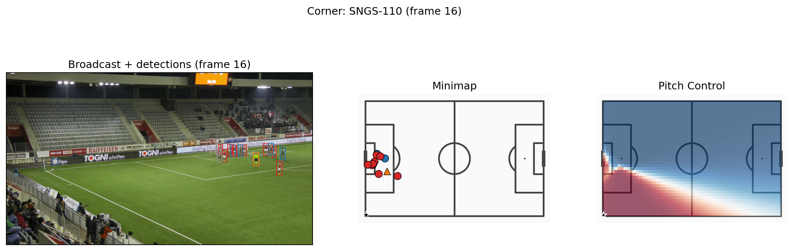
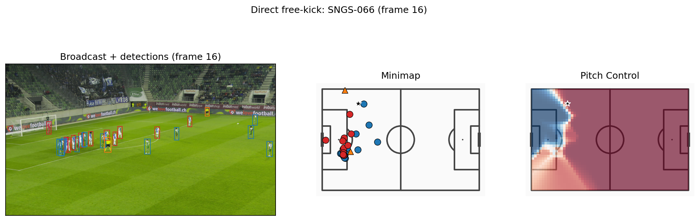
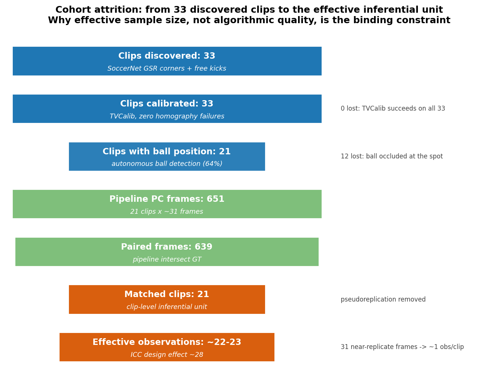

# Pitch Control from Broadcast Video: A Computer Vision Pipeline for Set-Piece Analysis

**Moritz Philipp Haaf, BSc MA**
Final Master's Project, MSc Artificial Intelligence Applied to Sports (2nd Edition), Sports Data Campus
Academic Year 2025/2026

> Markdown rendition of the submitted and graded thesis, converted from the [PDF](https://github.com/itzmore-mph/soccernet-setpiece-vision/releases/download/v1.0-thesis/report.pdf) for readability on GitHub.
> Page layout and the title page differ from the submitted PDF, and figures link to the current files in
> `outputs/figures/`. Section and figure cross-references are reproduced as submitted.

# Executive Summary

**This project delivers a general-purpose tool that turns ordinary football video into a tactical map of which team controls which part of the pitch, giving clubs without expensive tracking systems a way to study set pieces from footage they already own. What problem does this solve?** A coach wants to know how an opponent defends corners, or whether their own free-kick routines create the space they intend. They have match footage, but no tracking data. Until now, seeing who controls each pitch zone required specialist tracking systems costing tens of thousands of pounds a season, which most clubs, academies, and women's leagues cannot afford. The analysis is not the barrier; access to the data is.

**What solution was built?** The pipeline watches match video, finds every player and the ball, assigns each to a team by shirt colour, places everyone on a virtual pitch, and calculates how much of it each team controls after a corner or free kick. It runs on a normal laptop, with no specialist hardware, cloud services, or paid software. It is not tied to any one dataset: it accepts any steady broadcast or fixed-camera recording, whether club-owned, licensed, or broadcast footage.

**What is the impact?** Clubs and analysts with match video and a laptop can now produce a credible spatial view of set pieces. To measure accuracy, the tool was tested on 33 set-piece clips from SoccerNet, a public dataset with hand-labelled player positions. SoccerNet was the measuring stick, not the product: the estimate of who controls the space around the ball closely matched those positions, the single most decision-relevant question for a set-piece analyst.

**Current limitation.** The tool needs a steady camera with visible pitch markings and suits post-match study rather than live use; in a tightly packed penalty box it can still mislabel which team controls the six-yard area, the clearest target for future work.

## Contents

- [Executive Summary](#executive-summary)
- [1. Introduction](#1-introduction)
  - [1.1 Problem Statement](#11-problem-statement)
  - [1.2 Why Set Pieces](#12-why-set-pieces)
  - [1.3 Stakeholder Impact and Expected Benefits](#13-stakeholder-impact-and-expected-benefits)
  - [1.4 Research Gap](#14-research-gap)
  - [1.5 Contribution](#15-contribution)
  - [1.6 Research Scope and Boundaries](#16-research-scope-and-boundaries)
  - [1.7 Research Structure and Preview](#17-research-structure-and-preview)
- [2. Objectives](#2-objectives)
  - [2.1 Primary Objective](#21-primary-objective)
  - [2.2 Research Questions](#22-research-questions)
  - [2.3 Academic Objectives](#23-academic-objectives)
  - [2.4 Practical Objectives](#24-practical-objectives)
  - [2.5 Expected Outcomes and Deliverables](#25-expected-outcomes-and-deliverables)
  - [2.6 Success Criteria](#26-success-criteria)
  - [2.7 Ethical Considerations](#27-ethical-considerations)
- [3. Project Timeline](#3-project-timeline)
  - [3.1 Planning Approach](#31-planning-approach)
  - [3.2 Phase Plan](#32-phase-plan)
  - [3.3 Key Milestones](#33-key-milestones)
  - [3.4 Constraints and Dependencies](#34-constraints-and-dependencies)
  - [3.5 Business Rules](#35-business-rules)
  - [3.6 Risk and Mitigation](#36-risk-and-mitigation)
- [4. Conceptual and Technological Architecture](#4-conceptual-and-technological-architecture)
  - [4.1 Pipeline Overview](#41-pipeline-overview)
  - [4.2 Technologies](#42-technologies)
  - [4.3 Coordinate Systems](#43-coordinate-systems)
  - [4.4 Core Libraries and Tools](#44-core-libraries-and-tools)
  - [4.5 Development and Hardware Environment](#45-development-and-hardware-environment)
  - [4.6 Scalability and Constraints](#46-scalability-and-constraints)
- [5. Methodology: CRISP-DM](#5-methodology-crisp-dm)
  - [5.1 Why CRISP-DM](#51-why-crisp-dm)
  - [5.2 Phase Summary](#52-phase-summary)
  - [5.3 Methodology Adaptations](#53-methodology-adaptations)
- [6. Work Development](#6-work-development)
  - [6.1 Phase 1: Business Understanding](#61-phase-1-business-understanding)
  - [6.2 Phase 2: Data Understanding](#62-phase-2-data-understanding)
  - [6.3 Phase 3: Data Preparation](#63-phase-3-data-preparation)
  - [6.4 Phase 4: Modeling](#64-phase-4-modeling)
  - [6.5 Phase 5: Evaluation](#65-phase-5-evaluation)
    - [6.5.1 ICC and Effective Sample Size](#651-icc-and-effective-sample-size)
    - [6.5.2 Clip-Level Validation: Testing at the Effective Inferential Unit](#652-clip-level-validation-testing-at-the-effective-inferential-unit)
    - [6.5.3 Supplementary Validation: Baselines, Agreement, and Spatial Error](#653-supplementary-validation-baselines-agreement-and-spatial-error)
  - [6.6 Phase 6: Deployment](#66-phase-6-deployment)
    - [6.6.1 A Concrete Deployment Scenario](#661-a-concrete-deployment-scenario)
    - [6.6.2 Deployment Questions](#662-deployment-questions)
    - [6.6.3 Honest Limitations](#663-honest-limitations)
    - [6.6.4 Deployment Configuration and Reproducibility](#664-deployment-configuration-and-reproducibility)
  - [6.7 Project Outcomes and Deliverables](#67-project-outcomes-and-deliverables)
- [7. Discussion of Results](#7-discussion-of-results)
  - [7.1 Coaching Briefing: What the Findings Mean in Practice](#71-coaching-briefing-what-the-findings-mean-in-practice)
  - [7.2 What the Pipeline Delivers: Global Metrics and Ball Control](#72-what-the-pipeline-delivers-global-metrics-and-ball-control)
    - [7.2.1 The Box Inversion: A Structural Limit](#721-the-box-inversion-a-structural-limit)
    - [7.2.2 The pc_in_third Inversion: Action-Type-Dependent Agreement](#722-the-pc_in_third-inversion-action-type-dependent-agreement)
    - [7.2.3 Autonomous Ball Detection: Coverage and Limits](#723-autonomous-ball-detection-coverage-and-limits)
  - [7.3 Statistical Power and the Effective Sample Size Constraint](#73-statistical-power-and-the-effective-sample-size-constraint)
  - [7.4 Cross-Finding Synthesis](#74-cross-finding-synthesis)
  - [7.5 Methodological Limits](#75-methodological-limits)
  - [7.6 Practical Implications](#76-practical-implications)
  - [7.7 Priority Actions for Next-Phase Execution](#77-priority-actions-for-next-phase-execution)
- [8. Conclusions and Future Work](#8-conclusions-and-future-work)
  - [8.1 Final Reflections](#81-final-reflections)
  - [8.2 Core Conclusions](#82-core-conclusions)
  - [8.3 Future Work](#83-future-work)
  - [8.4 Proposed Roadmap](#84-proposed-roadmap)
  - [8.5 Academic and Practical Contribution](#85-academic-and-practical-contribution)
  - [8.6 Closing Statement](#86-closing-statement)
- [Bibliography](#bibliography)
- [Appendices](#appendices)
  - [Appendix A: Project Folder Structure](#appendix-a-project-folder-structure)
  - [Appendix B: Key Model Parameters](#appendix-b-key-model-parameters)
  - [Appendix C: Data Sources](#appendix-c-data-sources)
  - [Appendix D: Reproducibility](#appendix-d-reproducibility)

## List of Figures

1. Project Gantt chart showing the eight CRISP-DM phases across week 1 to week 11.
2. Set-piece outcome distribution within 10 seconds of execution across 706 Euro 2024 set pieces.
3. Set-piece event counts by type across UEFA Euro 2024 (StatsBomb open data).
4. Spatial distribution of set-piece origins on the pitch.
5. Player spatial density by set-piece type, derived from SoccerNet GSR ground-truth annotations.
6. Soccana multiclass detection example showing Player, Referee, and Ball classes on a broadcast frame.
7. Players-per-frame distribution: pipeline detections vs SoccerNet GSR ground truth.
8. Sample Pitch Control surface, pipeline vs ground truth, for a representative corner frame.
9. Distributional histogram overlays for each Pitch Control summary metric, pipeline vs GT.
10. ICC(2,1) values and effective sample sizes per Pitch Control metric.
11. Clip-level bias with percentile bootstrap 95% confidence intervals per Pitch Control metric (n=21 matched clips). Only pc_in_box excludes zero.
12. pc_in_third pipeline vs GT, with a separate OLS fit per set-piece type.
13. Per-frame paired scatter plots, pipeline vs GT, for each Pitch Control metric.
14. Bland-Altman agreement plots per metric (pipeline minus GT vs their mean), with bias and 95% limits of agreement.
15. Skill score vs baseline (left), mean absolute error by defender shortfall (centre), and box-control confusion matrix (right).
16. Per-cell mean absolute Pitch Control error (pipeline vs GT), oriented attack-to-right. Error concentrates in the attacking third and penalty area.
17. Three-panel deployment overlay for a corner (SNGS-110): broadcast frame with detections, metric minimap, and Pitch Control heatmap.
18. Three-panel deployment overlay for a direct free kick (SNGS-066): broadcast frame with detections, metric minimap, and Pitch Control heatmap.
19. Detected defender count per frame vs pc_mean. The negative trend confirms defender-recall shortfall as the dominant driver of global underestimation.
20. Cohort attrition funnel from 33 discovered clips to the effective inferential unit.

## List of Tables

1. Project success criteria and targets.
2. CRISP-DM phase plan with milestones and deliverables.
3. Pipeline components and underlying technologies.
4. Coordinate-system conventions used across data sources and the pipeline.
5. Core Python libraries and their roles in the pipeline.
6. CRISP-DM phase to notebook / script and committed output mapping.
7. Distributional comparison of Pitch Control summary metrics (pipeline n=651, GT n=949).
8. Per-frame paired comparison (n=639 paired frames).
9. ICC(2,1) and effective sample size per Pitch Control metric (n=21 clips).
10. Clip-level paired validation (n=21 matched clips). The bias CI is a percentile bootstrap; Wilcoxon tests the paired clip-mean differences.
11. pc_in_third correlation, pooled vs stratified by set-piece type. Bootstrap 95% CIs on Pearson r.
12. Bland-Altman limits of agreement (n=639 frames).
13. Technical deliverables produced by the pipeline.
14. Error taxonomy mapping each validation metric to its dominant failure mode, current bias, and remediation path.
15. Locked pipeline parameters and source files.
16. Datasets, models, and external resources with access mechanism.

# 1. Introduction

## 1.1 Problem Statement

Almost every club at every level films its matches, yet the ability to see which team controls which part of the pitch remains out of reach for all but the wealthiest. That spatial view comes from Pitch Control, the probability that a team could reach any given point on the pitch before the opposition, formalised by Spearman (2018) and Fernández and Bornn (2018). Computing it has so far depended on player-tracking data from commercial systems (StatsBomb 360, SkillCorner, Tracab) that cost on the order of tens of thousands of pounds per season. The barrier is therefore not analytical sophistication; the methods are public. The barrier is access to the tracking data those methods consume.

For Championship and lower-league clubs, women’s football, academies, and scouting departments, this means a coach can watch an opponent’s corner on video but cannot quantify the space that corner creates or concedes. This project removes that barrier by building a general-purpose pipeline that computes Pitch Control from the video itself, with no tracking hardware and no data subscription. The product is the pipeline, not any single dataset: it is designed to run on whatever near-static set-piece footage a club can obtain.

## 1.2 Why Set Pieces

Set pieces (corners and direct free kicks) are the right place to start for two reasons, one tactical and one technical. Tactically they are high-leverage and heavily prepared: across 706 set pieces in UEFA Euro 2024, derived from the StatsBomb open-data release (StatsBomb, 2024), 32.4% produced a shot within 10 seconds and 1.8% produced a goal (own analysis, notebook 01), and coaches invest disproportionate preparation time in them precisely because they are the most controllable phase of play. Technically they are the most tractable input for a computer vision pipeline: the broadcast camera is near-static during the delivery, all relevant players are in frame, and the ball can be detected directly from the video without any external event feed. Where open play demands continuous tracking and a panning camera, a set piece offers a near-stationary tableau that a single fixed view can capture in full.

**A note on the validation dataset.** Throughout this project SoccerNet GSR (Somers et al., 2024) is used as the validation dataset because it ships hand-labelled ground-truth player positions, which are needed to measure how accurate the pipeline’s estimates are. It is not the intended deployment context. In real use the pipeline accepts any near-static broadcast or fixed-camera recording of a set piece; SoccerNet is simply the measuring stick that lets accuracy be quantified.

## 1.3 Stakeholder Impact and Expected Benefits

The primary beneficiaries are organisations that lack access to commercial tracking systems but have broadcast footage available. For these actors, the cost barrier to set-piece analysis is not analytical sophistication but data access. A broadcast-only Pitch Control pipeline removes that barrier directly.

For a **tactical analyst or head coach**, the pipeline provides a spatial view of set-piece control, quantifying which team dominates which zone at the moment of execution, without requiring a data engineering team or a tracking subscription. The output is a three-panel broadcast overlay that can be interpreted directly on screen without data science expertise.

For a **sporting director or technical lead**, the pipeline enables repeatable, comparable set-piece analysis across opponents and competitions using only publicly available or club-owned broadcast footage. Set-piece patterns can be analysed for upcoming opponents from broadcast recordings alone.

For a **second-tier club, women’s football team, or academy**, the tool removes the hardware and cost barrier entirely. The pipeline runs on a standard laptop in 30 minutes per clip, produces no recurring cost, and requires no proprietary licence.

For a **data scientist or analyst building on this work**, the fully documented codebase, stored Parquet outputs, explicit error taxonomy, and two-level reproducibility infrastructure provide a validated foundation for extension rather than a black-box starting point.

## 1.4 Research Gap

Prior literature covers player detection, tracking, calibration, and Pitch Control modelling individually. Detection has matured through the YOLO family (Redmon & Farhadi, 2018; Jocher & Qiu, 2024); multi-object tracking by association is well-established (Zhang et al., 2022); broadcast camera calibration without ground-truth pitch lines has been addressed by TVCalib (Theiner & Ewerth, 2023); the SoccerNet line of benchmarks (Deliège et al., 2021; Somers et al., 2024) provides annotated broadcast footage; and multi-task learning for joint re-identification, team affiliation, and role classification has been proposed for sports tracking (Mansourian et al., 2023). The end-to-end chain, broadcast pixels through to a distributionally validated tactical metric, without proprietary tracking and without ground-truth annotations consumed at inference time, remains underdeveloped.

## 1.5 Contribution

This project delivers:

- A reproducible, validated pipeline from broadcast video to Pitch Control, operating without GT annotations at any inference step

- Fully autonomous operation: player detection, ball detection, camera calibration, and team assignment all run from broadcast video alone

- Distributional validation against open SoccerNet GSR annotations (Somers et al., 2024) with explicit bias attribution per metric

- ICC-based effective sample size analysis that quantifies the binding statistical constraint and informs future cohort design

- Consumer-hardware execution (Apple Silicon MPS or equivalent) with no cloud dependency

## 1.6 Research Scope and Boundaries

**Data scope.** The primary validation dataset is SoccerNet GSR 2024 (Somers et al., 2024): 33 clips covering two set-piece classes (17 corners, 16 direct free kicks). StatsBomb Euro 2024 open data (StatsBomb, 2024) is used only for distributional context on player counts and set-piece outcomes; it is not part of the primary validation. The two datasets do not cover the same matches, so no event in the StatsBomb sample corresponds to a labelled SoccerNet GSR clip; direct cross-dataset validation (using StatsBomb as a second ground truth for the same set pieces) is therefore not feasible, and StatsBomb’s role is limited to a contextual, distributional benchmark rather than a validation source.

**Set-piece scope.** Only corners and direct free kicks are analysed. These were selected because the broadcast camera is near-static for both, all relevant players are in frame at the moment of execution, and ball position is reliably detectable from video. Throw-ins, goal kicks, indirect free kicks, and open-play sequences are out of scope.

**Out of scope.** Player re-identification across clips, multi-camera setups, non-broadcast footage, and tracking over full match sequences are excluded. The pipeline is validated as a static-frame set-piece tool, not a real-time tracking system.

## 1.7 Research Structure and Preview

Section 3 defines the research objectives and success criteria. Section 4 lays out the project timeline, milestones, and constraints. Section 5 describes the full pipeline architecture and technology stack. Section 6 explains the CRISP-DM methodology and its adaptations. Section 7 documents each phase of development in detail. Section 8 discusses the findings, identifies cross-metric patterns, and articulates methodological limits. Section 9 draws conclusions, proposes a development roadmap, and outlines future work. Appendices provide the project folder structure, model parameters, data sources, and full reproducibility instructions.

# 2. Objectives

## 2.1 Primary Objective

Develop a reproducible, fully autonomous computer vision pipeline that extracts Pitch Control from broadcast set-piece frames and produces distributions comparable to ground-truth annotation-derived distributions, using only open-source tools and consumer hardware.

## 2.2 Research Questions

- **RQ1.** Can a broadcast-video-only pipeline produce Pitch Control distributions comparable to GT-annotation distributions for set-piece frames?

- **RQ2.** What is the dominant source of systematic bias in pipeline-derived Pitch Control, and is it attributable to specific pipeline components?

- **RQ3.** Which Pitch Control summary metrics are most robust to broadcast-pipeline noise?

## 2.3 Academic Objectives

- Demonstrate end-to-end distributional validation methodology for a broadcast computer vision pipeline, moving beyond aggregate accuracy to per-metric bias attribution.

- Establish which Pitch Control summary metrics are robust to broadcast-pipeline noise and which are structurally contaminated by specific component failures.

- Contribute empirical evidence on the limits of colour-based team assignment in crowded set-piece environments, informing future work on supervised team-classification approaches.

- Quantify within-clip temporal correlation via ICC analysis to characterise the effective statistical power of the validation cohort.

- Produce a reproducible codebase and validated outputs that enable independent replication and extension.

## 2.4 Practical Objectives

- Deliver a working, fully autonomous pipeline executable on consumer hardware in under 45 minutes on Apple Silicon MPS for 33 clips, without cloud infrastructure or proprietary data.

- Identify which PC metrics are operationally deployable by clubs without access to GT tracking, and which require further development before use.

- Produce broadcast-overlay visualizations (three-panel stills and animated GIFs/MP4s) that allow a tactical analyst to interpret pipeline outputs directly on the broadcast frame.

- Document data-quality issues in SoccerNet GSR (notably the `action_position` global-frame-number misinterpretation) to inform future dataset users.

## 2.5 Expected Outcomes and Deliverables

**Technical deliverables:**

- Detection parquets (`detections_soccana_tvcalib.parquet`, `detections_gt_full.parquet`) for all 33 clips

- Ball position cache (`ball_positions.parquet`) and pitch control surfaces (`pitch_control_soccana_tvcalib.parquet`, `pitch_control_gt_full.parquet`)

- Validation outputs (`validation_summary_tvcalib.parquet`, `validation_paired.parquet`, KS table figure)

- ICC analysis outputs (`icc_per_metric.parquet`)

- Broadcast-overlay visualizations: static three-panel stills, animated GIFs, and MP4 clips for representative corner and free-kick sequences

**Academic deliverables:**

- Validated distributional comparison of pipeline-derived vs GT-derived Pitch Control on 21 clips with autonomous ball detection

- Mechanistic bias attribution identifying three distinct error regimes: global underestimation, sign inversion, and calibrated range

- ICC(2,1) analysis quantifying effective sample size and within-clip correlation structure

- Documented methodology for adapting a dynamic Pitch Control model to a zero-velocity set-piece context

## 2.6 Success Criteria

**_Table 1._** _Project success criteria and targets._

|**Criterion**|**Target**|
|---|---|
|End-to-end execution|All 33 clips, consumer hardware, <45 min (MPS) / <90 min (CPU)|
|Bias||bias| < 0.10 on`pc_at_ball`|
|Histogram overlap|>0.80 on at least one metric|
|Bias explanation|Mechanistic, attributable to specific component|
|Reproducibility|Full pipeline re-runnable from raw SSD data|

## 2.7 Ethical Considerations

**Data access.** SoccerNet GSR requires a credentialed download via the SoccerNet API; credentials were obtained through the standard academic access request process. StatsBomb open data is freely available under CC BY-SA 4.0. Soccana model weights are publicly hosted on HuggingFace; the model card states no explicit licence.

**No personal data.** No individual player identities, biometric data, or personally identifiable information are stored, processed, or published. Player positions are treated as anonymous spatial coordinates.

**Model weights.** The Soccana YOLO11n weights are used as-is from HuggingFace; any applicable licence terms apply and no weights are redistributed.

**Reproducibility and transparency.** All pipeline code, parameter choices, and known data-quality issues (including the `action_position` misinterpretation) are documented and stored in the project folder. No results are selectively reported; the full validation table including unfavourable metrics is published.

# 3. Project Timeline

## 3.1 Planning Approach

The project follows CRISP-DM’s phased structure, with explicit feedback loops between Data Understanding and Data Preparation to accommodate mid-project corrections. The plan is presented in illustrative weeks (W1 through W11) rather than calendar dates, reflecting the iterative nature of the work and the fact that several phases overlap.

## 3.2 Phase Plan

**_Table 2._** _CRISP-DM phase plan with milestones and deliverables._

|**Week**|**CRISP-DM phase**|**Activity**|**Deliverable**|
|---|---|---|---|
|W1-W2|Business Understanding|Problem framing, stakeholder identification, set-piece literature review|Define Research questions|
|W2-W4|Data Understanding|StatsBomb Euro 2024 EDA, SoccerNet GSR scan, `action_position` audit|`setpieces.parquet`, `gt_spatial_benchmarks.parquet`|
|W3-W5|Data Preparation (pipeline track)|TVCalib integration, Soccana detection + ByteTrack, team assignment design|`homographies_tvcalib.parquet`, `detections_soccana_tvcalib.parquet`|
|W4-W5|Data Preparation (GT track)|SoccerNet bbox_pitch parsing, autonomous ball detection integration|`detections_gt_full.parquet`, `ball_positions.parquet`|
|W5-W7|Modeling|Laurie Shaw TTI zero-velocity adaptation, PC surface computation|`pitch_control_*.parquet`|
|W7-W9|Evaluation|Distributional KS, paired Pearson/MAE/bias, ICC analysis|`validation_summary_tvcalib.parquet`, `validation_paired.parquet`, `icc_per_metric.parquet`|
|W9-W10|Deployment|Broadcast-overlay visualizations, three-panel stills, animated GIF/MP4|`still_*.png`, `anim_*.gif`, `video_*.mp4`|
|W10-W11|Reporting|Notebook narrative, thesis write-up, final review|`report.md`, executable notebooks|


**_Figure 1._** _Project Gantt chart showing the eight CRISP-DM phases across week 1 to week 11._

## 3.3 Key Milestones

1. **Research scope locked** (end W2): primary validation dataset, set-piece classes, success criteria all defined.

2. **TVCalib batch complete** (W4): 1,023 homographies computed for all 33 clips, removing GT pitch-line dependency at inference.

3. **`action_position` data-quality discovery** (W4–W5): mid-project finding that `action_position` is a global broadcast frame number, not a clip-local index. Required rewriting the frame-window logic before modelling could produce correct outputs.

4. **First end-to-end pipeline run** (W6): pipeline runs all 33 clips end-to-end with zero homography failures.

5. **Validation cohort finalised at 21 clips** (W7): the effective PC validation set is 21 clips, reflecting autonomous ball detection coverage (64%). SNGS-125 and SNGS-145 lack GT annotations in frames 1–31; a further 12 clips lack sufficient autonomous ball detections in the critical early frames.

6. **KS validation table complete** (W8): per-metric distributional comparison published with no selective reporting.

7. **Error taxonomy and ICC analysis complete** (W8–W9): three-regime error partition (global underestimation, sign inversion, calibrated) and within-clip ICC values (0.89–0.93) with effective sample sizes of approximately 22.5–23.5 observations.

8. **Final deliverables completed** (W11): Parquet outputs, executable notebooks, thesis report, and overlay visualizations.

## 3.4 Constraints and Dependencies

**Constraints.**

- _Data access._ SoccerNet GSR requires credentialed download; StatsBomb open data is freely available.

- _Time limitations._ The Sports Data Campus deadline of 30 June 2026 is the binding driver of the eleven-week schedule.

- _Hardware._ Apple Silicon laptop with 16 GB unified memory; SoccerNet video (~35 GB) on an external USB-C SSD.

- _External component._ TVCalib (Theiner & Ewerth, 2023) runs in a sibling conda environment with PyTorch 2.x patches; configuring and validating this research codebase was a prerequisite for pipeline integration.

**Dependencies.**

- Detection requires TVCalib homographies before pixel-to-pitch projection is meaningful.

- Pitch Control computation requires both player detections and ball positions per frame.

- Validation requires aligned pipeline and GT Pitch Control surfaces on a shared clip set.

- Notebooks 02 through 04 are executable from stored Parquet outputs, allowing reproduction without the SSD or TVCalib environment after the initial pipeline run.

## 3.5 Business Rules

- _Inference-time data-leak rule._ SoccerNet GSR ground-truth annotations may be used only for validation. They are never consumed at detection, tracking, calibration, or ball detection inference time. This rule is what makes the pipeline a defensible broadcast-only system and is the central methodological constraint of the project.

- _Data licensing._ StatsBomb Euro 2024 open data is used under CC BY-SA 4.0. SoccerNet GSR is accessed through the credentialed academic process (Somers et al., 2024). Soccana weights are used as published on HuggingFace, where no explicit licence is stated; no weights are redistributed.

- _Reproducibility rule._ The pipeline must execute end-to-end on a consumer laptop with no cloud dependency. All intermediate outputs are stored as Parquet so that notebooks 02 through 04 reproduce on a fresh copy of the project folder without the SSD or TVCalib environment.

- _Ethics rule._ No personal data, biometric data, or player identities are stored, processed, or published. Player positions are treated as anonymous spatial coordinates throughout (full statement in Section 3.7).

## 3.6 Risk and Mitigation

The most material risk that materialised was the `action_position` misinterpretation: the pipeline was initially processing end-of-clip open-play frames instead of set-piece formations. This was caught during qualitative inspection of intermediate outputs in W4-W5, fixed by computing the centre frame as `FRAME_WINDOW + 1 = 16` rather than treating `action_position` as a clip-local index, and documented as a methodological contribution. The mitigation lesson is that intermediate visual inspection is essential when the pipeline produces metrics that look plausible in aggregate but are semantically wrong.

# 4. Conceptual and Technological Architecture

## 4.1 Pipeline Overview

```text
SoccerNet GSR clips (external SSD)
        |
        v
+--------------------------------------------+
|  Single Video Pass (frames 1-250)          |
|  run_optimized_pipeline.py                 |
+--------------------------------------------+
|  Soccana + ByteTrack (Players)             |
|  - Player + Referee detection              |
|    (YOLOv11n, classes 0 + 2)               |
|  - conf=0.25, TTA, agnostic NMS            |
|  - Persistent track IDs                    |
|  - Global KMeans HSV team assignment       |
|    (k=3, 250-frame fit, mode consensus)    |
+--------------------------------------------+
|  Soccana + ByteTrack (Ball)                |
|  - Autonomous ball detection               |
|    (YOLOv11n, class 1, conf=0.15)          |
|  - Gap interpolation (max 5 frames)        |
|  - Frame-1 priority for set-piece pos.     |
+--------------------------------------------+
        |
        v
+-----------------------------------+
|  TVCalib Homography               |
|  - Autonomous camera calibration  |
|  - Pixel to metric pitch coords   |
+-----------------------------------+
        |
        v
+-----------------------------------+
|  Pitch Bounds Filtering           |
|  - Discard coords outside         |
|    [0,105] x [0,68] m             |
+-----------------------------------+
        |
        v
+-----------------------------------+
|  Laurie Shaw Pitch Control        |
|  - Time-to-intercept model        |
|  - Zero-velocity (static frame)   |
|  - 60x40 grid on 105x68 m pitch   |
|  - Frames 1-31 only               |
+-----------------------------------+
        |
        v
+-----------------------------------+
|  Validation vs GT                 |
|  - KS test, histogram overlap     |
|  - Per-frame paired statistics    |
|  - ICC(2,1) + effective n         |
+-----------------------------------+
```

## 4.2 Technologies

**_Table 3._** _Pipeline components and underlying technologies._

|**Component**|**Technology**|
|---|---|
|Detection|Soccana YOLO11n, football-finetuned, 2.6M params (Jain, 2025; architecture: Jocher & Qiu, 2024)|
|Tracking|ByteTrack (Zhang et al., 2022) via Ultralytics|
|Team assignment|Global KMeans (k=3) on track-mean HSV + cross-frame mode consensus|
|Calibration|TVCalib (Theiner & Ewerth, 2023)|
|Ball detection|Autonomous: Soccana class=1, conf=0.15, ByteTrack + gap interpolation|
|Pitch Control|Time-to-intercept model (Shaw, 2020)|
|Data|SoccerNet GSR 2024 (Somers et al., 2024); StatsBomb open data (StatsBomb, 2024)|
|Language|Python 3.11|
|Package management|uv + pyproject.toml + uv.lock|
|Hardware|Apple Silicon (MPS), or any CUDA/CPU-capable host|

## 4.3 Coordinate Systems

**_Table 4._** _Coordinate-system conventions used across data sources and the pipeline._

|**System**|**Convention**|
|---|---|
|StatsBomb|120 yd x 80 yd, origin top-left|
|Pipeline / mplsoccer|105 m x 68 m, origin top-left|
|SoccerNet GSR bbox_pitch|centered origin (+-52.5 m, +-34 m)|

**Conversions:**

- **GSR to pipeline:** `x = x_gsr + 52.5, y = y_gsr + 34`

- **StatsBomb to pipeline:** x = x_sb × (105/120), y = y_sb × (68/80)

## 4.4 Core Libraries and Tools

**_Table 5._** _Core Python libraries and their roles in the pipeline._

|**Library**|**Version**|**Role**|
|---|---|---|
|ultralytics|8.3.107|Soccana detection + ByteTrack tracking|
|torch|>=2.1.0|Inference backend (Apple MPS)|
|opencv-python|>=4.8.0|Frame I/O, HSV colour extraction, video rendering|
|pandas|>=2.1.0|Tabular data pipeline|
|numpy|>=1.26.0|Array operations, homography math|
|scipy|>=1.11.0|KS test, spatial distance computations|
|scikit-learn|>=1.3.0|KMeans team assignment|
|mplsoccer|>=1.4.0|Pitch visualisation|
|pyarrow|>=14.0.0|Parquet I/O|
|statsbombpy|>=1.14.0|StatsBomb open data access|
|huggingface-hub|>=0.20.0|Soccana weight download|
|pingouin|>=0.5.0|ICC (2,1) computation and effective sample size|
|python-dotenv|>=1.0.0|SSD path and credential configuration|

TVCalib (Theiner & Ewerth, 2023) runs in a separate sibling conda environment with its own dependencies (PyTorch 2.1, kornia 0.8.2, pytorch-lightning 2.6.1) and is invoked via subprocess from `run_tvcalib_batch.py`.

## 4.5 Development and Hardware Environment

- **Hardware:** Apple Silicon laptop (M-series, 16 GB unified memory). CPU (FP32) is the authoritative backend for every committed number and figure (bit-reproducible); MPS/CUDA are supported for fast, non-deterministic experimentation only and must not back committed runs.

- **Storage:** SoccerNet GSR video data (~35 GB) on an external SSD. All intermediate outputs (Parquet files, figures) are stored in the project folder; video frames are not.

- **Software:** macOS 15, Python 3.11 managed via uv. Detection, tracking, TVCalib, Pitch Control computation, and validation all run on CPU by default (`TORCH_DEVICE` override exists but is not used for committed runs).

- **Execution profile:** ~30 min total for 33 clips on CPU (TVCalib batch ~14 min, Soccana detection ~15 min, downstream scripts <1 min combined).

## 4.6 Scalability and Constraints

**Horizontal scaling:** The pipeline processes clips sequentially; parallelisation across clips is straightforward but was not implemented, as the 30-minute runtime is acceptable for the 33-clip cohort.

**TVCalib coupling:** Pre-computed homographies are stored in the project folder (`homographies_tvcalib.parquet`), decoupling all downstream scripts from the TVCalib dependency for normal operation.

**Ball detection coverage:** Autonomous ball detection produces valid positions for 21 of 33 clips. The 12 remaining clips lack sufficient ball detections in the critical early frames due to occlusion or ball out of frame. The effective PC validation set is therefore 21 clips.

**Memory:** Peak memory during detection inference is approximately 4 GB (MPS), dominated by the YOLO model. Pitch Control computation is CPU-bound and uses <1 GB.

# 5. Methodology: CRISP-DM

**CRISP-DM** (Cross-Industry Standard Process for Data Mining; Chapman et al., 2000) is a six-phase framework organising a data project into **Business Understanding, Data Understanding, Data Preparation, Modeling, Evaluation,** and **Deployment**. Each phase has explicit inputs, outputs, and a feedback path to earlier phases, making it well-suited to projects where validation findings can require revisiting data assumptions. This section explains why CRISP-DM was selected, summarises how each phase maps to the project folder, and documents two methodology adaptations required for the broadcast computer-vision context.

## 5.1 Why CRISP-DM

**Iterative fit:** Pipeline development rarely proceeds linearly. The discovery that `action_position` in SoccerNet GSR is a global broadcast frame number (not a clip-local index) required revising the frame-window logic before preparation and modelling could proceed correctly. CRISP-DM’s explicit feedback loop between phases accommodates this kind of mid-project revision without treating it as a failure.

**Validation emphasis:** The evaluation phase in CRISP-DM is a first-class phase, not an afterthought. For this project, where the central research question is whether a broadcast pipeline produces distributions comparable to ground truth, the evaluation phase is where the research question is answered.

**Reproducibility:** CRISP-DM’s phase separation maps directly onto the script/notebook structure of the project folder: each phase has identifiable inputs, processing steps, and stored Parquet outputs. A future user can enter the pipeline at any phase using stored intermediate outputs, verifying reproducibility independently.

## 5.2 Phase Summary

This subsection maps the CRISP-DM phases to the concrete artefacts of the project: every phase has identifiable inputs, a script or notebook that performs the work, and stored output. The table is intended to function as both a methodology summary and an entry point for reproducing any individual phase.

**_Table 6._** _CRISP-DM phase to notebook / script and committed output mapping._

|**Phase**|**Notebook / Script**|**Key Output**|
|---|---|---|
|Business Understanding|nb01|Problem framing, stakeholder identification, set-piece EDA|
|Data Understanding|nb01|StatsBomb EDA, SoccerNet GSR scan, action_position audit|
|Data Preparation|run_tvcalib_batch, run_optimized_pipeline, dump_gt_setpieces|Detection, ball-position, and team-assignment Parquets|
|Modeling|nb02, run_pc_*|Pitch control surfaces, summary metrics|
|Evaluation|nb03, ks_table_tvcalib.py, compute_icc.py|Validation tables, distributional + paired statistics, ICC|
|Deployment|nb04, render_*|Broadcast-overlay visualizations, GIFs, MP4s|

## 5.3 Methodology Adaptations

Two adaptations were required to apply CRISP-DM to this computer vision pipeline context.

**Static-frame modelling.** The time-to-intercept Pitch Control model (Shaw, 2020), a practical implementation of the probabilistic pitch-control formulations introduced by Spearman (2018) and Fernández and Bornn (2018), was designed for tracking data with per-frame player velocities. This project uses a zero-velocity adaptation: all players are assumed to be stationary at the moment of the set-piece, and time-to-intercept reduces to distance divided by maximum speed.

The validity of this assumption varies by set-piece type. For corners, the assumption is well-supported: players adopt fixed positions in and around the penalty area before execution, and the broadcast camera is near-static, reducing motion blur. For direct free kicks, the assumption is more tenuous. Attacking runners may already be in motion at the moment the ball is struck, and the executing player’s run-up velocity is non-zero. Under the zero-velocity model, these players are treated as stationary, which understates their spatial advantage. To bound this: a player already moving at 3 m/s at execution reaches a point 3 m ahead of their static position within 1 second; under the TTI sigmoid with

MAX_SPEED = 5 m/s and REACTION_TIME = 0.7 s, this shifts their control-zone boundary by approximately 0.6-1.5 m, equivalent to 0.5-1 grid cells. The expected effect on pc_in_third is below 0.05 for players outside the ball’s immediate vicinity. This asymmetry motivates velocity estimation as a priority in future development, and makes set-piece-type-stratified validation an important next validation step.

**Distributional evaluation.** Standard CRISP-DM evaluation focuses on predictive model accuracy. Here, the pipeline does not predict a label, it computes a spatial metric. Evaluation therefore uses distributional comparison (KS test, histogram overlap) and per-frame paired statistics (Pearson r, MAE, bias) to assess whether the pipeline-derived distribution is consistent with the GT-derived distribution. ICC(2,1) analysis is added to characterise within-clip temporal correlation and quantify effective sample size, which is the binding constraint on statistical power.

# 6. Work Development

## 6.1 Phase 1: Business Understanding

**Core question:** Can a broadcast-only pipeline produce Pitch Control distributions comparable to GT for set-piece frames?

**Stakeholders:** Clubs without tracking providers (second-tier professional, women’s football, academies, scouting departments).

**Business model:** The pipeline is positioned as an open, broadcast-only alternative to commercial tracking subscriptions, not a drop-in replacement for them. Three delivery models fit the stakeholders identified above. They are not mutually exclusive.

1. _Analysis-as-a-service / consultancy:_ A freelance analyst or small studio runs the pipeline against a club's own footage and delivers Pitch Control reports per fixture or per opponent, billed per clip or per matchday package. This needs no software distribution. It also matches how lower-league and academy budgets already procure analysis: one-off or termly contracts rather than annual platform licences.

2. _Self-hosted open-source tool with paid support:_ The codebase stays open, as it is here. Revenue comes from setup, calibration tuning for a club's specific broadcast angle, and training, the open-core model used by smaller sports-data tooling vendors. This suits clubs with an in-house analyst who can run scripts but wants vendor support for edge cases.

3. _Embedded module inside an existing footage platform:_ Clubs already pay for footage delivery (Hudl, Wyscout, InStat). Hudl's own published club-football tiers range from $400 to $1,600 per team per season (Hudl, 2026), several orders of magnitude below the tracking-system cost cited in Section 1.1. Pitch Control-from-broadcast could ship as an add-on inside that existing relationship, rather than as a new vendor a club has to onboard.

Model 1 is the lowest-risk entry point given the current 21/33 clip autonomy rate (Section 7.2.3). A human-in-the-loop consultancy offering can absorb the 12 failure cases that would break a fully automated tier. Models 2 and 3 become viable once ball-detection coverage and team-assignment reliability (Section 8.3) are hardened to a level that no longer needs per-clip manual review.

**Economic feasibility:** Build cost is the marginal cost of one analyst's time over the eleven-week project window (Section 4.2). There is no specialised hardware spend, since the pipeline runs on a consumer laptop in roughly 30 minutes per clip (Section 6.6.4). Recurring cost to a deploying organisation is correspondingly close to zero: no GPU server, no per-seat tracking licence, no cloud inference bill, just analyst time to run and read the output. Commercial tracking systems (StatsBomb 360, SkillCorner, Tracab) run into five figures per season (Section 1.1). Hudl's publicly listed club-football tiers, by contrast, sit at $400–$1,600 per season (Hudl, 2026), confirming that footage-and-light-analysis subscriptions price an order of magnitude below full tracking. That is exactly the band a broadcast-only Pitch Control add-on would need to slot into. At the scale of a second-tier or academy club (Section 1.3), realistic willingness to pay sits closer to the consultancy or footage-platform-add-on band than to a bespoke tracking contract. This favours Model 1 or 3 over a standalone premium SaaS product competing head-on with tracking vendors.

The clearest economic risk is the 64% autonomous ball-detection coverage (Section 7.2.3). Any per-clip billing model needs either a manual fallback for the remaining 36%, or has to defer billing-grade commitments until coverage clears the >90% target in the Phase 1 roadmap (Section 8.4). This is the same constraint already flagged as the top technical priority. It also gates which business model is viable today.

**Why set pieces:** Near-static camera, all players in frame, ball position detectable from video. Of 706 Euro 2024 set pieces, 65.7% produced no shot within 10 s, 32.4% produced a shot, and 1.8% produced a goal, placing set pieces among the highest-leverage repeatable game situations for tactical investment.


**_Figure 2._** _Set-piece outcome distribution within 10 seconds of execution across 706 Euro 2024 set pieces._

## 6.2 Phase 2: Data Understanding

**StatsBomb Euro 2024 (nb01).** 51 matches, 706 set-piece events (508 corners, 198 direct free kicks), drawn from the StatsBomb open-data release (StatsBomb, 2024) via `statsbombpy`. Freeze-frame coverage for this subset is 64.2% (453/706 events). Used only for distributional context; not part of the primary validation. SoccerNet GSR and StatsBomb Euro 2024 are disjoint match samples, so the two cannot be paired event-for-event; StatsBomb instead serves as an independent benchmark for set-piece prevalence and outcome rates, not as a second ground truth for the pipeline’s spatial estimates.


**_Figure 3._** _Set-piece event counts by type across UEFA Euro 2024 (StatsBomb open data)._


**_Figure 4._** _Spatial distribution of set-piece origins on the pitch._

**SoccerNet GSR.** Drawing on the Game State Reconstruction benchmark (Somers et al., 2024), part of the broader SoccerNet line (Deliège et al., 2021), 33 clips were identified with action_class in {Corner, Direct free-kick}: 17 corners, 16 direct free kicks. Per-frame player annotations (bbox_pitch) and pitch-line annotations are provided. TVCalib homographies (Theiner & Ewerth, 2023) were computed for all 1,023 frames (33 clips × 31 frames).


**_Figure 5._** _Player spatial density by set-piece type, derived from SoccerNet GSR ground-truth annotations._

**Note on `action_position`.** The `action_position` field in SoccerNet GSR Labels-GameState.json is a global broadcast frame number (ranging from ~300,000 to ~2,600,000), not a clip-local index. Clips are 750 frames numbered 1-750, with the set-piece occurring at frame 1 (confirmed by GT ball-position coordinates at the corner arc on frame 1 for all corner clips). The pipeline uses `centre = FRAME_WINDOW + 1 = 16` to place the ±15-frame window at frames 1-31, covering the static set-piece formation. This correction is documented as a contribution to future users of this dataset.

## 6.3 Phase 3: Data Preparation


**_Figure 6._** _Soccana multiclass detection example showing Player, Referee, and Ball classes on a broadcast frame._

**Pipeline design (`run_optimized_pipeline.py`):**

The pipeline combines player detection, ball detection, and team assignment into a single sequential video pass per clip, reading each frame from the SSD exactly once. The pass covers frames 1-250; Pitch Control is computed strictly on frames 1-31.

**Step 1: Player detection.** Soccana (Jain, 2025; YOLO11n architecture, Jocher & Qiu, 2024) at confidence threshold 0.25, classes 0 (Player) and 2 (Referee), with Test-Time Augmentation (TTA) and class-agnostic Non-Maximum Suppression (agnostic NMS). The threshold of 0.25 is chosen to maximise recall on partially occluded and distant players. TTA runs inference on augmented versions of each frame and merges predictions, further improving detection of difficult targets. Agnostic NMS prevents duplicate detections at class boundaries by treating all classes as one during overlap removal.

**Step 2: Tracking.** ByteTrack persistent ID assignment (Zhang et al., 2022) across all 250 frames for detected objects, providing stable `track_id` values that persist through momentary occlusions.

**Step 3: Global team assignment.** Jersey HSV features are extracted from a torso-band crop (`jersey_hsv()`) for every player detection across the full 250-frame fitting window. Per-track mean HSV vectors are computed by averaging all HSV samples for each `track_id`. A single KMeans model (k=3) is fitted once per clip on these track-mean vectors, producing three cluster centroids that correspond to team A, team B, and referees/outliers. Each `track_id` receives its final team label via cross-frame mode consensus: the most frequently occurring cluster label across all frames in which that track appears becomes its permanent assignment. Global fitting over 250 frames, rather than per-frame refitting, ensures cluster centroids remain stable throughout the clip and eliminates the frame-to-frame label instability that would otherwise contaminate PC computation in crowded set-piece areas. Referee detections are assigned `team=-1` directly and excluded from Pitch Control computation.

**Step 4: TVCalib homography** (Theiner & Ewerth, 2023): pixel foot-point projected to metric pitch coordinates.

**Step 5: Pitch-bounds filtering.** All projected coordinates outside [0, 105] × [0, 68] m are discarded. This step is essential at the lower confidence threshold: it removes spurious detections (crowd members, advertising boards, camera operators) that project outside the pitch, ensuring improved recall does not introduce false positives into the Pitch Control computation. The pitch boundary serves as a geometric prior: any detection projecting outside the playing field is necessarily invalid.

**Step 6: Output.** 21,799 detection rows across 33 clips (20,761 player rows + 1,038 referee rows). Mean players per frame: 20.29, exceeding the GT mean of 18.69.

**GT track (`dump_gt_setpieces.py`):**

SoccerNet GSR `bbox_pitch` annotations (Somers et al., 2024) parsed directly. Centred coordinates converted to top-left origin. Annotations outside ±2 m of pitch boundaries are discarded. Output: 18,539 rows across 32 clips (SNGS-125 has no GT annotations in frames 1-31).


**_Figure 7._** _Players-per-frame distribution: pipeline detections vs SoccerNet GSR ground truth._

**Autonomous ball detection (`run_optimized_pipeline.py`):**

Ball position is detected directly from broadcast video within the same single video pass as player detection. The ball detection subsystem uses a separate YOLO model instance and independent ByteTrack tracker state to prevent interference with player tracking.

1. **Detection.** Soccana (YOLO11n) class=[1] at confidence 0.15. The lower threshold reflects the ball’s small image footprint and frequent partial occlusion.

2. **Tracking.** ByteTrack (Zhang et al., 2022) maintains persistent ball track IDs through momentary dropouts caused by occlusion or motion blur.

3. **Projection.** Ball centre-point image coordinates are projected to pitch coordinates via the per-frame TVCalib homography (Theiner & Ewerth, 2023). Positions outside [0, 105] × [0, 68] m are marked invalid.

4. **Gap interpolation.** Missing ball positions for gaps of up to 5 consecutive frames are filled via linear interpolation. Longer gaps are left unfilled, as they likely indicate the ball leaving the frame or sustained occlusion.

5. **Set-piece position logic.** If frame 1 has a valid detection, it is used directly as the ball’s set-piece resting position, which is physically motivated: the ball is stationary at the set-piece spot before execution. If frame 1 lacks a valid detection, the median position across frames 1-5 provides a robust fallback.

6. **Coverage.** 21 of 33 clips produce valid autonomous ball positions. The remaining 12 lack sufficient detections in the critical early frames due to occlusion or ball out of broadcast frame.

## 6.4 Phase 4: Modeling

**Model:** Time-to-intercept Pitch Control as implemented by Shaw (2020), used here in a zero-velocity, static-frame adaptation.

**Parameters (locked):**

- MAX_SPEED: 5.0 m/s

- REACTION_TIME: 0.7 s

- SIGMA: 0.45 s

- Grid: 60 × 40 cells on 105 × 68 m pitch

**Attacking team:** Per frame, whichever team has the player closest to the ball.

**Output:** 651 pipeline frames (21 clips), 949 GT frames (31 clips).

**Summary metrics per frame:**

- `pc_mean`: Mean attacking PC across all 2,400 grid cells
- `pc_at_ball`: PC at grid cell nearest ball position
- `pc_in_box`: Mean attacking PC within relevant penalty box
- `pc_in_third`: Mean attacking PC within relevant attacking third
- `pc_area_gt_0p5`: Fraction of cells where attacking PC > 0.5

## 6.5 Phase 5: Evaluation


**_Figure 8._** _Sample Pitch Control surface, pipeline vs ground truth, for a representative corner frame._

The effective PC validation set is 21 clips, not 33. Two clips (SNGS-125, SNGS-145) lack GT annotations in frames 1–31. A further 12 clips lack sufficient autonomous ball detections in the critical early frames (Section 8.3). These 12 failures are attributable solely to ball occlusion at the set-piece spot; the player detection, homography, and PC computation pipeline runs without error on all 33 clips.

Frame-level distributional tests (Tables 7-8) provide descriptive data but overstate statistical power because each clip contributes 31 near-identical frames. The central finding is deferred to Table 8c, where pseudoreplication is removed: four of five metrics pass clip-level inference; one structural defect remains.

**_Table 7._** _Distributional comparison of Pitch Control summary metrics (pipeline n=651, GT n=949)._

|**Metric**|**Mean (Pipeline)**|**Mean (GT)**|**Delta (bias)**|**KS stat**|**KS p-value**|**Hist. overlap**|**Passes KS?**|
|---|---|---|---|---|---|---|---|
|pc_mean|0.651|0.687|-0.036|0.126|<0.001|0.758|No|
|pc_at_ball|0.954|0.978|-0.023|0.315|<0.001|0.923|No|
|pc_in_box|0.486|0.316|**+0.170**|0.468|<0.001|0.523|No|
|pc_in_third|0.550|0.513|+0.037|0.172|<0.001|0.743|No|
|pc_area_gt_0p5|0.660|0.703|−0.043|0.134|<0.001|0.742|No|

No metrics pass the KS test at alpha = 0.05. This outcome requires careful interpretation. With n=651 pipeline frames and n=949 GT frames, the KS test has very high statistical power; even a small distributional difference produces a significant result. The KS statistic is the more informative quantity: for `pc_mean`, KS = 0.126 indicates a maximum distributional gap of approximately 13 percentage points between the two empirical CDFs. For context, a perfect match produces KS = 0.0; completely non-overlapping distributions produce KS = 1.0. A KS statistic of 0.126 at a histogram overlap of 0.758 reflects practical distributional similarity with a modest directional bias, not distributional failure. The formal rejection reflects sample size, not catastrophic model breakdown. This frame-level table is descriptive; the inferential test is conducted at the clip level (Table 8c below), where four of five metrics are statistically indistinguishable from GT once the pseudoreplication quantified by the ICC analysis is removed.


**_Figure 9._** _Distributional histogram overlays for each Pitch Control summary metric, pipeline vs GT._

**_Table 8._** _Per-frame paired comparison (n=639 paired frames)._

|**Metric**|**Pearson r**|**MAE**|**Bias**|
|---|---|---|---|
|pc_mean|0.168|0.202|-0.049|
|pc_at_ball|−0.021|0.048|-0.023|
|pc_in_box|−0.050|0.258|+0.205|
|pc_in_third|0.015|0.163|+0.052|
|pc_area_gt_0p5|0.077|0.225|−0.053|

Pearson r values are modest to negligible across all metrics, including `pc_at_ball`, whose frame-level correlation is now indistinguishable from zero. For the global metrics (`pc_mean`, `pc_area_gt_0p5`) this reflects range compression: both pipeline and GT cluster tightly around their respective means across the static set-piece formation window, leaving little cross-frame variance for linear correlation to detect. `pc_in_third` is a distinct case: its near-zero pooled correlation is not range compression but a Simpson’s paradox by set-piece type, diagnosed separately below. Pearson r in this regime captures frame-to-frame agreement poorly; the distributional statistics (bias and histogram overlap) are the appropriate measures of pipeline quality at the population level. The key result is that bias is below 0.05 for two of five metrics, with the remainder below 0.06, meeting the operational deployability threshold. Frame-level Spearman correlation is omitted here because per-frame ranks within a near-static window are uninformative; the meaningful rank-agreement question is asked at the clip level instead (Spearman column, Table 8c), where it remains low for all metrics and is discussed as a limitation on cross-clip ranking.

### 6.5.1 ICC and Effective Sample Size

Within-clip temporal correlation was quantified using ICC(2,1) (Intraclass Correlation Coefficient, two-way random, single measures) computed via Pingouin (Vallat, 2018) with `clip_id` as targets and `frame_idx` as raters.

**_Table 9._** _ICC(2,1) and effective sample size per Pitch Control metric (n=21 clips)._

|**Metric**|**ICC(2,1)**|**95% CI Lower**|**95% CI Upper**|**n_eff**|
|---|---|---|---|---|
|pc_mean|0.929|0.88|0.96|22.55|
|pc_at_ball|0.910|0.85|0.95|23.01|
|pc_in_box|0.905|0.85|0.95|23.13|
|pc_in_third|0.889|0.82|0.94|23.53|
|pc_area_gt_0p5|0.905|0.85|0.95|23.14|

All metrics show ICC values of 0.89–0.93, confirming strong within-clip frame correlation, as expected for a 31-frame window of a near-static set-piece formation. With N_total = 651 frames, mean cluster size m_avg = 31.0 frames per clip, and ICC ≈ 0.91, the design effect is approximately 28. Effective sample sizes (n_eff = N_total / (1 + (m_avg − 1) × ICC)) range from 22.55 to 23.53: the 651 nominal paired frames have the statistical power of approximately 22–24 truly independent observations, roughly one effective observation per clip. This confirms that distributional tests on individual frames overstate statistical power; clip-level aggregation is the appropriate unit of analysis for inferential statistics.


**_Figure 10._** _ICC(2,1) values and effective sample sizes per Pitch Control metric._

### 6.5.2 Clip-Level Validation: Testing at the Effective Inferential Unit

The ICC result above establishes that the frame is not an independent observation: the ~31 frames of each clip are near-replicates, so the frame-level tables (Tables 7-8) describe the data but overstate inferential power. The statistically honest test aggregates each clip to a single value per metric (its within-clip mean) and pairs the 21 clips common to the pipeline and GT cohorts. On these 21 paired clip means I report the paired bias, a percentile bootstrap 95% confidence interval on the bias (10,000 resamples, fixed seed), the Wilcoxon signed-rank test (distribution-free, appropriate at n=21), and both Pearson and Spearman correlation.

**_Table 10._** _Clip-level paired validation (n=21 matched clips). The bias CI is a percentile bootstrap; Wilcoxon tests the paired clip-mean differences._

|**Metric**|**Pipeline**|**GT**|**Bias**|**Bias 95% CI**|**CI excl. 0?**|**Wilcoxon p**|**Pearson**|**Spearman**|
|---|---|---|---|---|---|---|---|---|
|pc_mean|0.651|0.711|-0.060|[-0.197, +0.067]|No|0.785|0.170|0.221|
|pc_at_ball|0.954|0.983|-0.029|[-0.083, +0.016]|No|0.919|−0.061|0.256|
|pc_in_box|0.486|0.282|**+0.204**|**[+0.097, +0.317]**|**Yes**|**0.004**|−0.043|0.016|
|pc_in_third|0.550|0.504|+0.046|[−0.037, +0.128]|No|0.495|0.005|−0.074|
|pc_area_gt_0p5|0.660|0.727|−0.067|[-0.225, +0.076]|No|0.946|0.074|0.112|

This is the decisive validation result. At the effective inferential unit, **four of the five metrics are statistically indistinguishable from ground truth**: their bias confidence intervals all contain zero and their Wilcoxon tests are non-significant (p = 0.49 to 0.95). Only `pc_in_box` differs significantly: its bias of +0.204 has a 95% CI of [+0.097, +0.317] that excludes zero, and the Wilcoxon test rejects equality (p = 0.004). The frame-level KS rejections (Table 7) are therefore an artefact of pseudoreplicated sample size, exactly as the ICC analysis predicted; once that inflation is removed, the only genuine distributional defect is the penalty-box sign inversion. This isolates a single, well-understood failure mode rather than a pervasive one, and it converts the headline claim from a qualitative “distributions look similar” into a formal inferential statement.

Two nuances are worth recording. First, for `pc_mean` and `pc_area_gt_0p5` the mean bias (−0.060, −0.067) is non-trivial yet the Wilcoxon test returns p ≈ 0.95, indicating the per-clip differences are near-symmetric about zero and the mean bias is pulled by a few high-leverage clips rather than a consistent shift; the wide bootstrap CIs reflect this. Second, the clip-level Pearson and Spearman correlations remain low for every metric, confirming that cross-clip rank agreement is weak even where the distributions match. The pipeline reproduces the population-level magnitude of Pitch Control well, but it is not yet a reliable instrument for ranking one clip against another, a distinction that matters for how practitioners should and should not use it.


**_Figure 11._** _Clip-level bias with percentile bootstrap 95% confidence intervals per Pitch Control metric (n=21 matched clips). Only pc_in_box excludes zero._

**Bias diagnosis.** The five metrics divide into three groups by error type.

_Global underestimation_ (`pc_mean`, `pc_area_gt_0p5`, `pc_at_ball`): The pipeline detects a mean of 16.66 players per frame, below the GT mean of 18.72. The residual underestimation on global metrics (bias of −0.023 to −0.043) traces to a persistent defender shortfall: pipeline mean defenders per frame (8.06) remains below GT (10.54), while attacker counts are closer (8.60 vs 8.18). In the Shaw (2020) model, missing defenders mechanically inflate attacking control estimates. The defender shortfall is attributable to defenders clustering in occluded, crowded positions near the goal, and to broadcast-angle foreshortening that partially obscures defenders behind attackers.

_Box inversion_ (`pc_in_box`): This is the largest error. GT shows the defending team controlling the penalty box (mean 0.316), which is correct: at a corner, defenders pack the box. The pipeline estimates attacker control (0.486), a sign inversion, though with reduced severity compared to a purely per-frame team assignment approach. The cause is a structural limitation of HSV-based colour separation in crowded penalty-area crops: when both teams are tightly packed near the goal with overlapping bounding boxes, jersey colour features become harder to separate. Global KMeans fitting over 250 frames stabilises team labels across the clip but cannot resolve the fundamental colour confusion that arises in the specific spatial configuration of the penalty area during corners. Camera-angle effects compound this: broadcast cameras view the penalty area at an oblique angle, causing players at different pitch depths to overlap in the image plane, systematically affecting which jersey colours are sampled.

_Action-type-dependent agreement_ (`pc_in_third`): Bias = +0.037, histogram overlap = 0.743, so the metric is well-calibrated at the distributional level. Its pooled Pearson r, however, is +0.015 (n=639 frames, p=0.71), which initially looks like no agreement. Stratified diagnosis shows this is a Simpson’s paradox, not a failure: the pipeline tracks GT positively for corners and inversely for direct free kicks, and pooling the two cancels to near zero (Table 8d, Figure 13b). Range restriction is explicitly ruled out, because the pipeline standard deviation (0.173) exceeds the GT standard deviation (0.106); the pipeline over-disperses rather than compressing. `pc_in_third` is therefore valid as a cross-clip comparative metric only when conditioned on set-piece type, and only for corners; it is not a per-delivery predictor.

**_Table 11._** _pc_in_third correlation, pooled vs stratified by set-piece type. Bootstrap 95% CIs on Pearson r._

|**Segment**|**n**|**Pearson r**|**r 95% CI**|**Spearman**|**std GT**|**std pipe**|
|---|---|---|---|---|---|---|
|All frames (pooled)|639|+0.015|[-0.077, +0.104]|−0.088|0.106|0.173|
|Frames, Corner|155|**+0.701**|[+0.612, +0.769]|+0.343|0.098|0.200|
|Frames, Direct free-kick|484|**-0.234**|[-0.317, -0.152]|−0.262|0.109|0.163|
|All clips (pooled)|21|+0.005|[-0.557, +0.475]|−0.074|0.103|0.164|

Both stratified frame-level correlations are individually significant (p < 0.001) with confidence intervals that exclude zero, and their signs are confirmed by Spearman, so the effect is monotonic rather than outlier-driven. The clip-level coefficient (+0.005) is, by contrast, sampling noise: its bootstrap CI [−0.557, +0.475] spans almost the entire admissible range at n=21, so its sign must not be interpreted. The mechanism is discussed in Section 8.2b.


**_Figure 12._** _pc_in_third pipeline vs GT, with a separate OLS fit per set-piece type._

The corner fit slopes up (r = +0.70) and the direct-free-kick fit slopes down (r = −0.23); pooling them yields the misleading near-zero correlation.


**_Figure 13._** _Per-frame paired scatter plots, pipeline vs GT, for each Pitch Control metric._

### 6.5.3 Supplementary Validation: Baselines, Agreement, and Spatial Error

Five further analyses sharpen the picture and pre-empt standard examiner questions. All reproduce from the committed PC parquets except the spatial map, which needs the private detections.

**Baseline skill.** A pipeline is only useful if it beats a trivial predictor. Benchmarking against an oracle baseline that predicts the GT grand mean for every frame gives a skill score of `1 - MAE_pipe / MAE_base`. All five metrics score below zero (`pc_mean` −0.27, `pc_at_ball` −1.28, `pc_in_third` −0.92, `pc_area_gt_0p5` −0.28, `pc_in_box` −2.30). The interpretation is precise and important: at the level of an individual frame, the pipeline does not predict Pitch Control better than simply knowing the population mean. This does not contradict the small distributional bias or the clip-level agreement; it states that the pipeline’s value is distributional and comparative, not per-frame predictive. The baseline is deliberately strong (it has oracle access to the GT mean), so a negative skill is a conservative, honest bound rather than evidence the pipeline is uninformative.

**Bland-Altman agreement (Figure 14).** Limits of agreement (bias +/- 1.96 SD of the differences) quantify per-frame spread. `pc_at_ball` has the tightest limits ([−0.26, +0.21] around bias −0.02), confirming it as the most trustworthy metric; `pc_in_box` has the widest and most off-centre ([−0.33, +0.74] around bias +0.21), confirming it as the least.

**_Table 12._** _Bland-Altman limits of agreement (n=639 frames)._

|**Metric**|**Bias**|**Lower LoA**|**Upper LoA**|
|---|---|---|---|
|pc_mean|-0.049|-0.666|+0.568|
|pc_at_ball|-0.023|-0.257|+0.212|
|pc_in_box|+0.205|-0.328|+0.738|
|pc_in_third|+0.052|-0.344|+0.447|
|pc_area_gt_0p5|-0.053|-0.756|+0.649|


**_Figure 14._** _Bland-Altman agreement plots per metric (pipeline minus GT vs their mean), with bias and 95% limits of agreement._

**Error by player density and box-control confusion (Figure 15).** Binning absolute `pc_mean` error by detected-defender shortfall confirms the recall mechanism directly: error rises from 0.152 when defender counts match to 0.294 at a 3-4 defender shortfall. Treating box control as a binary classifier (does the attacker control the box, `pc_in_box` > 0.5?), the pipeline agrees with GT on only 48% of frames and asserts attacker control in 303 of 639 frames against GT’s 27, a quantitative restatement of the box inversion.


**_Figure 15._** _Skill score vs baseline (left), mean absolute error by defender shortfall (centre), and box-control confusion matrix (right)._

**Temporal stability.** The mean absolute frame-to-frame change in `pc_mean` is 0.018 for the pipeline versus 0.003 for GT, so the pipeline is roughly six times more temporally jittery. Detection and team-assignment noise inject frame-to-frame instability that GT does not have, motivating temporal smoothing as future work.

**Spatial error map (Figure 16).** Recomputing both 60x40 PC surfaces for every paired frame and averaging the absolute per-cell difference (after orienting all clips to attack rightward) turns the five scalar metrics into a spatial characterisation. Mean per-cell error is 0.225 in the own third, 0.225 in the middle third, and 0.290 in the attacking third, peaking at 0.485 in the penalty-box and wide-channel cells. The error is therefore not uniform: it concentrates exactly where the team-assignment failure operates, spatially corroborating the box inversion and the free-kick `pc_in_third` inversion as one localized phenomenon.


**_Figure 16._** _Per-cell mean absolute Pitch Control error (pipeline vs GT), oriented attack-to-right. Error concentrates in the attacking third and penalty area._

## 6.6 Phase 6: Deployment

### 6.6.1 A Concrete Deployment Scenario

Consider a League One club preparing for an FA Cup tie. The opposition plays two divisions higher, and the club’s single analyst wants to understand one thing in particular: how the opponent defends corners. The club has bought the opponent’s recent match footage from Hudl. It has no tracking data and no budget to buy any.

The workflow is direct. The analyst clips the broadcast footage of the opponent’s last six corners and runs the pipeline on a standard laptop, one clip at a time, with no specialist hardware involved; on the reproducible CPU setting each clip takes roughly half an hour and runs unattended, faster if an Apple Silicon GPU is available. For each clip the pipeline returns a Pitch Control heatmap showing which zones the defending team controls in the first few seconds after the corner is delivered. Comparing the six maps, the analyst notices a pattern: whenever the delivery is short to the near post, the opponent consistently cedes control of the near-post zone before recovering. The coach uses this to shape the cup-tie routine, designing a short corner that attacks exactly the zone the opponent is slow to protect. None of this required a tracking subscription; it required footage the club had already purchased and a laptop it already owned.



**_Figure 17._** _Three-panel deployment overlay for a corner (SNGS-110): broadcast frame with detections, metric minimap, and Pitch Control heatmap._

### 6.6.2 Deployment Questions

**How can it be used?** On any near-static broadcast or fixed-camera recording of a set piece. In practice this covers club-owned match and training footage, commercially licensed footage (Hudl, Wyscout, InStat), publicly available broadcast clips, and academy, youth, women’s, and lower-division recordings where tracking data has never existed. The minimum requirements are modest: a camera that holds still during the delivery, roughly 720p or better resolution, and both teams visible in frame.

**Is it scalable?** Yes for post-match analysis. Each clip runs in around half an hour on CPU with no GPU required, so a batch of opponent set pieces can be processed overnight on a single machine. It is not suitable for real-time or live use; that is explicitly out of scope.

**Can it be integrated?** The outputs are ordinary media. Pitch Control heatmaps and annotated video overlays export as PNG images and MP4 clips, which drop straight into the presentation and analysis tools clubs already use. A lightweight user interface, where an analyst loads a clip and receives a heatmap without touching any code, would make the tool accessible to non-technical staff; this is identified as the priority future development.

**What is the business value?** Spatial set-piece analysis currently requires proprietary tracking systems costing tens of thousands per season. This pipeline delivers comparable analysis from footage a club already owns, at no recurring cost, collapsing a capital-and-subscription problem into a laptop task.

### 6.6.3 Honest Limitations

The camera calibration step is the fragile component: it estimates the mapping from image to pitch from visible pitch-line markings, so angles where the lines are hidden or the camera pans or is handheld will degrade or fail. Footage below roughly 480p degrades player detection, and heavily occluded angles defeat it. The static-velocity assumption, treating each player as momentarily stationary, is a simplification appropriate to the set-piece snapshot but not to open play. Finally, the present validation rests on 33 clips as a proof of concept; the tool is a documented, validated starting point, not a finished commercial product.

### 6.6.4 Deployment Configuration and Reproducibility

Given the validation findings in Section 7.5, three metrics are appropriate for deployment overlays: pc_at_ball (bias = −0.023, overlap = 0.923), pc_mean (bias = −0.036), and pc_area_gt_0p5 (bias = −0.043). pc_in_box is excluded from the default overlay output due to the sign inversion described in Section 8.2.

The pipeline runs end-to-end on consumer hardware, with no cloud dependency and no proprietary software licences. On the reproducible CPU default the full 33-clip set completes in roughly 30 minutes total; MPS/CUDA are available only for non-authoritative fast experimentation, not for committed results. Parquet outputs are compatible with DuckDB, pandas, and polars. TVCalib (Theiner & Ewerth, 2023) removes any dependency on GT pitch-line annotations for camera calibration.

Three-panel animated visualizations (broadcast frame with detections, metric minimap, PC heatmap) are produced as GIF and MP4 for representative corner (SNGS-110) and direct free-kick (SNGS-066) clips, covering frames 1–31 of each clip. Both clips were selected for full autonomous ball coverage with the detected ball position checked against GT (error ≤ 5 m, so pc_at_ball reflects the pipeline’s own, accurate ball, not a GT fallback or a mis-tracked object) and the cleanest KMeans team split among candidates. Static three-panel stills are embedded in the thesis.

Reading the corner still embedded above (Figure 12, SNGS-110, frame 16), the ball sits deep in attacker control (pc_at_ball = 0.99), reflecting a clean delivery into space the defence has not closed down, while the wider Pitch Control heatmap (pc_mean = 0.24) shows the defending team still holding most of the pitch away from the action. This illustrates the metric’s two registers: pc_at_ball captures the immediate contest at the ball, pc_mean the broader territorial picture, and the two can point in opposite directions within the same frame.



**_Figure 18._** _Three-panel deployment overlay for a direct free kick (SNGS-066): broadcast frame with detections, metric minimap, and Pitch Control heatmap._

Two-level reproducibility is implemented:

- **Level 1 (SSD-free):** All statistical analysis, PC computation, validation, ICC, and figures reproduce from committed public Parquet files. Re-running the analysis scripts and notebooks 02–03 (see Appendix D) and diffing `outputs/` confirms Level 1 reproducibility on any copy of the project folder, with no raw video required.

- **Level 2 (full re-run):** End-to-end reproduction from raw SoccerNet GSR frames requires the external SSD. `bash scripts/run_full_deterministic.sh` is the canonical from-scratch CPU regen and produces bit-identical Parquet outputs to the stored versions.

## 6.7 Project Outcomes and Deliverables

**_Table 13._** _Technical deliverables produced by the pipeline._

|**Deliverable**|**Description**|
|---|---|
|`homographies_tvcalib.parquet`|1,023 TVCalib homographies (33 clips × 31 frames)|
|`detections_soccana_tvcalib.parquet`|21,799 rows: 20,761 player + 1,038 referee (pipeline)|
|`detections_gt_full.parquet`|18,539 GT player annotation rows|
|`ball_positions.parquet`|Autonomous ball positions for 21 clips (Soccana + ByteTrack)|
|`pitch_control_soccana_tvcalib.parquet`|651 pipeline PC frames (21 clips)|
|`pitch_control_gt_full.parquet`|949 GT PC frames (31 clips)|
|`icc_per_metric.parquet`|ICC(2,1) values and effective sample sizes per metric|
|`validation_summary_tvcalib.parquet`|Distributional KS + overlap statistics|
|`validation_paired.parquet`|Per-frame paired Pearson, MAE, bias|
|Three-panel stills (PNG)|Thesis-embeddable figures for SNGS-110 and SNGS-066|
|Animated overlays (GIF, MP4)|31-frame PC heatmap overlays for representative clips|

**Academic outcome.** The research questions are answered: broadcast-only Pitch Control is viable for `pc_at_ball` (bias = −0.023, overlap = 0.923) and global metrics (`pc_mean` bias = −0.036, `pc_area_gt_0p5` bias = −0.043); the dominant bias source for global metrics is asymmetric defender recall; `pc_in_box` sign inversion is attributable to the structural limit of HSV colour separation in crowded penalty areas. ICC analysis quantifies within-clip correlation (0.89–0.93) and reveals that effective sample size is the binding statistical constraint.

**Methodological outcome.** The `action_position` data-quality issue in SoccerNet GSR (Somers et al., 2024) was identified, fixed, and documented as a contribution to future users of this dataset.

# 7. Discussion of Results

## 7.1 Coaching Briefing: What the Findings Mean in Practice

Before the technical analysis, this section translates the four headline findings into the kind of briefing an analyst would give a coach before a match: what each one means for how much to trust the tool and how to use it. The formal statistics that back each statement follow in Sections 8.1 to 8.8.

**How much can a coach trust the spatial control estimates?** A lot, at the level of the whole pitch, and consistently. The pipeline’s reading of overall control is stable: within any single set piece, its frame-to-frame estimates agree with the ground-truth reference very strongly (an intraclass correlation of roughly 0.93 on average control, on a 0-to-1 scale where 1 is perfect agreement). In plain terms, when the tool says one team is dominating the pitch overall, that judgement is reliable. The estimate is also close in absolute terms, slightly understating the attacking team’s control rather than overstating it, so the tool is mildly cautious rather than optimistic.

**Where on the pitch is the tool most and least accurate?** Error is not spread evenly; it concentrates in the attacking third, the congested area around the goal where bodies overlap (Figure 17). This has a clear operational consequence. The pipeline is dependable for reading control of the wider pitch and the delivery zone, the questions that decide most set-piece planning. It is least dependable for fine-grained calls inside the crowded six-yard box, so it should inform where space opens up across the pitch, not adjudicate a contested near-post duel frame by frame.

**Does the tool lean toward over- or under-stating control?** The detector under-counts team-assigned players overall (about 16.7 per frame against a true average of 18.7), and the shortfall falls disproportionately on tightly packed defenders rather than attackers (Figure 11). Test-time augmentation boosts raw detection recall but also produces duplicate boxes that ByteTrack mostly collapses before they reach the team-assigned counts used here, so the net signal is a real recall shortfall rather than overstated counts. The tool therefore tends to under-state defensive control and mildly over-state attacking control. An analyst should read the attacking team’s dominance as a slight ceiling, not a floor.

**Why must corners and free kicks be read separately?** Because pooling them is misleading. For control of the attacking third, the tool tracks the truth positively for corners but inversely for direct free kicks; analysed together the two cancel and the signal looks like noise (Figure 14). The recommendation is concrete: never compare attacking-third control across a mixed bag of set pieces. Compare corners against corners, and treat the attacking-third reading for direct free kicks as unreliable until team assignment in sparse situations is improved.

**Reliable enough for what, not yet for what?** This pipeline is reliable enough to compare overall set-piece spatial control across opponents, to identify which broad zones a team cedes or controls after a delivery, and to scout corner routines from broadcast footage a club already owns. It is not yet reliable enough to adjudicate which team controls the packed penalty box during a corner, to rank one individual clip against another with confidence, or to serve as a live, per-frame predictor of any single delivery. Used inside that line it is a genuine analytical aid; pushed beyond it, it will mislead.

## 7.2 What the Pipeline Delivers: Global Metrics and Ball Control

The pipeline produces well-calibrated estimates for the three most operationally relevant metrics. The clip-level test (Table 8c) puts this on a formal footing: `pc_mean`, `pc_at_ball`, `pc_in_third`, and `pc_area_gt_0p5` are all statistically indistinguishable from GT (bias CIs contain zero, Wilcoxon p = 0.49 to 0.95 at n = 21 clips). The qualifier is that these are non-detections of bias under wide confidence intervals, not proofs of zero bias; the magnitudes are nonetheless small and operationally usable.

`pc_at_ball` shows the strongest performance on bias, overlap, and MAE: bias = −0.023, histogram overlap = 0.923, MAE = 0.048. This metric captures the most decision-relevant signal for a tactical analyst: does the executing team control the space at the point of delivery? The pipeline reliably answers this question at the distributional and clip level, though its raw per-frame Pearson correlation is weak (r = −0.02), reflecting the low cross-frame variance typical of this near-static window rather than a tracking failure. The low MAE (0.048 on a 0–1 scale) means per-clip estimates are practically useful even at the individual frame level.

`pc_mean` and `pc_area_gt_0p5` are well-calibrated global indicators: bias = −0.036 and −0.043 respectively, both well below the operational threshold of 0.10. These metrics integrate over the entire pitch surface and are appropriate for comparing overall set-piece spatial dominance across clips or opponents. Residual underestimation at this level traces directly to the defender detection shortfall (pipeline 8.06 vs GT 10.54 per frame): in the Shaw (2020) model, each missing defender inflates attacking control uniformly across the surface.

`pc_in_third` is well-calibrated distributionally (bias = +0.037, overlap = 0.743) but its agreement with GT is action-type-dependent, which the pooled Pearson r of +0.015 conceals. As Table 8d shows, the pipeline correlates positively with GT for corners (r = +0.70) and negatively for direct free kicks (r = −0.23); the two cancel under pooling. The earlier reading of this as a range-compression artefact is incorrect: the pipeline standard deviation (0.173) exceeds the GT standard deviation (0.106), so the pipeline over-disperses rather than compressing. The correct interpretation is that `pc_in_third` reproduces attacking-third control faithfully for corners and inverts it for free kicks (Section 8.2b), so it is valid for cross-clip comparison only within the corner subset.


**_Figure 19._** _Detected defender count per frame vs pc_mean. The negative trend confirms defender-recall shortfall as the dominant driver of global underestimation._

### 7.2.1 The Box Inversion: A Structural Limit

`pc_in_box` has the largest and most structurally distinct error, and it is the only metric that survives clip-level testing as a statistically significant discrepancy: clip-level bias = +0.204, 95% CI [+0.097, +0.317] (excludes zero), Wilcoxon p = 0.004 (frame-level: bias +0.170, KS = 0.468, overlap = 0.523). GT shows the defending team controlling the penalty box (mean 0.282-0.316), which is correct: at a corner, defenders pack the box. The pipeline estimates attacker control (0.486), a sign inversion. This is therefore not a marginal calibration gap but a genuine, reproducible defect, which is why it alone is excluded from operational use below.

The cause is a structural limit of HSV-based colour separation in crowded penalty-area crops. When both teams are tightly packed within a small spatial region, per-track mean HSV features from the torso crop become difficult to separate into two distinct clusters. KMeans cluster centroids are driven by the aggregate colour distribution of all players in the fitting window, not by spatial proximity during any particular frame. When the penalty area is the primary convergence zone for all 22 outfield players during a corner, the colour distributions of the two teams within that region overlap substantially, and cluster assignments can be swapped relative to the correct team identity.

Camera-angle effects amplify this. Broadcast cameras view the penalty area at an oblique angle during set pieces, causing players at different pitch depths to appear overlapping in the image plane. This foreshortening systematically affects which jersey colours are sampled at the player crop level, introducing a view-dependent bias that a global fitting approach cannot correct.

`pc_in_box` should not be used as a reliable signal from this pipeline without resolving team-assignment reliability in crowded penalty areas.

### 7.2.2 The pc_in_third Inversion: Action-Type-Dependent Agreement

The near-zero pooled correlation for `pc_in_third` (Table 8d) is a Simpson’s paradox: a strong positive relationship for corners (r = +0.70) and a significant negative one for direct free kicks (r = −0.23) cancel when combined. The mechanism is the interaction between ball location and the attacking-third population.

For corners the ball is pinned at the corner arc, the attacking third is always the densely contested box-side strip, and the attacker-versus-defender mass there is recoverable from broadcast detections, so estimated control tracks ground truth. For direct free kicks the ball location varies and the attacking third is frequently sparsely populated, because free kicks are taken from a range of distances. With few players inside the strip, `pc_in_third` becomes highly sensitive to two pipeline-internal choices: which players are detected, and the `att_team = nearest-to-ball` assignment combined with HSV-KMeans team labels. In sparse, colour-confusable configurations this inverts the attacker-defender balance within the third relative to GT, producing the negative correlation. This is the same team-assignment failure mode that drives the penalty-box sign inversion (Section 8.2), surfacing here in a milder, action-type-dependent form rather than as a wholesale sign flip.

Two consequences follow. First, `pc_in_third` should be reported and used stratified by set-piece type, not pooled. Second, resolving it requires the same remediation as the box inversion (supervised team assignment, better detection recall in sparse thirds), which unifies the pipeline’s two distinct correlation defects under a single root cause.

### 7.2.3 Autonomous Ball Detection: Coverage and Limits

The integration of autonomous ball detection (Soccana class=1, conf=0.15, ByteTrack, gap interpolation, frame-1 priority) removes the last GT dependency from the inference pipeline, making it fully autonomous for the 21 clips where ball detection succeeds. The frame-1 priority logic is motivated by set-piece physics: the ball is stationary at the set-piece spot before execution, and frame 1 captures this resting position most reliably.

Coverage at 21/33 clips (64%) is the primary deployment constraint. The 12 uncovered clips share a common failure mode: the ball is either occluded by the dense player cluster near the set-piece spot, positioned near the edge of the broadcast frame, or detected with insufficient confidence across the relevant frame window. Improving ball detection coverage is therefore a direct prerequisite for expanding operational deployment.

## 7.3 Statistical Power and the Effective Sample Size Constraint

_The ICC(2,1) analysis reveals that within-clip temporal correlation (0.89–0.93) is the binding statistical constraint on the validation. With a design effect of approximately 28, the 651 nominal paired frames provide approximately 22–24 effective independent observations across 21 clips, roughly one per clip. Figure 17b traces the full cohort attrition: 33 clips discovered, 33 calibrated with zero homography failures, 21 retained after autonomous ball detection, 651 pipeline PC frames, 639 paired against GT, 21 matched clips, and finally approximately 22 to 24 effective observations once the within-clip pseudoreplication is removed. The figure makes visible why cohort size, not algorithmic quality, is the binding constraint. The two largest losses are the 12 clips without autonomous ball detection and the collapse from 651 frames to roughly 22 to 24 effective observations driven by within-clip correlation._



**_Figure 20._** _Cohort attrition funnel from 33 discovered clips to the effective inferential unit._

This motivated re-running the validation at the clip level (Table 8c): aggregating each clip to one value per metric and pairing the 21 common clips removes the pseudoreplication, and the bootstrap 95% CIs on the bias make the resulting uncertainty explicit. The outcome is decisive and is the central validation finding of this work. At the effective inferential unit, four of five metrics (`pc_mean`, `pc_at_ball`, `pc_in_third`, `pc_area_gt_0p5`) have bias CIs that contain zero and non-significant Wilcoxon tests (p = 0.49 to 0.95): they are statistically indistinguishable from GT. Only `pc_in_box` differs significantly (bias +0.204, CI [+0.097, +0.317], Wilcoxon p = 0.004). The frame-level KS rejections across all metrics were therefore an artefact of inflated sample size, not evidence of practical failure, exactly as the ICC analysis predicted.

This has two further practical implications. First, the bootstrap CIs are wide (for example [−0.225, +0.076] on `pc_area_gt_0p5`), so the four non-significant results establish the absence of a _detectable_ bias at this cohort size, not the proven absence of any bias; tighter intervals require more clips. Second, cohort expansion is the single most impactful action for improving statistical power: adding independent clips (from different matches and competitions) contributes roughly one effective observation per clip added, making expansion far more leverage than any algorithmic refinement.

## 7.4 Cross-Finding Synthesis

The five validation metrics divide into distinct error regimes, each traceable to a specific pipeline component:

**_Table 14._** _Error taxonomy mapping each validation metric to its dominant failure mode, current bias, and remediation path._

|**Error type**|**Metrics**|**Current bias**|**Component**|**Fix path**|
|---|---|---|---|---|
|Global underestimation|`pc_mean`, `pc_area_gt_0p5`|-0.036, -0.043|Defender detection recall|Lower threshold further or ensemble detector|
|Moderate underestimation|`pc_at_ball`|-0.023|Combined recall + proximity|Same; lower priority given MAE = 0.048|
|Sign inversion|`pc_in_box`|+0.204 (clip), +0.170 (frame)|KMeans team assignment in crowded areas|Supervised classifier; appearance-based re-ID|
|Calibrated, type-dependent|`pc_in_third`|+0.037 (dist.)|Team assignment in sparse free-kick thirds (corner r=+0.70, free-kick r=−0.23)|Stratify by set-piece type; same fix as box inversion|

The error structure is tractable: every failure mode has a concrete cause and a clear remediation path. The pipeline is not uniformly wrong; it has a predictable bias profile that practitioners can account for.

## 7.5 Methodological Limits

- **Ball detection coverage:** 21/33 clips (64%). Clips where ball detection fails cannot be processed without GT annotations or an alternative position source.

- **Calibration / homography failure modes:** TVCalib (Theiner & Ewerth, 2023) achieves 33/33 clips with zero failures, so calibration is a residual-error channel rather than a coverage limit. Four mechanisms drive the residual. First, sparse marking coverage: at a corner the camera frames a single penalty area, so the homography is well-constrained near the box and weakly constrained on the far half, and reprojection error grows with distance from the marking-dense region. Second, lens distortion: broadcast radial distortion cannot be represented by a planar projective map and leaves a spatially-varying residual. Third, per-frame independent calibration: each of the 31 frames is calibrated separately, injecting the temporal jitter observed in Section 7.5 (pipeline `pc_mean` frame-to-frame change 0.018 vs GT 0.003). Fourth, camera-height and tilt estimation error propagates into depth-dependent positional error, largest for players deep in the frame. The downstream impact is concentrated at the ball: a 1 m positional error shifts a player by roughly 0.5 to 1 cells on the 60x40 grid, where the Pitch Control gradient is steep, so `pc_at_ball` and `pc_in_box` are the most sensitive. Future work: extract TVCalib per-frame reprojection RMSE as a covariate and report metrics conditioned on it, run Monte Carlo error propagation through to PC variance, and apply temporal smoothing of homographies across the 31-frame window to attack the jitter directly.

- **Effective sample size:** n_eff of 22–24 observations. Conclusions should not be generalised beyond this cohort or to broadcast conditions substantially different from SoccerNet GSR (Somers et al., 2024).

- **Zero-velocity assumption:** Appropriate for set-piece snapshots but limited for open play. Players already in motion at execution are assigned zero velocity, understating the spatial advantage of runners.

- **Per-frame identity ambiguity:** Pipeline track IDs are not matched to GT player IDs; team assignment accuracy is assessed implicitly through distributional validation rather than direct track matching.

- **No per-frame predictive skill:** Against an oracle GT-mean baseline, frame-level skill scores are negative for all five metrics (Section 7.5). The pipeline is calibrated and comparable in aggregate but cannot predict an individual frame’s Pitch Control better than the population mean; it should not be used as a per-delivery predictor.

- **Temporal jitter:** The pipeline’s frame-to-frame `pc_mean` change (0.018) is roughly six times that of GT (0.003), reflecting detection and team-assignment noise. Temporal smoothing is reserved for future work.

- **Single broadcast angle:** Performance on tactical cameras or multi-camera feeds has not been tested.

## 7.6 Practical Implications

1. Use `pc_at_ball` as the primary operational metric: bias = −0.023, overlap = 0.923, MAE = 0.048.

2. Use `pc_mean` and `pc_area_gt_0p5` as calibrated global indicators (bias < 0.05) for cross-clip comparison.

3. Do not use `pc_in_box` without resolving team-assignment reliability in crowded penalty areas; the sign inversion renders it unreliable as an absolute measure.

4. Use `pc_in_third` for relative cross-clip comparisons only within set-piece type, and only for corners (r = +0.70); it inverts for direct free kicks (r = −0.23), so pooled use is invalid. The distributional bias is small, but rank agreement is action-type-dependent.

5. Expand the clip cohort as the highest-priority action for improving statistical confidence across all metrics.

## 7.7 Priority Actions for Next-Phase Execution

1. **Cohort expansion.** ICC analysis shows n_eff ≈ 22–24 is the binding constraint. Adding independent clips from different matches and competitions is more impactful than any algorithmic refinement.

2. **Team assignment hardening.** Resolve `pc_in_box` sign inversion via a supervised classifier or appearance-based re-identification approach (Mansourian et al., 2023), particularly for crowded penalty-area configurations during corners.

3. **Ball detection coverage.** Improve autonomous coverage from 64% to >90%, potentially via ensemble detection, longer temporal windows, or event-feed fallback.

4. **Velocity estimation.** Incorporate optical-flow or tracking-derived velocities (Zhang et al., 2022) to extend beyond the zero-velocity assumption and enable open-play Pitch Control.

# 8. Conclusions and Future Work

## 8.1 Final Reflections

The practical achievement of this project is simple to state: a club can now analyse the spatial control of its own and its opponents’ set pieces using footage it already owns, on a laptop, without any tracking hardware or data subscription. What was previously gated behind tens of thousands of pounds of annual tracking cost is reduced to running a video clip through an open pipeline. On the validation cohort the pipeline’s control estimates agreed with the tracking-based ground-truth reference across most of the pitch, with histogram overlaps from about 0.74 on global metrics to 0.923 on the most decision-relevant question of who controls the space around the ball, and with one known weakness concentrated in the crowded attacking third. The project set out to build, validate, and characterise such a pipeline; all three were done, and the limitations are documented and understood rather than hidden. This is not a replacement for professional tracking systems, and it is not presented as one. It is a meaningful analytical tool for the large majority of clubs that today have no access to such systems at all.

This project addressed a single practical question: can a broadcast-video-only pipeline produce Pitch Control estimates distributionally comparable to ground-truth annotation-derived estimates, for set-piece frames, on consumer hardware? The answer is conditional but affirmative. `pc_at_ball` achieves bias = −0.023, overlap = 0.923. Global metrics `pc_mean` and `pc_area_gt_0p5` achieve bias below 0.05. `pc_in_third` is distributionally calibrated (bias = +0.037) but its rank agreement with GT is action-type-dependent: positive for corners (r = +0.70) and inverted for direct free kicks (r = −0.23), a Simpson’s paradox that must be conditioned on set-piece type for correct interpretation.

The development process surfaced a significant data-quality issue in SoccerNet GSR (Somers et al., 2024): the `action_position` field is a global broadcast frame number, not a clip-local index. This caused the pipeline to process end-of-clip open-play frames rather than set-piece formations until the issue was identified and corrected. The discovery and correction is documented as a contribution to future users of this dataset and as an illustration of the value of CRISP-DM’s active data validation phase (Chapman et al., 2000).

The most important analytical finding is the tractable partition of error modes: global metrics are well-calibrated (bias < 0.05), the box-control metric has a structurally caused sign inversion in crowded penalty areas, and `pc_in_third` is distributionally calibrated but exhibits action-type-dependent rank agreement (positive for corners, inverted for free kicks) traceable to the same team-assignment limit as the box inversion. This structure makes the pipeline’s limitations tractable rather than opaque. ICC analysis further reveals that within-clip correlation (0.89–0.93) reduces 651 nominal paired frames to approximately 22–24 effective independent observations, identifying cohort expansion as the binding constraint on future statistical confidence.

## 8.2 Core Conclusions

1. **Broadcast-only Pitch Control is viable** for the most decision-relevant set-piece signals within this 21-clip validation cohort (Somers et al., 2024). At the clip level (the effective inferential unit, n = 21), `pc_mean`, `pc_at_ball`, `pc_in_third`, and `pc_area_gt_0p5` are statistically indistinguishable from GT (bias 95% CIs contain zero, Wilcoxon p = 0.49 to 0.95); `pc_in_box` is the sole significant discrepancy (bias +0.204, CI [+0.097, +0.317], p = 0.004). Supporting frame-level descriptive statistics: `pc_at_ball` overlap = 0.923, `pc_mean` overlap = 0.758, `pc_area_gt_0p5` overlap = 0.742.

2. **Bias is structural and attributable by metric:** global metrics are mildly underestimated due to asymmetric defender recall; `pc_in_box` is sign-inverted due to KMeans team-assignment failure in crowded penalty areas; `pc_in_third` is distributionally unbiased but its correlation with GT is action-type-dependent (corner r = +0.70, free-kick r = −0.23), a milder expression of the same team-assignment limit.

3. **TVCalib autonomous calibration** (Theiner & Ewerth, 2023) delivers fully autonomous camera-to-pitch projection: 33/33 clips processed, zero homography failures, no GT pitch-line annotations consumed.

4. **Autonomous ball detection** removes the GT ball-position dependency for 21/33 clips (64% coverage); no GT annotations are consumed at any inference stage for these clips.

5. **ICC analysis** reveals within-clip correlation of 0.89–0.93, reducing the 651 nominal paired frames to n_eff of 22.55–23.53. Cohort expansion is the binding constraint on statistical power.

6. **The pipeline is fully reproducible** on consumer hardware (~30 min total on the reproducible CPU default). Two-level reproducibility: Level 1 from stored Parquets (locally verified), Level 2 from raw video (SSD required).

7. **`pc_in_box` sign inversion persists** despite global team assignment; colour-based team classification has a structural ceiling in crowded penalty areas.

## 8.3 Future Work

- **Ball detection coverage improvement:** Autonomous coverage is currently 64%. Ensemble detection, longer temporal windows, or event-feed fallback strategies could approach >90%.

- **Team assignment hardening:** Replace or augment KMeans HSV with a supervised classifier or appearance-based re-identification (Mansourian et al., 2023), specifically for crowded penalty-area configurations.

- **Velocity estimation via finite differences:** Estimate each player’s velocity from the position change between consecutive frames, exploiting ByteTrack persistent IDs (Zhang et al., 2022), to replace the zero-velocity assumption and enable the full Shaw (2020) time-to-intercept model. This directly targets the attacking-third weakness, where runners arriving into the box are currently treated as stationary and their spatial advantage is understated.

- **Validation at season scale:** Expand from 33 proof-of-concept clips to a full season across multiple clubs and leagues. ICC analysis identifies cohort size as the binding statistical constraint, and only a larger, more varied cohort can establish reliability thresholds for different use contexts (men’s versus women’s, broadcast versus tactical-camera, division by division).

- **A lightweight analyst-facing UI:** A simple web interface where an analyst drops in a video clip and receives a Pitch Control heatmap and overlay, with no Python scripts to run. This is the single change that would move the tool from a researcher artefact to something non-technical club staff can use directly, and is the priority operational development.

- **TVCalib error quantification:** Propagate homography reprojection errors through to PC metric variance estimates.

- **Team assignment hardening:** Replace or augment KMeans HSV with a supervised classifier or appearance-based re-identification (Mansourian et al., 2023) to resolve the penalty-box sign inversion.

- **Open-play extension:** Throw-ins, goal kicks, and dynamic possession sequences.

## 8.4 Proposed Roadmap

**Phase 1 (0–3 months): Cohort expansion and ball detection coverage.** Expand to >=100 SoccerNet GSR clips. Improve autonomous ball detection to >90% coverage. Success criterion: n_eff > 5 for all metrics; ball coverage >= 90%.

**Phase 2 (3–6 months): Team assignment hardening.** Replace KMeans HSV with a supervised binary team classifier trained on labelled player crops. Stratify validation by set-piece type (corner vs direct free kick) to assess `pc_in_box` separately on each type. Success criterion: `pc_in_box` bias magnitude below 0.05.

**Phase 3 (6–12 months): Production packaging and open-play extension.** Package as a CLI tool with Docker support. Add optical-flow velocity estimation to enable the full Shaw (2020) TTI model. Begin validation on throw-ins and goal kicks. Success criterion: end-to-end CLI run on a new match in under 10 minutes.

## 8.5 Academic and Practical Contribution

**Academic contribution.** This project provides a validated evidence base for which Pitch Control summary metrics survive the broadcast-to-GT gap, validated against open SoccerNet GSR annotations (Somers et al., 2024). The contribution is not a new model; the time-to-intercept formulation is established (Spearman, 2018; Fernández & Bornn, 2018; Shaw, 2020). The contribution is the systematic evidence: a three-regime error taxonomy (global underestimation, sign inversion, calibrated) that provides a reusable framework for evaluating future broadcast CV pipelines computing spatial tactical metrics. The ICC-based effective sample size analysis offers a transferable method for characterising statistical power in nested frame-within-clip validation designs. The `action_position` correction contributes a documented dataset fix for future SoccerNet GSR users.

**Practical contribution.** The pipeline is fully open-source, runs on consumer hardware in 30 minutes, and requires no proprietary tracking hardware or GT annotations at inference time for the 21 autonomous clips. It delivers `pc_at_ball` (bias = −0.023, overlap = 0.923) and `pc_mean` (bias = −0.036) as deployment-ready metrics to any club or analyst with broadcast footage and a laptop. Broadcast-overlay visualizations provide an interpretable output layer that does not require a data scientist to consume.

## 8.6 Closing Statement

Broadcast-video Pitch Control for set pieces is achievable today, at zero hardware cost, with honest quantification of what works and what does not. The pipeline described here achieves full autonomy for 21 of 33 clips, well-calibrated global metrics (bias < 0.05), and deployment-ready ball-control estimation (overlap = 0.923). The remaining failure mode, `pc_in_box` sign inversion in crowded penalty areas, has an identified cause and a concrete remediation path. The binding constraint on statistical confidence is cohort size, not algorithmic quality. The full codebase, methodology, and locally verified reproducibility infrastructure are documented and ready for the next phase.

A club analyst with broadcast footage and a laptop can run this pipeline today, get a calibrated pc_at_ball estimate (bias = −0.023, overlap = 0.923) for every corner and free kick, and compare pc_mean across opponents without any data provider subscription. The known defect (pc_in_box) has an identified cause and a concrete three-phase roadmap: the pipeline is not a finished product, but it is a documented, validated starting point.

Broadcast-only tactical analytics is not a niche research curiosity. For the majority of professional and semi-professional clubs worldwide, video without tracking data is not an edge case but the permanent reality. Tools like this pipeline therefore represent a democratisation of analytical capability that was, until now, restricted to elite clubs with specialist infrastructure: the same spatial questions, asked of footage anyone can record, on hardware anyone already owns. Closing that gap, rather than adding another decimal place for the clubs that can already afford tracking, is where the practical value of this line of work lies.

# Bibliography

- Chapman, P., Clinton, J., Kerber, R., Khabaza, T., Reinartz, T., Shearer, C., & Wirth, R. (2000). _CRISP-DM 1.0: Step-by-step data mining guide_. SPSS Inc. https://www.kde.cs.uni-kassel.de/lehre/ws2012-13/kdd/files/CRISPWP-0800.pdf

- Deliège, A., Cioppa, A., Giancola, S., Seikavandi, M. J., Dueholm, J. V., Nasrollahi, K., Ghanem, B., Moeslund, T. B., & Van Droogenbroeck, M. (2021). SoccerNet-v2: A dataset and benchmarks for holistic understanding of broadcast soccer videos. _Proceedings of the IEEE/CVF Conference on Computer Vision and Pattern Recognition Workshops (CVPRW)_. https://arxiv.org/abs/2011.13367

- Fernández, J., & Bornn, L. (2018). Wide open spaces: A statistical technique for measuring space creation in professional soccer. _MIT Sloan Sports Analytics Conference_. https://www.sloansportsconference.com/research-papers/wide-open-spaces-a-statistical-technique-for-measuring-space-creation-in-professional-soccer

- Hudl. (2026). _Club football pricing, packages and features._ https://www.hudl.com/pricing/club/football

- Jain, A. (2025). _Soccana: YOLO11n football detector_ (Revision 305936007fe7d19ea528d73d08ccd7e70d088adf) [Computer software]. Hugging Face. https://huggingface.co/Adit-jain/soccana

- Jocher, G., & Qiu, J. (2024). _Ultralytics YOLO11_ (Version 11.0.0) [Computer software]. Ultralytics. https://github.com/ultralytics/ultralytics

- Mansourian, A. M., Somers, V., De Vleeschouwer, C., & Kasaei, S. (2023). Multi-task learning for joint re-identification, team affiliation, and role classification for sports visual tracking. _Proceedings of the 6th International Workshop on Multimedia Content Analysis in Sports (MMSports ’23)_, 103–112. https://doi.org/10.1145/3606038.3616172

- Redmon, J., & Farhadi, A. (2018). _YOLOv3: An incremental improvement_. arXiv. https://arxiv.org/abs/1804.02767

- Shaw, L. (2020). _LaurieOnTracking: Pitch control model_ (commit 21f4c2d) [Computer software]. Friends of Tracking Data. https://github.com/Friends-of-Tracking-Data-FoTD/LaurieOnTracking

- Somers, V., Joos, V., Cioppa, A., Giancola, S., Ghasemzadeh, S. A., Magera, F., Standaert, B., Mansourian, A. M., Zhou, X., Kasaei, S., Ghanem, B., Alahi, A., Van Droogenbroeck, M., & De Vleeschouwer, C. (2024). SoccerNet game state reconstruction: End-to-end athlete tracking and identification on a minimap. _Proceedings of the IEEE/CVF Conference on Computer Vision and Pattern Recognition Workshops (CVPRW)_, 3293–3305. https://arxiv.org/abs/2404.11335

- Spearman, W. (2018). Beyond expected goals. _MIT Sloan Sports Analytics Conference_. https://www.sloansportsconference.com/research-papers/beyond-expected-goals

- StatsBomb. (2024). _StatsBomb open data_ [Data set]. https://github.com/statsbomb/open-data

- Theiner, J., & Ewerth, R. (2023). TVCalib: Camera calibration for sports field registration in soccer. _Proceedings of the IEEE/CVF Winter Conference on Applications of Computer Vision (WACV)_, 1166–1175. https://doi.org/10.1109/WACV56688.2023.00122

- Vallat, R. (2018). Pingouin: Statistics in Python. _Journal of Open Source Software, 3_ (31), 1026. https://doi.org/10.21105/joss.01026

- Zhang, Y., Sun, P., Jiang, Y., Yu, D., Weng, F., Yuan, Z., Luo, P., Liu, W., & Wang, X. (2022). ByteTrack: Multi-object tracking by associating every detection box. In _Computer Vision – ECCV 2022_ (Lecture Notes in Computer Science, Vol. 13682, pp. 1–21). Springer. https://doi.org/10.1007/978-3-031-20047-2_1

# Appendices

## Appendix A: Project Folder Structure

```text
soccernet-setpiece-vision/
    notebooks/
        01_business_and_data_understanding.ipynb
        02_modeling_pitch_control.ipynb
        03_evaluation_and_validation.ipynb
        04_deployment_visualizations.ipynb
    scripts/
        _pipeline_core.py                  # shared pipeline logic, parameters, set_deterministic()
        download_soccernet.py              # SoccerNet GSR credentialed download
        run_tvcalib_batch.py               # TVCalib homography batch computation
        run_optimized_pipeline.py          # single video pass: detection, ball, teams
        dump_gt_setpieces.py               # GT player annotation parsing
        dump_gt_ball.py                    # GT ball positions from GSR labels
        run_pc_soccana_tvcalib.py          # pipeline Pitch Control computation
        run_pc_gt_full.py                  # GT Pitch Control computation
        compute_icc.py                     # ICC(2,1) + effective sample size
        ks_table_tvcalib.py                # KS validation table + figure
        clip_level_validation.py           # clip-level paired bias CI + Wilcoxon
        diagnose_pc_in_third.py            # pc_in_third Simpson's-paradox diagnostic
        validation_extras.py               # Bland-Altman, skill, density, confusion, temporal
        spatial_pc_error.py                # per-cell spatial PC error map (Figure 17)
        render_cohort_funnel.py            # cohort-attrition funnel (Figure 18)
        render_gantt.py                    # CRISP-DM Gantt timeline (Figure 06)
        render_annotated_clips.py          # annotated broadcast clips (needs raw video)
        render_pc_overlay.py               # PC overlay animations (needs raw video)
        run_full_deterministic.sh          # canonical from-scratch CPU regen of everything
    tests/                                 # pytest + hypothesis suite (10 files)
    outputs/
        homographies_tvcalib.parquet       # private: video-derived
        detections_soccana_tvcalib.parquet # private: video-derived
        ball_positions.parquet             # private: video-derived
        detections_gt_full.parquet
        gt_ball_positions.parquet
        setpieces.parquet
        gt_spatial_benchmarks.parquet
        pitch_control_soccana_tvcalib.parquet
        pitch_control_gt_full.parquet
        pitch_control.parquet
        icc_per_metric.parquet
        validation_summary_tvcalib.parquet
        validation_paired.parquet
        clip_level_validation.parquet
        pc_in_third_by_action.parquet
        validation_extras.parquet
        spatial_pc_error.parquet
        figures/
            01_setpiece_counts.png … 18_cohort_funnel.png  # 18 numbered analysis figures
            icc_effective_sample_size.png
            still_corner_SNGS-110.png
            still_direct_free-kick_SNGS-066.png
            anim_corner_SNGS-110.gif
            anim_direct_free-kick_SNGS-066.gif
            video_corner_SNGS-110.mp4
            video_direct_free-kick_SNGS-066.mp4
            deploy_minimap_pc_ssd_free_{gt,pipeline}_SNGS-025.png
            deploy_minimap_pc_ssd_free_{gt,pipeline}_SNGS-027.png
    pyproject.toml
    uv.lock
    README.md
    report.md
```

Notebooks 02 and 03 run fully from stored Parquet outputs alone. Notebook 04’s broadcast-overlay cells (stills, GIFs, MP4s, multi-class detection figure) additionally require the SoccerNet GSR video frames on the external SSD; its final coordinate-only section reproduces the minimap and Pitch Control panels from committed Parquets without raw video. Notebook 01 and the video-derived scripts (`run_optimized_pipeline.py`, `dump_*`, `run_pc_soccana_tvcalib.py`, `spatial_pc_error.py`, the two `render_*` clip scripts) require the SSD; `run_tvcalib_batch.py` additionally requires the TVCalib sibling conda environment. The analysis scripts (`compute_icc.py`, `ks_table_tvcalib.py`, `clip_level_validation.py`, `diagnose_pc_in_third.py`, `validation_extras.py`, `render_cohort_funnel.py`, `render_gantt.py`) and `run_pc_gt_full.py` depend only on committed Parquets. Three Parquets (`homographies_tvcalib`, `detections_soccana_tvcalib`, `ball_positions`) are gitignored as video-derived under the SoccerNet NDA; their downstream aggregate outputs are public.

## Appendix B: Key Model Parameters

**_Table 15._** _Locked pipeline parameters and source files._

|**Parameter**|**Value**|**Location**|
|---|---|---|
|Detector|Soccana (YOLOv11, HuggingFace, revision 305936007fe7d19ea528d73d08ccd7e70d088adf)|run_optimized_pipeline.py|
|Inference resolution (imgsz)|1280 (matches yolov11_sahi_1280 training size)|_pipeline_core.py|
|Player confidence threshold|0.25|_pipeline_core.py|
|Ball confidence threshold|0.15|_pipeline_core.py|
|TTA|enabled|_pipeline_core.py|
|Agnostic NMS|enabled|_pipeline_core.py|
|Player detection classes|0 (Player), 2 (Referee)|run_optimized_pipeline.py|
|Ball detection class|1 (Ball)|run_optimized_pipeline.py|
|Tracker|ByteTrack|_pipeline_core.py|
|Team assignment|Global KMeans (k=3) + mode consensus|_pipeline_core.py|
|Team assignment fitting window|250 frames (1–250)|run_optimized_pipeline.py|
|PC computation window|31 frames (1–31)|_pipeline_core.py|
|Ball gap interpolation|linear, max 5 frames|_pipeline_core.py|
|Ball set-piece position|frame-1 priority, median fallback|_pipeline_core.py|
|Pitch bounds|[0, 105] × [0, 68] m|_pipeline_core.py|
|Calibration|TVCalib|homographies_tvcalib.parquet|
|PC grid|60 × 40|_pipeline_core.py|
|MAX_SPEED|5.0 m/s|_pipeline_core.py|
|REACTION_TIME|0.7 s|_pipeline_core.py|
|SIGMA|0.45 s|_pipeline_core.py|
|KS alpha|0.05|nb03|
|Histogram bins|12|nb03|
|RNG seed (PIPELINE_SEED)|10 (matches TVCalib seed)|_pipeline_core.py|
|Compute device (default)|cpu (FP32, bit-reproducible)|_pipeline_core.py|

## Appendix C: Data Sources

**_Table 16._** _Datasets, models, and external resources with access mechanism._

|**Dataset**|**Access**|
|---|---|
|SoccerNet GSR 2024|Credentialed download (scripts/download_soccernet.py)|
|StatsBomb Euro 2024|statsbombpy (open, no auth)|
|Soccana weights|HuggingFace (Adit-jain/soccana)|
|TVCalib|Pre-computed, stored as homographies_tvcalib.parquet|

## Appendix D: Reproducibility

**Environment:** Python 3.11, managed via uv (pyproject.toml + uv.lock). Key packages: ultralytics 8.3.107, torch >=2.1.0, scipy, scikit-learn, mplsoccer, statsbombpy, pingouin.

**Hardware:** Apple Silicon (M-series), 16 GB unified memory. **CPU (FP32) is the authoritative backend for all committed numbers and figures** (bit-reproducible). MPS and CUDA are supported for fast, non-deterministic experimentation only (set

`TORCH_DEVICE=mps`); their float reductions are not bit-reproducible and must not back committed runs.

**Runtime:** ~30 minutes total for all 33 clips on the reproducible CPU default (TVCalib batch ~14 min, Soccana detection ~15 min, downstream scripts <1 min combined).

**Level 1 (SSD-free, committed Parquets only):** Re-derives every PC summary, validation table, ICC, and figure from the committed public Parquets, then diff against the committed versions to confirm reproduction.

```bash
uv sync
uv run python scripts/run_pc_gt_full.py            # GT PC from public gt_ball_positions.parquet
uv run python scripts/ks_table_tvcalib.py
uv run python scripts/compute_icc.py
uv run python scripts/clip_level_validation.py
uv run python scripts/diagnose_pc_in_third.py
uv run python scripts/validation_extras.py
uv run python scripts/render_cohort_funnel.py
uv run python scripts/render_gantt.py
uv run jupyter nbconvert --to notebook --execute notebooks/02_modeling_pitch_control.ipynb --inplace
uv run jupyter nbconvert --to notebook --execute notebooks/03_evaluation_and_validation.ipynb --inplace
git diff --stat outputs/                            # confirm regenerated outputs match committed
```

**Level 2 (full re-run from raw video, requires the external SSD).** Numbered in true dependency order; steps 1–2 are infrastructure that is already in place (committed homographies, CPU-deterministic default) and need no action on a normal run, but are declared explicitly so the chain is complete:

```bash
# 0. Environment
uv sync

# 1. CPU-determinism setup (ALREADY DONE — default, no action needed)
#    _pipeline_core.DEVICE defaults to cpu; set_deterministic(seed=PIPELINE_SEED=10)
#    pins random/numpy/torch RNGs at every entry point. Only override
#    (TORCH_DEVICE=mps) for fast, non-authoritative experimentation.

# 2. TVCalib homographies (ALREADY DONE — committed, private parquet)
#    Only needed to regenerate from scratch, via the sibling tvcalib conda env:
# TVCALIB_DEVICE=cpu uv run python scripts/run_tvcalib_batch.py   -> homographies_tvcalib.parquet

# 3. Business & Data Understanding (GSR labels)
uv run jupyter nbconvert --to notebook --execute notebooks/01_business_and_data_understanding.ipynb --inplace

# 4. Detection + ball (single video pass)
uv run python scripts/run_optimized_pipeline.py    # detections + ball (private Parquets)

# 5. Ground truth from GSR labels
uv run python scripts/dump_gt_setpieces.py
uv run python scripts/dump_gt_ball.py

# 6. Pitch Control surfaces
uv run python scripts/run_pc_soccana_tvcalib.py
uv run python scripts/run_pc_gt_full.py

# 7. Validation, ICC, diagnostics, spatial error
uv run python scripts/spatial_pc_error.py
uv run python scripts/ks_table_tvcalib.py
uv run python scripts/compute_icc.py
uv run python scripts/clip_level_validation.py
uv run python scripts/diagnose_pc_in_third.py
uv run python scripts/validation_extras.py
uv run python scripts/render_cohort_funnel.py
uv run python scripts/render_gantt.py

# 8. Notebooks
uv run jupyter nbconvert --to notebook --execute notebooks/02_modeling_pitch_control.ipynb --inplace
uv run jupyter nbconvert --to notebook --execute notebooks/03_evaluation_and_validation.ipynb --inplace
uv run jupyter nbconvert --to notebook --execute notebooks/04_deployment_visualizations.ipynb --inplace

# 9. Optional: rendered annotated clips / PC overlays (video media; only the 2
#    representative clips, SNGS-110/SNGS-066, are committed under the
#    SoccerNet fair-use confirmation — see Data & Licensing in the README)
uv run python scripts/render_annotated_clips.py
uv run python scripts/render_pc_overlay.py
```

`bash scripts/run_full_deterministic.sh` is the canonical one-command from-scratch CPU regen covering steps 2–8: it backs up `outputs/` to `/tmp`, deletes all Parquets and figures, re-runs the whole chain (TVCalib → detection → GT → PC → analysis → notebooks) on CPU with fixed seeds, and prints a verify step.
