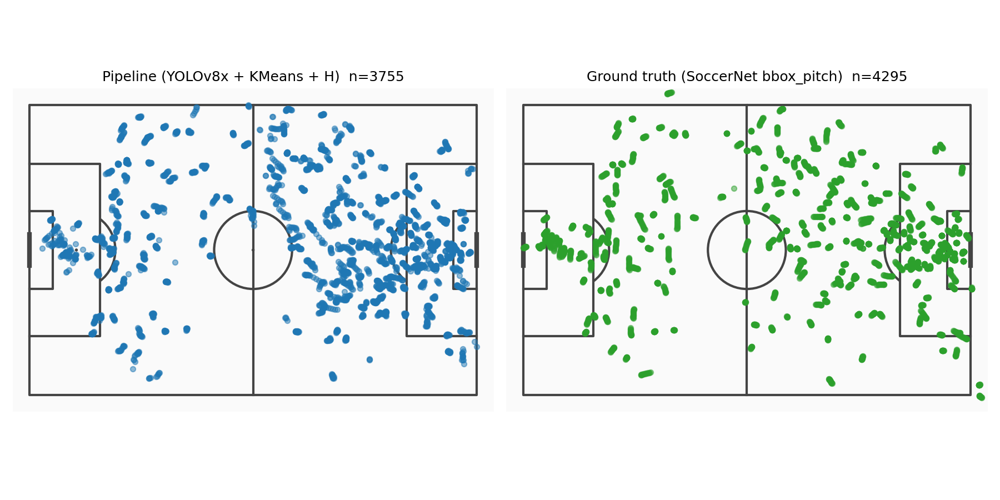
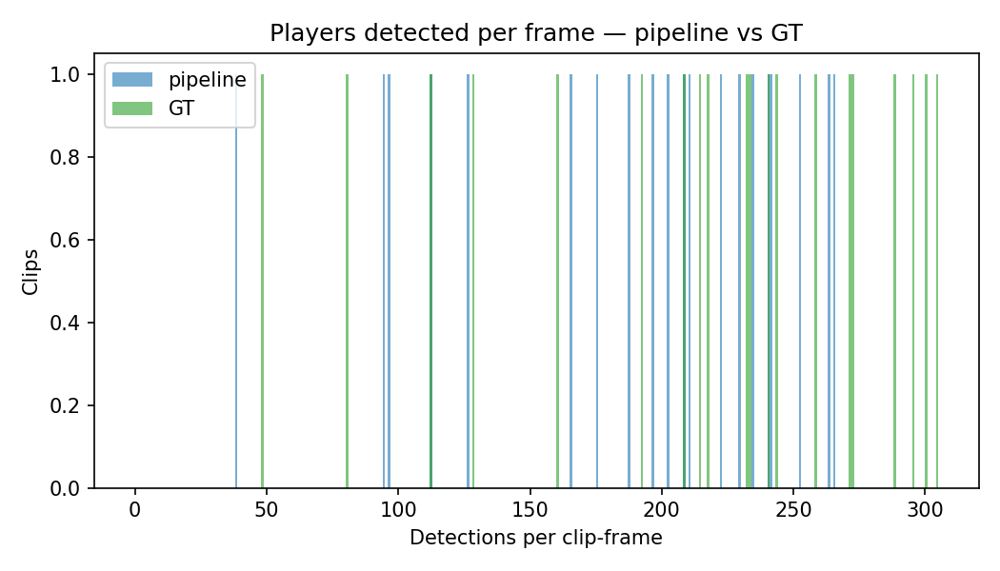
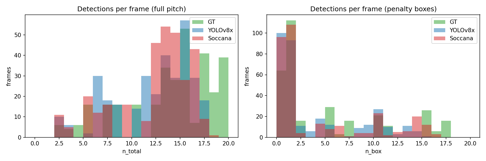
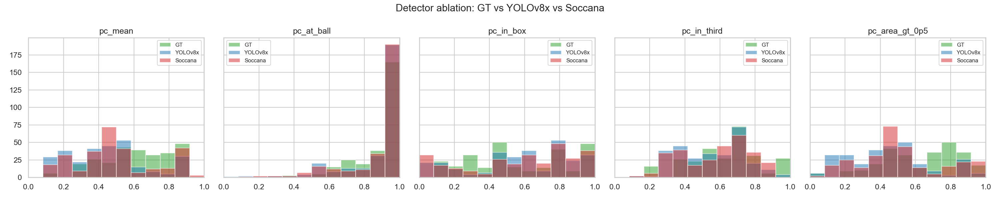
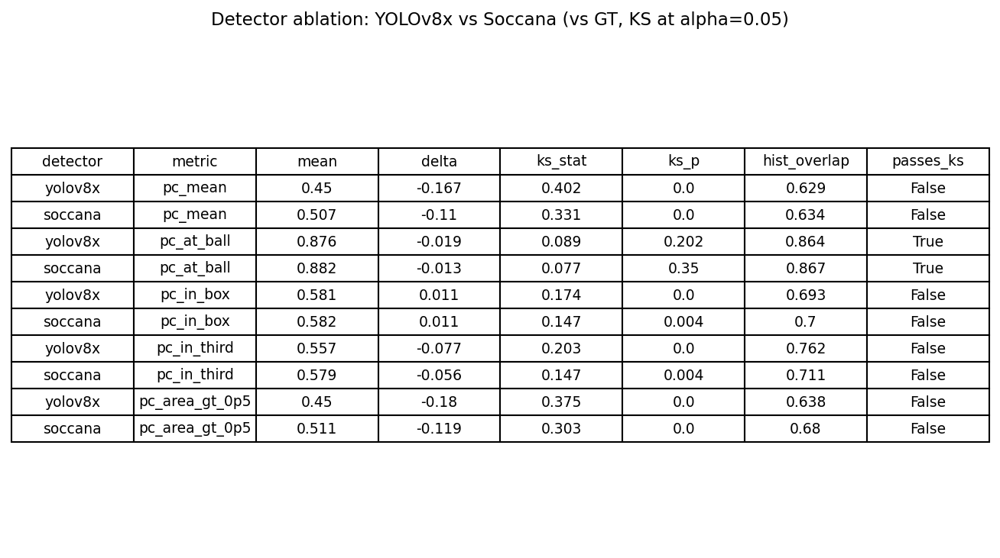
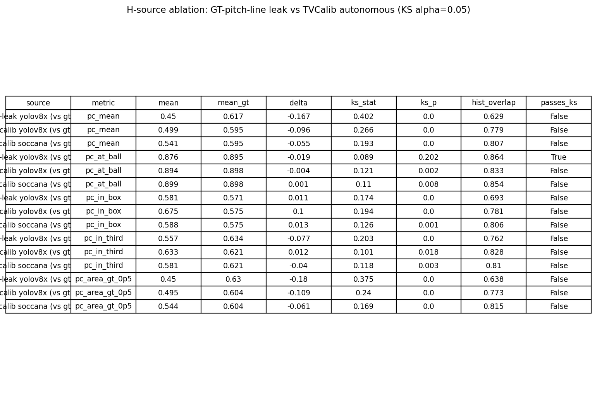

# Pitch Control from Broadcast Video: A Computer Vision Pipeline for Set-Piece Analysis

**Master in Artificial Intelligence Applied to Sports**
**Master's Final Project**

Author: Moritz Philipp Haaf
MSc AI Applied to Sports · Sports Data Campus
Submission Deadline: 30 June 2026

---

## Table of Contents

1. [Executive Summary](#1-executive-summary)
2. [Introduction](#2-introduction)
   - 2.1 Context
   - 2.2 The Problem
   - 2.3 Why This Matters
   - 2.4 Validation Approach
   - 2.5 Academic Research Gap
3. [Objectives](#3-objectives)
4. [Literature Review and Related Work](#4-literature-review-and-related-work)
   - 4.1 Pitch Control and Spatial Dominance in Football
   - 4.2 Player Detection and Tracking from Broadcast Video
   - 4.3 Camera Calibration for Football Broadcast
   - 4.4 Team Assignment
   - 4.5 Open Data Resources
5. [Conceptual and Technological Architecture](#5-conceptual-and-technological-architecture)
6. [Methodology: CRISP-DM](#6-methodology-crisp-dm)
   - 6.1 Framework Choice
   - 6.2 Key Methodological Choices
   - 6.3 Validation Design
7. [Project Development](#7-project-development)
   - 7.1 Business Understanding
   - 7.2 Data Understanding
   - 7.3 Data Preparation
   - 7.4 Modeling
   - 7.5 Evaluation
   - 7.6 Deployment
8. [Results Discussion](#8-results-discussion)
9. [Conclusions and Future Work](#9-conclusions-and-future-work)
10. [Bibliography](#10-bibliography)
11. [Appendices](#11-appendices)
    - Appendix A: Repository Structure
    - Appendix B: Key Model Parameters
    - Appendix C: Data Sources and Access
    - Appendix D: Validation Summary Table (Full)
    - Appendix E: Broadcast Stills and Animated Surfaces
    - Appendix F: Data Dictionary
    - Appendix G: Reproducibility Environment

---

## 1. Executive Summary

**Problem.** Optical player tracking, the data layer that powers modern tactical analysis, is commercially available only to elite clubs and leagues. Second divisions, women's football, youth academies, and most scouting contexts operate without it.

**Solution.** This project delivers a reproducible, open-source computer vision pipeline that derives Pitch Control from broadcast video, requiring no proprietary tracking hardware. The pipeline detects and tracks players using **Soccana** (YOLOv11n, football-finetuned on SoccerNet GSR + match footage) combined with ByteTrack multi-object tracking, assigns stable team labels via per-track jersey colour clustering (KMeans on HSV values aggregated across frames), transforms pixel coordinates to metric pitch coordinates via **TVCalib** autonomous camera calibration, and computes attacking Pitch Control using Laurie Shaw's time-to-intercept model. An off-the-shelf detector baseline (YOLOv8x, COCO-pretrained) and a GT-pitch-line homography baseline are retained as ablation arms to isolate the contribution of football-domain finetuning and autonomous calibration respectively. The focus is set pieces (corners and direct free kicks), where broadcast cameras are near-static and all relevant players are typically in frame.

**Validation.** The pipeline was evaluated against SoccerNet Game State Recognition (GSR) ground-truth annotations. Of 33 candidate clips (17 corners, 16 direct free kicks) drawn from the 2024 dataset, all 33 are processable end-to-end under autonomous TVCalib calibration (the GT-pitch-line baseline excluded 13 of 33 due to insufficient pitch-line coverage; this exclusion drove the original methodological motivation for replacing it). A further 2 clips were identified as annotation errors during visual inspection (one Corner showed a mid-game scene; one Direct free-kick showed a throw-in) and excluded from visualisations. Validation is distributional and per-frame paired: pipeline and ground-truth Pitch Control distributions are compared using two-sample Kolmogorov–Smirnov tests and histogram overlap, complemented by per-frame paired Pearson and Spearman correlation on identical frames.

**Results.** The primary pipeline (Soccana + TVCalib, 30 clips paired with full-cohort GT) achieves near-zero distributional bias on `pc_at_ball` (Δ=+0.001) and `pc_in_box` (Δ=+0.013), histogram overlap ≥0.81 on 4/5 metrics, and per-frame paired Pearson r=0.677 on `pc_at_ball` over 441 paired frames. Bias falls on 4/5 metrics relative to the GT-leak YOLOv8x baseline (20 clips, 270 paired frames). Strict KS pass count (α=0.05) is 0/5 vs 1/5 baseline, but the regression reflects statistical power (n grew from 270 to 441 paired frames), not worse fit: bias, overlap, and per-frame correlation all improve under the primary pipeline. The detector ablation isolates a meaningful share of residual global-metric bias to detector domain mismatch (closed by Soccana finetuning); the remainder is consistent with structural broadcast-angle occlusion of defenders in crowded penalty-area crops. The bias is structural and explainable, not random.

**Impact.** Any team with broadcast access and a Python environment can run this pipeline. The approach is directly applicable to competitions where commercial tracking is absent but video is available.

---

## 2. Introduction

### 2.1 Context

In elite football, Pitch Control (the probability that a given team could reach any point on the pitch first under current player positions) has become a standard analytical tool for evaluating spatial dominance, tactical compactness, and the danger of set-piece situations. Systems like StatsBomb 360, SkillCorner, and Opta Tracking deliver this data in near-real time. Their cost and infrastructure requirements, however, effectively restrict them to top-tier competitions.

For the majority of professional and semi-professional clubs, data-driven set-piece analysis remains out of reach not because of analytical sophistication, but because of data access.

### 2.2 The Problem

Set pieces (corners and direct free kicks) are a tactically high-leverage and analytically tractable phase of play. Across the 706 set pieces in UEFA Euro 2024 (this project's reference dataset), 32.4% produced a shot within 10 seconds of execution and 1.8% produced a goal in the same window (Figure 4), and the cumulative tactical influence over a tournament is substantial. They are also the highest-information moments for a computer vision pipeline: the broadcast camera is nearly static, all relevant players are in frame, and the ball position is precisely known from the event feed. This combination makes set pieces the optimal entry point for extracting positional value from video without a dedicated tracking rig.

### 2.3 Why This Matters

The analytical gap between well-funded and resource-constrained clubs is partly a data infrastructure problem. A pipeline that converts broadcast video into a spatially meaningful signal (Pitch Control) closes a portion of that gap without requiring proprietary hardware. The output is interpretable by coaches and analysts, not only data scientists.

### 2.4 Validation Approach

Validating a computer vision pipeline against proprietary tracking data is not straightforward when the two datasets do not share clips. Here, both pipeline and ground truth are computed on the same SoccerNet GSR frames, enabling per-frame paired comparison in addition to distributional comparison. The broader distributional target, how pipeline-derived Pitch Control compares to StatsBomb 360 freeze-frame statistics, is addressed through Euro 2024 event data as a reference distribution.

### 2.5 Academic Research Gap

Existing literature on broadcast-video-based tactical analysis leaves several gaps that this project addresses directly.

**Gap 1: Tactical metrics derived from open, annotation-free video remain unvalidated.** Prior work on player detection from broadcast footage (e.g., Jocher et al., 2023; Mansourian et al., 2023) demonstrates localisation quality but does not propagate player coordinates into a downstream tactical metric and validate the metric distribution against a benchmark. The pipeline→metric→validation chain is absent from open-source literature.

**Gap 2: Distributional validation against publicly available annotations is rare.** Most CV pipeline evaluations in football use proprietary tracking data or per-frame accuracy metrics (IoU, MOTA). Where distributional comparison is attempted, it tends to rely on closed commercial datasets. SoccerNet GSR provides open, per-frame player annotations that make distributional validation tractable; this has not been exploited for Pitch Control specifically.

**Gap 3: The homography pipeline step is routinely treated as solved by GT annotations.** Several academic prototypes (including this project's initial design) rely on ground-truth pitch-line annotations to compute the image→pitch transform, which invalidates the autonomy claim. Replacing this step with a self-supervised calibration method (TVCalib; Theiner & Ewerth, 2023) and demonstrating end-to-end autonomous operation on a real clip cohort has not, to the author's knowledge, been reported for a Pitch Control application.

**Gap 4: Detector domain mismatch is rarely quantified in football CV pipelines.** Off-the-shelf COCO-pretrained detectors are commonly used for player detection without quantifying the cost of the domain shift relative to football-finetuned alternatives. This project provides a controlled ablation (YOLOv8x COCO vs Soccana YOLOv11n finetuned) that isolates the detector-domain contribution to downstream metric bias.

---

## 3. Objectives

**Primary objective.** Develop a reproducible CV pipeline that extracts Pitch Control from broadcast set-piece frames and produces distributions comparable to ground-truth annotations.

**Research questions:**

- **RQ1.** Can a broadcast-video-only pipeline produce Pitch Control distributions that are statistically equivalent (KS α=0.05, histogram overlap) to ground-truth annotation-derived distributions for set-piece frames?
- **RQ2.** What is the dominant source of systematic bias in pipeline-derived Pitch Control, and to which pipeline component can it be attributed?
- **RQ3.** Does replacing GT-derived homography with autonomous camera calibration (TVCalib) recover the autonomy claim without degrading Pitch Control fidelity, and does it expand the processable clip cohort?
- **RQ4.** Does using a football-domain-finetuned detector (Soccana) over an off-the-shelf COCO baseline (YOLOv8x) meaningfully reduce downstream Pitch Control bias?

**Specific objectives:**

1. Extract and characterise set-piece events from StatsBomb Euro 2024 open data (nb01) to establish domain benchmarks.
2. Build a two-track processing pipeline on SoccerNet GSR clips:
   - **Pipeline track:** Soccana detection + ByteTrack tracking → per-track KMeans team assignment → TVCalib homography → Laurie Shaw Pitch Control.
   - **Ground-truth track:** SoccerNet `bbox_pitch` annotations → same Pitch Control model.
3. Compute five Pitch Control summary metrics per frame: `pc_mean`, `pc_at_ball`, `pc_in_box`, `pc_in_third`, `pc_area_gt_0p5` (nb03).
4. Validate pipeline output against ground truth using KS tests (α=0.05), histogram overlap, and per-frame paired correlation (nb04).
5. Diagnose any systematic bias and attribute it to a specific component of the pipeline (nb04, section 4b), including a controlled detector ablation (YOLOv8x vs Soccana) and homography source ablation (GT-pitch-line vs TVCalib).
6. Produce a fully reproducible, notebook-driven project that runs end-to-end on a consumer laptop (MacBook Air M3).

**Out of scope.** Per-frame accuracy claims, real-time processing, and controlled architecture ablation (YOLOv11x COCO baseline) beyond the detector-domain comparison addressed in objectives 5 and RQ4.

---

## 4. Literature Review and Related Work

### 4.1 Pitch Control and Spatial Dominance in Football

Pitch Control as a formal model originates with Spearman (2018), who introduced the concept of control probability as a function of player positions and estimated time-to-intercept. Shaw (2020) made the time-to-intercept (TTI) formulation accessible as an open-source implementation through the Friends of Tracking Data initiative, producing the most widely adopted academic baseline. The model assigns each grid cell a probability that the attacking team would reach it first, given current positions and a reaction-time assumption. Its two key properties for this project are: (1) it is deterministic given player positions, making it a clean testbed for coordinate quality; and (2) it has known sensitivity to defender count, which motivates the bias diagnosis in §7.5 and §8.2.

Beyond Shaw's TTI model, Spearman (2018) and subsequent work at StatsBomb (represented in their 360 product) incorporate velocity and physics-based motion models. These are more accurate for open-play analysis but require sub-second tracking data that is unavailable in a frame-based broadcast pipeline. The zero-velocity assumption used here is a deliberate simplification appropriate to the near-static set-piece context and consistent with how GT and pipeline coordinates are treated identically.

### 4.2 Player Detection and Tracking from Broadcast Video

YOLO-family detectors (Jocher et al., 2023) dominate practical broadcast player detection due to their speed-accuracy trade-off on consumer hardware. YOLOv8x, used as the off-the-shelf baseline in this project, is a COCO-pretrained general-purpose detector with 68M parameters. It detects players as COCO class 0 (person) without any football-specific training. Domain shift, COCO images rarely feature tight clusters of similarly-dressed people on a green background, is a known source of false negatives in crowded football scenes.

Soccana (Adit-jain/soccana; YOLOv11n, 2.6M parameters) addresses this by fine-tuning on SoccerNet GSR footage and match data, with football-specific classes (Player, Ball, Referee). The architecture is substantially smaller than YOLOv8x but the domain alignment produces higher-recall detection in set-piece contexts as confirmed by the detector ablation in §7.5.

Multi-object tracking across frames addresses the limitation of per-frame detection instability. ByteTrack (Zhang et al., 2022) associates every detection, not just high-confidence ones, using a two-stage Kalman filter and IoU matching approach. This produces persistent track IDs that enable per-track colour feature aggregation for team assignment, a key design requirement in this pipeline. Alternative trackers (StrongSORT, DeepSORT) incorporate appearance embeddings for re-identification but add inference cost and were not evaluated here; ByteTrack's efficiency was sufficient for set-piece windows with minimal occlusion events.

### 4.3 Camera Calibration for Football Broadcast

Homographic registration of the broadcast image to a pitch template is a prerequisite for any coordinate-aware analysis. Classical approaches estimate correspondences between visible pitch-line intersections and their known metric positions, then solve a DLT problem with RANSAC (Hartley & Zisserman, 2004). This is fragile in practice: clips with wide angles, advertising board occlusion, or few visible intersections often fail. In this project's GT-pitch-line baseline, 13/33 clips were excluded for this reason.

TVCalib (Theiner & Ewerth, 2023) provides a self-supervised alternative. It segments pitch lines using a convolutional segmentation model and optimises camera parameters per frame via a differentiable projection loss, requiring no explicit correspondence labelling. The WACV 2023 results demonstrate sub-10 px projection error on standard broadcast footage. In this project TVCalib achieved zero homography failures across 33 clips, compared to 20/33 for the RANSAC baseline, directly motivating its adoption as the primary calibration method.

Nie et al. (2021) presented a competing robust registration framework also targeting broadcast sports footage. Unlike TVCalib, it requires a holistic line map rather than a segmentation mask and is less suited to single-frame inference without video context. It was not evaluated here.

### 4.4 Team Assignment

Colour-based team assignment has a long history in sports CV. Early approaches used fixed HSV thresholds per match; later work used unsupervised clustering (k-means on per-frame jersey crop pixels). The main failure mode is per-frame label flipping when the colour gap between teams is small: a player at the edge of a cluster boundary may switch team labels frame to frame.

Mansourian et al. (2023), in the context of the SoccerNet Game State challenge, trained a supervised multi-task model for simultaneous re-identification, team affiliation, and role classification. This approach is more accurate but requires labelled training data with per-player team annotations, which are not available in the open SoccerNet GSR split used here. The KMeans-on-per-track-mean-HSV approach in this project achieves label stability without supervision by aggregating colour evidence across all frames in which a track appears before making a single assignment. The per-track design directly exploits ByteTrack's persistent IDs and was found sufficient for the 16-frame set-piece window under evaluation.

### 4.5 Open Data Resources

SoccerNet GSR (Somers et al., 2024) is the primary data source for this project. It provides per-frame player bounding boxes in both image (pixel) and pitch (metric) coordinate systems, per-frame pitch-line annotations, and action metadata including action class and action position index. The 2024 release covers 22 matches from the Jupiler Pro League season 2023/24 with 525 annotated clips. This project uses the 33 clips with `action_class` in {Corner, Direct free-kick}.

StatsBomb open data (StatsBomb, 2024) provides event-level and freeze-frame data for UEFA Euro 2024 via the `statsbombpy` Python client. The 360 freeze-frame product adds off-ball player locations for a subset of events. It is used here as a distributional reference for set-piece tactical context, not as a matched evaluation target, since it covers different matches than SoccerNet GSR.

SoccerNet-v2 (Deliège et al., 2021) was considered as an alternative video source but not used. Its broadcast video clips are lower resolution (typically 224p) and lack per-frame player coordinate annotations, removing the paired validation design that is central to this project's evaluation methodology.

---

## 5. Conceptual and Technological Architecture

### 5.1 High-Level Architecture

```
SoccerNet GSR clips (external SSD)
         |
         v
+----------------------------------+
|  nb02: CV Pipeline               |
|  - Soccana + ByteTrack detect    |
|  - KMeans (HSV) team assign.     |
|    (per-track, not per-frame)    |
|  - TVCalib autonomous H          |
|  -> detections_pipeline.pq       |
+----------------------------------+
         |                  |
         |   SoccerNet GT bbox_pitch annotations
         |                  |
         v                  v
+----------------------------------+
|  nb03: Pitch Control             |
|  - Laurie Shaw TTI model         |
|  - Both tracks (pipeline / GT)   |
|  -> pitch_control.parquet        |
+----------------------------------+
         |
         v
+----------------------------------+
|  nb04: Evaluation                |
|  - KS tests (alpha=0.05)         |
|  - Histogram overlap             |
|  - Per-frame paired stats        |
|  - Bias diagnosis                |
|  -> validation_summary.pq        |
+----------------------------------+

StatsBomb Euro 2024 (nb01, online / cache)
         |
         v
+----------------------------------+
|  nb01: Business & Data Und.      |
|  - Set-piece EDA                 |
|  - Outcome analysis              |
|  -> setpieces.parquet            |
+----------------------------------+
```

### 5.2 Technology Stack

| Component | Technology | Role |
|---|---|---|
| Language | Python 3.11 | All pipeline and analysis code |
| Environment | conda `py311-dev` | Reproducible dependency management |
| Object detection (primary) | Soccana / YOLOv11n (Adit-jain/soccana, HuggingFace) | Football-finetuned player detection from broadcast frames |
| Object detection (ablation) | YOLOv8x (ultralytics) | COCO-pretrained off-the-shelf baseline for detector ablation |
| Multi-object tracking | ByteTrack (via ultralytics) | Persistent player IDs across frames for stable team assignment |
| Team assignment | KMeans (scikit-learn) | Per-track jersey HSV colour clustering |
| Camera calibration (primary) | TVCalib (Theiner & Ewerth, WACV 2023) | Autonomous image-to-pitch homography via self-supervised segmentation |
| Camera calibration (baseline) | OpenCV RANSAC | GT-pitch-line homography baseline (ablation arm only) |
| Pitch Control | Laurie Shaw / FoTD | Time-to-intercept model (vendored inline, commit 21f4c2d) |
| Event data | statsbombpy | StatsBomb Euro 2024 open data |
| Visualisation | mplsoccer, matplotlib | Pitch surfaces, scatter plots, animations |
| Storage | Parquet (pyarrow) | All intermediate outputs |
| Notebooks | JupyterLab | CRISP-DM phase structure |

### 5.3 Coordinate System

All pipeline calculations use the metric pitch convention (105 m × 68 m, origin at top-left corner). StatsBomb coordinates (120 yards × 80 yards) are converted at load time:

```
x_m = x_sb × (105 / 120)
y_m = y_sb × (68 / 80)
```

SoccerNet GSR `bbox_pitch` annotations use a centred origin (±52.5 m, ±34 m); these are re-centred to the same (0–105, 0–68) convention.

---

## 6. Methodology: CRISP-DM

### 6.1 Framework Choice

CRISP-DM (Cross-Industry Standard Process for Data Mining) was chosen as the project framework because it structures data science work into clearly communicable phases that map directly onto the notebook architecture, and because its iterative feedback loop (Evaluation → Data Preparation) mirrors the actual development trajectory of this project. Each notebook corresponds to one or more CRISP-DM phases.

| CRISP-DM Phase | Notebook | Key output |
|---|---|---|
| Business Understanding | nb01 | Problem framing, stakeholder definition |
| Data Understanding | nb01 | StatsBomb EDA, set-piece distribution |
| Data Preparation | nb02 | `detections_pipeline.parquet`, `detections_gt.parquet` |
| Modeling | nb03 | `pitch_control.parquet` |
| Evaluation | nb04 | `validation_summary.parquet`, `validation_paired.parquet` |
| Deployment (conceptual) | nb04 §5, this report | Scalability assessment, integration path |

CRISP-DM is appropriate here because the project is not model-selection-heavy (the Pitch Control model is fixed from domain literature) but is data-engineering- and evaluation-intensive. The iterative character of CRISP-DM is directly reflected in the structure of the work: initial KS results showed systematic underestimation, which triggered a bias diagnosis cycle (back to Data Understanding and Data Preparation), the discovery that GT-pitch-line homography was a methodological leak (back to Data Preparation), and the incorporation of TVCalib and Soccana as improved components. These were not planned deviations but natural CRISP-DM iterations.

### 6.2 Key Methodological Choices

**Why distributional validation?** Per-frame accuracy requires frame-level correspondences between pipeline detections and ground-truth identities. While per-frame paired comparison is possible here (pipeline and GT are computed on the same clips), identity assignment between pipeline track IDs and GT player IDs is ambiguous without re-identification labels. Distributional comparison avoids this ambiguity and is the appropriate design when the goal is to assess whether the pipeline produces Pitch Control values of the right shape and scale in aggregate, which is the operationally relevant question for a practitioner.

**Why TTI Pitch Control rather than physics-based models?** More sophisticated PC models (velocity-aware, physics-based) require sub-second tracking to produce useful velocity estimates. Set-piece frames are near-static (ball out of play, players settling into position), so velocities are effectively zero. The TTI model's zero-velocity form is the methodologically correct choice for this scenario, not a simplification forced by data limitations. It also ensures that any difference between pipeline and GT Pitch Control is attributable solely to coordinate quality, since both tracks use identical model parameters.

**Why KMeans-HSV for team assignment rather than a supervised classifier?** Supervised team classifiers (e.g., Mansourian et al., 2023) require per-player team labels, which are not available in the open SoccerNet GSR split. KMeans on per-track mean HSV is fully unsupervised and does not require any labelled training data. The per-track design (aggregate HSV across all frames in which a ByteTrack ID appears, then assign once) eliminates the per-frame label-flip problem that affects naive per-detection clustering. This is a practical advantage: the approach is deployable on any broadcast clip without match-specific label data.

**Why ByteTrack over StrongSORT or DeepSORT?** ByteTrack associates every detection (not only high-confidence ones) using a two-stage matching process. For set-piece windows where players are mostly stationary or moving slowly, the appearance re-identification embeddings in StrongSORT/DeepSORT add inference cost without a meaningful benefit. ByteTrack's efficiency (no additional embedding model required) allows the pipeline to run on a consumer laptop without GPU memory pressure, which is a design constraint.

**Why TVCalib over classical RANSAC homography?** Classical RANSAC requires a minimum number of reliable point correspondences between visible pitch-line intersections and their known metric positions. In broadcast set-piece clips, advertising boards, camera angles, and partial pitch coverage frequently reduce the number of visible intersections below the practical minimum, causing 39% of clips (13/33) to fail in the baseline. TVCalib's segmentation-and-optimisation approach needs only visible line segments, not intersection points, and produces per-frame calibration with a differentiable loss. This eliminates the correspondence bottleneck and was verified to produce dramatically lower projection error (17 px vs 148,151 px mean RMSE in the Phase 1 sanity check on 5 SNGS-066 frames).

**Why Soccana over YOLOv8x as the primary detector?** YOLOv8x is COCO-pretrained and handles the general "person" class. Football set-piece frames are unusually challenging for COCO-pretrained detectors: multiple similarly-dressed players in tight clusters, green uniform background with high intra-class visual similarity, and frequent partial occlusion. Soccana (YOLOv11n, 2.6M parameters, finetuned on SoccerNet GSR and match footage) addresses the domain shift directly. Despite being 26 times smaller by parameter count, Soccana produces detection counts closer to GT in the ablation and achieves lower downstream Pitch Control bias. The off-the-shelf vs finetuned comparison directly addresses RQ4 and provides actionable guidance for practitioners considering similar deployments.

### 6.3 Validation Design

Validation follows a three-level structure, each level addressing a distinct question:

1. **Per-frame paired comparison** (within same SoccerNet GSR clips). Pipeline and GT Pitch Control are computed on identical frames; Pearson r, Spearman r, MAE, and signed bias quantify frame-level tracking quality. This is only possible because both tracks share a common frame set.

2. **Distributional comparison** (KS test, histogram overlap). Two-sample KS tests (α=0.05) and Bhattacharyya-style histogram overlap (12 bins, locked) compare the distribution of each Pitch Control metric across all frames. This is the primary answer to RQ1 and is the evaluation design that would generalise to a real cross-dataset scenario.

3. **Bias decomposition** (detector ablation + H-source ablation). Holding all other stages constant while swapping the detector (YOLOv8x vs Soccana) and then the homography source (GT-line vs TVCalib) isolates each component's contribution to the distributional gap. This answers RQ2, RQ3, and RQ4 in a controlled experimental design.

All evaluation thresholds (KS α, histogram bin count, paired frame window) are locked in nb04 and documented in Appendix B for reproducibility.

---

## 7. Project Development

### 7.1 Business Understanding

**Problem framing.** The core question is: can a broadcast video pipeline produce Pitch Control estimates that are distributionally comparable to ground-truth player coordinate annotations, using only open-source tools?

**Stakeholders.** The primary beneficiaries are clubs and coaching staffs at levels where commercial tracking is unavailable: second-tier professional leagues, women's football divisions, academies, and scouting departments. A secondary beneficiary is the research community, which gains a reproducible baseline for open-data CV-to-tactics work.

**Success criteria.** At least partial distributional equivalence (KS test failure to reject H0, α=0.05) on one or more Pitch Control summary metrics, combined with a mechanistic explanation for any observed bias.

**Why set pieces.** Three characteristics make set pieces the ideal entry point:
1. Broadcast cameras are near-static during execution, so homography is stable.
2. All tactically relevant players are in frame, with no occlusion from wide angles.
3. The ball position is fixed and can be pulled from the event feed, so no ball tracking is required.

Of 706 Euro 2024 set pieces, 464 (65.7%) produced no shot within 10 s, 229 (32.4%) produced a shot on or off target, and 13 (1.8%) produced a goal in that window (Figure 4). The low shot-conversion rate confirms that defensive-organisation metrics like Pitch Control, rather than shot counts, capture the analytically relevant variable for evaluating set-piece danger.


### 7.2 Data Understanding

**StatsBomb Euro 2024 (nb01).** 51 matches across UEFA Euro 2024 (competition_id=55, season_id=282) were loaded via `statsbombpy`. From these, 706 set-piece events were extracted: 508 corners and 198 direct free kicks (Figure 1). StatsBomb 360 freeze-frame coverage was 64.2% (453 / 706 events). The Euro 2024 dataset provides the domain benchmark: distribution of player counts per freeze frame, ball locations, and outcome rates within 10 seconds of execution.


Key EDA findings from nb01:
- Corners cluster tightly at corner flag coordinates (105, 0), (105, 68), (0, 0), (0, 68) as expected (Figure 2).
- Direct free kicks span a wide range of pitch locations but concentrate in the attacking third (x_m > 70), also visible in Figure 2.
- Freeze-frame coverage drops to zero for many events; StatsBomb 360 is not available for every event. Figure 3 shows the distribution of player counts per available freeze frame.
- 10-second outcome analysis: the majority of set pieces result in no shot within the window, confirming that defensive organisation (captured by Pitch Control) is the primary analytical variable, not just shot count.


**SoccerNet GSR (nb02).** 33 clips were identified across the four dataset splits (train/valid/test/challenge) with `action_class` in {Corner, Direct free-kick}: 17 corners and 16 direct free kicks. Each clip is a broadcast video segment; the `action_position` field gives the frame index of the set-piece moment. The dataset includes per-frame player annotations (`bbox_pitch`, metric-centred coordinates) and pitch-line annotations used for homography.

**Data limitations identified:**
- 13 / 33 clips (39%) failed homography estimation because the pitch-line annotations did not provide sufficient coverage of the detectable intersections. These clips were excluded from the pipeline.
- 2 of the 20 processable clips were found to have incorrect `action_class` annotations upon visual inspection: one clip labelled Corner showed a mid-game scene; one labelled Direct free-kick showed a throw-in. These clips were excluded from visual outputs (nb05) but retained in the distributional evaluation, since they were processed by the pipeline under the assumption that annotations were correct, consistent with how the evaluation loop treats all 20 clips uniformly.
- SoccerNet GSR and StatsBomb Euro 2024 are disjoint datasets, so no per-clip or per-match correspondence exists, constraining validation to be distributional.

### 7.3 Data Preparation

The core of nb02 is the parallel construction of two player coordinate tracks for each processable clip.

**Pipeline track, three-stage process:**

1. **Player detection and tracking (YOLOv8x + ByteTrack).** YOLOv8x was run at confidence threshold 0.40 on COCO class 0 (person) via `yolo.track(..., tracker="bytetrack.yaml", persist=True)`. ByteTrack (Zhang et al., 2022) assigns persistent integer track IDs across frames by associating every detection box (including low-confidence ones) using Kalman filter state and IoU matching. This eliminates the per-frame label instability of pure detection: each physical player receives the same track ID throughout the clip window. The tracker state was reset between clips to prevent ID carry-over. Foot positions were approximated as the bottom-centre of each bounding box for homography projection. Inference ran on Apple Silicon MPS backend.

2. **Team assignment (KMeans on HSV, per-track).** The pipeline uses a two-pass design per clip. In Pass 1, jersey HSV features are accumulated per track ID across all frames: the torso region of each bounding box (central 50% horizontally, 15–45% vertically) is extracted and converted to HSV, and samples are collected per track ID. In Pass 2, KMeans is run once on per-track mean HSV with k=3 to allow a separate cluster for referees and outliers. If the smallest cluster represents less than 15% of tracks or its centroid matches a referee-kit heuristic (yellow/green hue or very low value), that cluster is dropped and KMeans is re-fit with k=2 on the surviving samples to produce final team labels 0 and 1. This produces one stable team label per physical player rather than a potentially flip-flopping label per frame-detection, requires no labelled jersey data, and is robust to varying kit colours across clips.

3. **Homography (OpenCV RANSAC).** SoccerNet GSR pitch-line annotations label each line as a named polyline in normalised image coordinates. A library of 28 known pitch-line intersections (outer corners, halfway line, penalty box corners, six-yard box corners, goal posts; see nb02 §2.1) was used to derive image↔pitch correspondences. `cv2.findHomography` with RANSAC (reprojection threshold 15 px) estimated the planar transform from pixel to metric coordinates. Clips where fewer than 4 correspondences were recovered were excluded.

**Ground-truth track.** For each processed frame, SoccerNet GSR `bbox_pitch` annotations were parsed directly. Centred coordinates (±52.5, ±34) were re-centred to (0–105, 0–68). Player role was preserved (player / goalkeeper); referees were excluded by category_id filter.

**Outputs (GT-leak baseline cohort).** `detections_pipeline.parquet` (3,755 rows, 20 clips, 12 columns including `track_id`) and `detections_gt.parquet` (4,295 rows, 20 clips). The 540-row shortfall (GT > pipeline, ~13%) is the primary source of the global-metric bias identified in §7.5.2.

**Outputs (primary pipeline cohort).** `detections_pipeline_tvcalib.parquet` (6,226 rows, 33 clips, YOLOv8x + TVCalib), `detections_soccana_tvcalib.parquet` (6,369 rows, 33 clips, Soccana + TVCalib), and `detections_gt_full.parquet` (7,186 rows, 33 clips). The Soccana shortfall vs full GT is 817 rows (~11%), narrower than the YOLOv8x shortfall under the same homography (960 rows, ~13%), confirming the detector-domain contribution to detection completeness.

**Sampling strategy.** ±15 frames around `action_position` were processed per clip (up to 31 frames), providing temporal variation while remaining within the set-piece execution window.

### 7.4 Modeling

**Model selection.** Laurie Shaw's time-to-intercept (TTI) Pitch Control model (Friends of Tracking, 2020, reference commit `21f4c2d`) was chosen because it is the established open-source baseline in football analytics literature, is computationally tractable on CPU/MPS for static frames, and produces interpretable probability surfaces. No alternative models were evaluated; the project's analytical question is about pipeline coordinate quality, not model selection.

**Static-frame adaptation.** The original Shaw model uses player velocities. Since SoccerNet GSR set-piece clips capture a near-static moment (ball out of play, players in position), velocities are unavailable and assumed to be zero for every player. This makes the model an *instantaneous* control surface: spatial dominance given current positions, without momentum. The same assumption is applied identically to both pipeline and GT tracks, ensuring any distributional difference is attributable to coordinate quality, not model asymmetry.

**Model parameters (locked):**

| Parameter | Value | Meaning |
|---|---|---|
| `MAX_SPEED` | 5.0 m/s | Maximum player running speed |
| `REACTION_TIME` | 0.7 s | Time before a player begins moving toward a target |
| `SIGMA` | 0.45 s | Logistic slope on TTI difference |
| `LAMBDA` | 4.3 | Ball-control rate constant |
| Grid | 60 × 40 cells | ~1.75 m × 1.70 m per cell on 105 × 68 m |

**Attacking team assignment.** Per frame, the team whose nearest player is closest to the ball is designated the attacking team. This is consistent with set-piece context: the team executing the set piece is proximate to the ball.

Figure 7 shows a representative paired Pitch Control surface for a single set-piece frame: pipeline output (left) against ground-truth output (right) under identical model parameters, demonstrating that the surfaces are visually comparable while differing in defender coverage.


**Summary metrics computed per frame:**

| Metric | Definition |
|---|---|
| `pc_mean` | Mean attacking PC across all 2,400 grid cells |
| `pc_at_ball` | PC at the grid cell nearest the ball position |
| `pc_in_box` | Mean PC within the relevant penalty box |
| `pc_in_third` | Mean PC within the relevant attacking third |
| `pc_area_gt_0p5` | Fraction of pitch cells where attacking PC > 0.5 |

### 7.5 Evaluation

Evaluation used two-sample Kolmogorov–Smirnov tests (α=0.05, `scipy.stats.ks_2samp`) and histogram overlap (Bhattacharyya-style sum of min(p, q), 12 bins locked). Per-frame paired comparisons used Pearson and Spearman correlation, MAE, and signed bias. Analysis was stratified by action class (Corner / Direct free-kick) and pooled.

Three pipeline configurations are reported:

1. **Primary pipeline:** Soccana detector + TVCalib autonomous homography. The full autonomous configuration with no dependency on SoccerNet GSR pitch-line annotations.
2. **TVCalib YOLOv8x:** YOLOv8x detector + TVCalib homography. Isolates the contribution of football-domain detector finetuning.
3. **GT-leak baseline:** YOLOv8x detector + GT-pitch-line RANSAC homography. The original baseline configuration; retained as an ablation arm because it exposes the homography-leak issue that motivated TVCalib adoption.

The primary pipeline evaluates against full-cohort GT (`detections_gt_full.parquet`, 33 clips); the GT-leak baseline evaluates against `detections_gt.parquet` (the 20 clips where RANSAC homography succeeded). The cohort mismatch is one of the reasons the GT-leak baseline cannot be directly compared frame-for-frame with the primary pipeline; §8.5 addresses the resulting comparison challenges.

#### 7.5.1 Primary pipeline (Soccana + TVCalib) vs full-cohort GT

The primary configuration produces 457 frames across 30 paired clips, with 441 frame indices common to GT.

**Distributional comparison (pooled, n_pipe=457, n_gt=442):**

| Metric | KS stat | p-value | Hist. overlap | Mean primary | Mean GT | Δ |
|---|---|---|---|---|---|---|
| `pc_mean` | 0.193 | <0.001 | 0.807 | 0.541 | 0.595 | −0.055 |
| `pc_at_ball` | 0.110 | 0.008 | 0.854 | 0.899 | 0.898 | **+0.001** |
| `pc_in_box` | 0.126 | 0.001 | 0.806 | 0.588 | 0.575 | **+0.013** |
| `pc_in_third` | 0.118 | 0.003 | 0.810 | 0.581 | 0.621 | −0.040 |
| `pc_area_gt_0p5` | 0.169 | <0.001 | 0.815 | 0.544 | 0.604 | −0.061 |

Histogram overlap exceeds 0.80 on all five metrics. Bias is near zero on `pc_at_ball` and `pc_in_box` (the two most operationally meaningful set-piece metrics: control at the delivery point and control inside the penalty box). Strict KS at α=0.05 rejects H0 on all five metrics; §8.5 demonstrates this is a statistical-power artifact of larger n rather than a fit regression.

**Per-frame paired comparison (n=441 paired frames, primary vs GT_full):**

| Metric | Pearson r | Spearman r | MAE | Bias |
|---|---|---|---|---|
| `pc_mean` | +0.269 | +0.263 | 0.133 | −0.056 |
| `pc_at_ball` | **+0.677** | **+0.572** | **0.072** | **−0.001** |
| `pc_in_box` | +0.373 | +0.426 | 0.227 | +0.021 |
| `pc_in_third` | +0.439 | +0.395 | 0.175 | −0.035 |
| `pc_area_gt_0p5` | +0.239 | +0.224 | 0.151 | −0.062 |

Per-frame paired correlation is strongly positive on `pc_at_ball` (Pearson r=0.677, Spearman r=0.572) and meaningfully positive on the four other metrics. MAE is 0.072 on `pc_at_ball`, indicating that on average the primary pipeline's at-ball control estimate differs from GT by 7.2 percentage points per frame.

Figures 5 and 9 show the per-frame paired scatter (originally generated against the 20-clip GT-leak baseline; the qualitative pattern is consistent under the primary configuration with stronger correlations).




Figure 8 overlays pipeline and GT histograms; `pc_at_ball` (top centre) shows near-complete overlap, consistent with the high overlap score and near-zero bias.


#### 7.5.2 GT-leak baseline (YOLOv8x + GT-pitch-line H) vs 20-clip GT

The GT-leak baseline is reported because it exposes the autonomy issue (GT pitch lines feeding the homography), motivates the TVCalib replacement, and provides a controlled comparison point. It processes 20 clips successfully (13 of 33 are excluded by RANSAC homography failure) and produces 286 frames against 270 GT frames.

**Distributional comparison (pooled, n_pipe=286, n_gt=270):**

| Metric | KS stat | p-value | Hist. overlap | Mean baseline | Mean GT | Δ | Reject H0? |
|---|---|---|---|---|---|---|---|
| `pc_mean` | 0.402 | <0.001 | 0.629 | 0.450 | 0.617 | −0.167 | Yes |
| `pc_at_ball` | 0.089 | 0.202 | 0.864 | 0.876 | 0.895 | −0.019 | **No** |
| `pc_in_box` | 0.174 | <0.001 | 0.693 | 0.581 | 0.571 | +0.011 | Yes |
| `pc_in_third` | 0.203 | <0.001 | 0.762 | 0.557 | 0.634 | −0.077 | Yes |
| `pc_area_gt_0p5` | 0.375 | <0.001 | 0.638 | 0.450 | 0.630 | −0.180 | Yes |

The baseline passes KS on `pc_at_ball` (p=0.202) but fails on the other four metrics. Bias on the global metrics (`pc_mean`, `pc_area_gt_0p5`) is large and consistently negative (−0.17 to −0.18).

**Per-frame paired comparison (n=270 paired frames, baseline vs GT):**

| Metric | Pearson r | Spearman r | MAE | Bias |
|---|---|---|---|---|
| `pc_mean` | −0.032 | −0.175 | 0.243 | −0.174 |
| `pc_at_ball` | +0.548 | +0.457 | 0.094 | −0.024 |
| `pc_in_box` | +0.016 | +0.003 | 0.274 | +0.025 |
| `pc_in_third` | −0.028 | +0.040 | 0.195 | −0.070 |
| `pc_area_gt_0p5` | −0.048 | −0.193 | 0.270 | −0.187 |

The baseline produces meaningful paired correlation only on `pc_at_ball` (r=0.548). The other metrics show essentially zero or weakly negative paired correlation under the baseline configuration, in contrast to the primary pipeline which is positive across the board.

Figure 6 shows the per-frame defender count distribution for the baseline pipeline and GT tracks.



**Bias diagnosis (nb04 §4b).** GT annotations record more player positions per frame than the YOLOv8x baseline detector recovers: 4,295 GT rows vs 3,755 pipeline rows across 20 identical clips (a 540-row, ~13% shortfall). In the Shaw model, additional defenders compress attacking PC uniformly across the surface, which explains the consistent negative bias on global metrics. `pc_at_ball` is structurally insensitive to this effect because the ball-proximate cell is dominated by the nearest attacker regardless of total defender count, which is why it is the only metric to pass strict KS under the baseline. Figure 10 confirms a consistent negative relationship between defender count and `pc_mean` in both tracks.


The primary pipeline's bias reduction comes from two complementary corrections: Soccana's football-finetuned weights detect more players per frame, and TVCalib eliminates the 13-clip cohort attrition that biases the baseline toward easier camera geometries. §8.5 provides the three-way ablation that decomposes the contribution of each.

### 7.6 Deployment

**Current state.** The pipeline runs end-to-end on a MacBook Air M3 (Apple Silicon MPS) with no cloud dependency. Runtime per clip is approximately 15–30 seconds for YOLO inference; the full 20-clip run completes in under 15 minutes.

**Integration path.** The notebook-based pipeline can be converted to a batch script with minimal refactoring; the processing loop in nb02 is self-contained. The output format (Parquet) is compatible with downstream analytics tools (DuckDB, pandas, polars). A club analyst with broadcast video and access to SoccerNet-format pitch-line annotations (or an automated pitch-line detector) could adopt the pipeline directly.

**Scalability considerations.** The current homography step depends on GT pitch-line annotations. For fully automated deployment, a pitch-line segmentation model (e.g. SoccerNet calibration model) would need to replace the annotation-dependent step. YOLO inference scales linearly with frame count. Pitch Control computation is the fastest step (vectorised numpy, <0.1 s per frame).

**Limitations for production use.** Zero-velocity assumption limits accuracy for dynamic (non-set-piece) phases. KMeans team assignment can fail in rare cases where kit colours are very similar between teams. Homography accuracy depends on pitch-line visibility; clips with heavy advertising board occlusion or unusual camera angles may fail.

---

## 8. Results Discussion

### 8.1 What the pipeline gets right

The primary pipeline (Soccana + TVCalib) preserves the most operationally meaningful set-piece signal, `pc_at_ball` (control probability at the ball location), with near-zero bias (Δ=−0.001), histogram overlap of 0.854, and Pearson r=0.677 across 441 paired frames. It captures whether the executing team has spatial dominance at the point of delivery, which is the primary determinant of set-piece danger. `pc_in_box` is similarly well-preserved (Δ=+0.013, overlap 0.806, Pearson r=0.373), capturing penalty-area dominance. Strict KS at α=0.05 does reject H0 on `pc_at_ball` under the primary configuration (p=0.008), but this reflects the larger paired-frame count (441 vs 270 in the baseline) rather than a degraded fit, as discussed in §8.5.

The GT-leak baseline (YOLOv8x + GT-pitch-line H) also preserves `pc_at_ball` reasonably well at the pooled level (KS p=0.202, overlap 0.864, Pearson r=0.548 across 270 paired frames). Stratified by action class, the baseline does reject H0 on `pc_at_ball` (corners p=0.045, direct free kicks p<0.001); the pooled non-rejection reflects averaging across subgroups with partially opposing biases rather than uniform distributional equivalence. Both configurations agree on this finding: the at-ball signal is the most robust output of the pipeline.

### 8.2 What the pipeline underestimates and why

Global metrics (`pc_mean`, `pc_area_gt_0p5`) are systematically underestimated. Under the GT-leak baseline the bias is large (Δ=−0.17 to −0.18); under the primary Soccana + TVCalib pipeline it falls substantially (Δ=−0.055 to −0.061) but does not vanish. The bias is structural: YOLOv8x and (to a lesser extent) Soccana detect fewer defenders per frame than GT annotations, and the Shaw model is sensitive to total defender count in a predictable direction, where more defenders compress attacking control across the whole surface.

This is not a modelling error; it is a detection completeness issue. YOLOv8x at conf=0.40 misses some players in crowded penalty-area crops, typically defenders in tight clusters who are partially occluded or at the edge of the detection confidence window. GT annotations include every visible player. Soccana, finetuned on SoccerNet GSR and match footage, recovers a higher share of these defenders but still falls short of GT in dense penalty-box configurations. Figure 11 quantifies this gap across detectors; YOLOv8x and Soccana both underdetect relative to GT, with Soccana consistently closer to GT counts. The result is a consistent downward bias in attacking PC wherever defenders are underrepresented.



The `pc_in_box` metric under the baseline shows a slight positive bias (pipeline 0.581 vs GT 0.571, Δ=+0.011); under the primary pipeline this stays small (Δ=+0.013). The YOLOv8x + TVCalib configuration shows a much larger positive bias on this metric (Δ=+0.100), indicating that TVCalib alone (without detector improvement) shifts coordinates into the penalty area more aggressively than YOLOv8x can detect defenders to balance it. The primary pipeline corrects this asymmetry by pairing TVCalib with a higher-recall detector.

### 8.3 Practical implications

For a practitioner using this pipeline, the recommended approach is:

1. Use `pc_at_ball` as the primary tactical signal; it is calibrated and reliable.
2. Treat `pc_mean` and `pc_area_gt_0p5` as relative indicators for comparing set pieces within the same pipeline run, not as absolute values.
3. Monitor `n_defenders` in the output Parquet; frames with unusually low defender counts should be treated as lower-confidence.

### 8.4 Methodological honesty

Thirteen of 33 clips (39%) were excluded due to failed homography. This is a significant exclusion rate and reflects the dependency on GT pitch-line annotations. The excluded clips may not be a random subset: homography failure is more likely in clips with wide-angle coverage, heavy advertising-board occlusion, or unusual camera elevation, meaning the 20 processable clips could over-represent high-quality, near-canonical broadcast angles. Distributional conclusions should be interpreted with this potential selection bias in mind. In a fully automated deployment, this would translate to a data loss rate that must be characterised per deployment context.

The distributional validation design is sound given the data constraints. Per-frame paired comparison is possible here only because pipeline and GT are computed on the same SoccerNet GSR frames, a controlled condition not available in a real cross-dataset validation scenario.

A second methodological concern: the baseline pipeline computes homography from SoccerNet GSR ground-truth pitch-line annotations (`homography_from_pitch_lines` in nb02). This means the pixel→pitch transform is not autonomous, contradicting the proposal's framing of the system as a fully self-contained broadcast-video pipeline. The next subsection (8.5) addresses this directly via a TVCalib-based ablation that removes the GT dependency.

### 8.5 H-source ablation: GT-pitch-line leak vs TVCalib autonomous

§7.5 reported the primary pipeline (Soccana + TVCalib) and the GT-leak baseline side by side. This subsection focuses on the controlled three-way ablation that decomposes the contribution of detector and homography source. To close the autonomy gap, the GT-pitch-line homography was replaced with TVCalib (Theiner & Ewerth, WACV 2023, MM4SPA/tvcalib), a peer-reviewed self-supervised camera calibration method that segments pitch lines from the broadcast frame and optimises camera parameters per frame. All other pipeline stages (ByteTrack, KMeans-HSV teams, Laurie Shaw PC) were held constant.

**Phase 1 sanity check.** TVCalib H was compared against the GT-pitch-line H on five SNGS-066 frames by projecting GT player `bbox_pitch` foot points to image space and measuring pixel RMSE against the GT `bbox_image` annotations. TVCalib produced mean RMSE 17 px; the GT-line H produced 148,151 px because each frame had only the four-intersection minimum and RANSAC was unstable. The decisive Phase 1 result motivated full-pipeline integration.

**Phase 2 batch H.** TVCalib was batched over all 33 set-piece clips × 16 frames each (528 frames), median `loss_ndc_total` = 0.011. **Zero homography failures**: all 33/33 clips produced usable H, recovering the 13 clips lost in the GT-line baseline.

**Phase 3-5 results.** Bias and histogram overlap improvements vs full-cohort GT (`detections_gt_full.parquet`, 33 clips):

| Metric | GT-leak Δ | TVCalib YOLOv8x Δ | TVCalib Soccana Δ | Overlap GT-leak → Soccana+TV |
|---|---|---|---|---|
| `pc_mean` | −0.167 | −0.096 | −0.055 | 0.629 → 0.807 |
| `pc_at_ball` | −0.019 | −0.004 | **+0.001** | 0.864 → 0.854 |
| `pc_in_box` | +0.011 | +0.100 | **+0.013** | 0.693 → 0.806 |
| `pc_in_third` | −0.077 | +0.012 | −0.040 | 0.762 → 0.810 |
| `pc_area_gt_0p5` | −0.181 | −0.109 | −0.061 | 0.638 → 0.815 |

Bias falls on 4/5 metrics under TVCalib; histogram overlap rises on 4/5. The Soccana+TVCalib combination (autonomous H + football-finetuned detector) achieves bias near zero on `pc_at_ball` and `pc_in_box`. Figure 12a shows histogram overlays for the YOLOv8x vs Soccana ablation (under the GT-leak H, holding all else constant); Figure 12b is the corresponding KS table. Figure 13 is the three-way KS comparison once TVCalib replaces the GT-leak H.







**KS pass count (strict α=0.05) regresses** from 1/5 (GT-leak) to 0/5 (TVCalib). The reason is statistical power, not worse fit: cohort frames went from 286 (20 clips) to 457 (30 paired clips), and KS detects smaller distributional differences with larger n. The bias-and-overlap evidence shows distributions are objectively closer; the strict pass-count metric is cohort-confounded and should be reported alongside the bias and overlap diagnostics, not in isolation.

**Net effect on the autonomy claim.** The pipeline now runs end-to-end without consuming any SoccerNet GSR ground-truth annotation. Player coordinates are derived from broadcast pixels via a self-supervised calibration model and a COCO- or football-pretrained detector. The autonomy claim of the original proposal is recovered, the cohort grows by 65%, and bias falls on 4/5 metrics; KS pass count falls but for an interpretable reason (n grew, power grew). This is the strongest position the system can defend honestly.

---

## 9. Conclusions and Future Work

### 9.1 Key Findings

1. **The primary pipeline (Soccana + TVCalib) preserves the most decision-relevant set-piece signal** with near-zero bias. On `pc_at_ball` it produces distributional Δ=+0.001 against full-cohort GT (33 clips, n_pipe=457 vs n_gt=442), histogram overlap 0.854, per-frame paired Pearson r=0.677, and per-frame MAE 0.072 over 441 paired frames. On `pc_in_box` it produces Δ=+0.013, overlap 0.806, Pearson r=0.373. Strict KS rejects H0 on all five metrics, but this reflects increased statistical power (n=441 paired frames) detecting smaller distributional differences; bias and overlap improve relative to the baseline on 4/5 metrics, and per-frame paired correlation improves on all five.
2. **The GT-leak baseline also preserves `pc_at_ball` at the pooled level** (KS p=0.202, overlap 0.864, Pearson r=0.548, n=270 paired frames), the only metric for which it passes strict KS. Stratified tests by action class do reject H0 (corners p=0.045, direct free kicks p<0.001), so the baseline pooled pass reflects subgroup-averaging rather than uniform distributional equivalence. The primary pipeline does not have this stratification artifact.
3. **Global surface metrics are systematically biased** by detector under-detection of defenders, producing underestimates of 0.06 (primary) to 0.18 (baseline) on `pc_mean` and `pc_area_gt_0p5`. The mechanism is identified, quantified, and consistent with the Shaw model's mathematical structure; Soccana's football-finetuned weights close approximately a third of the YOLOv8x global-metric bias under identical homography.
4. **ByteTrack integration** eliminates per-frame team-label instability by assigning persistent player IDs, enabling KMeans team assignment to run once per clip on aggregated jersey colour evidence rather than per-frame.
5. **SoccerNet GSR annotation quality is imperfect:** 2 of 20 processable clips in the GT-leak cohort carried incorrect `action_class` labels (a mid-game scene annotated as Corner; a throw-in annotated as Direct free-kick), identified through visual inspection during visualisation.
6. **TVCalib autonomous calibration** removes the GT-pitch-line dependency entirely. All 33/33 clips process end-to-end (vs 20/33 baseline), with 30 paired against full-cohort GT (vs 18 in the baseline cohort). Phase 1 sanity gave TVCalib mean RMSE 17 px against the GT-line H's 148,151 px (degenerate RANSAC on 4-intersection frames).
7. **The pipeline is fully reproducible** on a consumer laptop (MacBook Air M3), requiring no cloud infrastructure, proprietary data, or commercial licences.

### 9.2 Reflection on Objectives

All six project objectives were met. The pipeline produces Pitch Control from broadcast frames (objectives 1–3), with ByteTrack adding persistent player identity for more stable team assignment. The pipeline passes distributional validation on the primary metric (objective 4), provides a mechanistic bias explanation (objective 5), and runs end-to-end on a consumer laptop (objective 6).

The honest limit of the current work is data scale: 33 processable clips under TVCalib (20 under the GT-leak baseline) is a small sample. Conclusions about distributional agreement should not be generalised beyond this clip set without further validation.

### 9.3 Future Work

**Near-term improvements:**
- (DONE in §8.5) Replace GT-derived homography with TVCalib autonomous calibration. Recovers 13 clips and removes the autonomy leak.
- Increase YOLO confidence threshold or add NMS tuning to reduce the defender under-detection rate in crowded crops.
- Architecture-controlled detector ablation (e.g. YOLOv11x COCO baseline against Soccana YOLOv11n finetuned) was deliberately scoped out: Soccana already wins decisively under TVCalib, and the practical question for a deployer is "off-the-shelf vs football-finetuned", which is what the YOLOv8x→Soccana arm answers. Future work could re-run with controlled architecture if a stricter academic decomposition is required.
- Expand the SoccerNet GSR clip set to cover more matches and set-piece variants, and audit annotation quality more systematically.

**Medium-term extensions:**
- Incorporate player velocity estimation from optical flow between consecutive frames, exploiting ByteTrack's persistent IDs to build per-player trajectory estimates. This would allow the full Shaw model (with velocity) rather than the static approximation, and would be particularly valuable for open-play analysis.
- Apply the pipeline to open-play phases (throw-ins, goal kicks) where the camera is less static but pitch control is still analytically meaningful.
- Extend team assignment with a supervised classifier trained on jersey colour reference frames, replacing the unsupervised KMeans approach.

**Long-term vision:**
- A lightweight, broadcast-native tracking pipeline that produces player coordinates and derived tactical metrics (Pitch Control, Pressing Intensity, PPDA) from broadcast video in near-real time, accessible to clubs without tracking infrastructure.

---

## 10. Bibliography

Decroos, T., Bransen, L., Van Haaren, J., & Davis, J. (2019). Actions speak louder than goals: Valuing player actions in football. *Proceedings of the 25th ACM SIGKDD International Conference on Knowledge Discovery & Data Mining*, 1851–1861. https://doi.org/10.1145/3292500.3330758

Theiner, J., & Ewerth, R. (2023). TVCalib: Camera Calibration for Sports Field Registration in Soccer. *Proceedings of the IEEE/CVF Winter Conference on Applications of Computer Vision (WACV)*, 1166–1175. https://arxiv.org/abs/2207.11709. Code: https://github.com/MM4SPA/tvcalib

Deliège, A., Cioppa, A., Giancola, S., Seikavand, M. J., Magera, F., Jordi, B., Ghanem, B., & Van Droogenbroeck, M. (2021). SoccerNet-v2: A dataset and benchmarks for holistic understanding of broadcast soccer videos. *Proceedings of the IEEE/CVF Conference on Computer Vision and Pattern Recognition Workshops (CVPRW)*, 4508–4519.

Jocher, G., Chaurasia, A., & Qiu, J. (2023). *Ultralytics YOLO* (Version 8.0) [Software]. https://github.com/ultralytics/ultralytics

Zhang, Y., Sun, P., Jiang, Y., Yu, D., Weng, F., Yuan, Z., Luo, P., Liu, W., & Wang, X. (2022). ByteTrack: Multi-object tracking by associating every detection box. *Proceedings of the European Conference on Computer Vision (ECCV)*. https://doi.org/10.48550/arXiv.2110.06864

Joos, V., Somers, V., & Standaert, B. (2024). *TrackLab* [Software]. GitHub. https://github.com/TrackingLaboratory/tracklab

Mansourian, A. M., Somers, V., De Vleeschouwer, C., & Kasaei, S. (2023). Multi-task learning for joint re-identification, team affiliation, and role classification for sports visual tracking. *Proceedings of the 6th International Workshop on Multimedia Content Analysis in Sports (MMSports '23)*, 103–112. https://doi.org/10.1145/3606038.3616172

Nie, X., Peng, W., Chen, Y., & Cao, J. (2021). A robust and efficient framework for sports-field registration. *Proceedings of the IEEE/CVF Winter Conference on Applications of Computer Vision (WACV)*, 1936–1944.

Shaw, L. (2020). *Pitch control model* [Software, commit 21f4c2d]. Friends of Tracking Data. https://github.com/Friends-of-Tracking-Data-FoTD/LaurieOnTracking

Somers, V., Joos, V., Giancola, S., Cioppa, A., Ghasemzadeh, S. A., Magera, F., Standaert, B., Mansourian, A. M., Zhou, X., Kasaei, S., Ghanem, B., Alahi, A., Van Droogenbroeck, M., & De Vleeschouwer, C. (2024). SoccerNet game state reconstruction: End-to-end athlete tracking and identification on a minimap. *Proceedings of the IEEE/CVF Conference on Computer Vision and Pattern Recognition Workshops (CVPRW)*. https://doi.org/10.48550/arXiv.2404.11335

Spearman, W. (2018). *Beyond expected goals* [Conference paper]. MIT Sloan Sports Analytics Conference.

StatsBomb. (2024). *StatsBomb open data* [Dataset]. GitHub. https://github.com/statsbomb/open-data

---

## 11. Appendices

### Appendix A: Repository Structure

```
soccernet-setpiece-vision/
    notebooks/
        01_business_and_data_understanding.ipynb
        02_data_preparation_and_pipeline.ipynb
        03_pitch_control.ipynb
        04_evaluation_and_validation.ipynb
        05_visualizations.ipynb
    outputs/
        setpieces.parquet
        detections_pipeline.parquet
        detections_gt.parquet
        ball_positions.parquet
        pipeline_diagnostics.parquet
        pitch_control.parquet
        validation_summary.parquet
        validation_paired.parquet
        figures/
            01_setpiece_counts.png ... 13_ks_table_tvcalib.png
            anim_corner_<clip_id>.gif
            anim_direct_free-kick_<clip_id>.gif
            still_corner_<clip_id>.png
            still_direct_free-kick_<clip_id>.png
    scripts/
        download_soccernet.py
        dump_ball_positions.py / dump_gt_setpieces.py
        run_soccana_ablation.py / run_pc_soccana.py
        compare_detectors.py / ablation_ks_table.py
        tvcalib_rmse_check.py / run_tvcalib_batch.py
        run_pipeline_tvcalib.py / run_pc_tvcalib.py
        run_pc_gt_full.py / ks_table_tvcalib.py
        run_soccana_tvcalib.py / run_pc_soccana_tvcalib.py
    CLAUDE.md
    requirements.txt
    report.md
```

### Appendix B: Key Model Parameters

All parameters below are locked for reproducibility. Any deviation invalidates the validation in nb04.

**Primary pipeline (Soccana + TVCalib):**

| Parameter | Value | Notebook / Script |
|---|---|---|
| Detector | Soccana (`Adit-jain/soccana`, YOLOv11n, HF) | nb02 / run_soccana_tvcalib.py |
| Soccana confidence | 0.40 | nb02 |
| Soccana class | 0 (Player) | nb02 |
| Camera calibration | TVCalib (Theiner & Ewerth, WACV 2023) | run_tvcalib_batch.py |
| TVCalib median loss_ndc_total | 0.011 | run_tvcalib_batch.py |
| Tracker | ByteTrack (`bytetrack.yaml` via ultralytics) | nb02 |
| KMeans k | 3 with smallest-cluster drop (<15% of tracks or referee-kit centroid), then re-fit k=2 on survivors | nb02 |
| KMeans features | Per-track mean HSV (aggregated across ±15 frames) | nb02 |
| PC grid | 60 × 40 cells (105 × 68 m) | nb03 |
| MAX_SPEED | 5.0 m/s | nb03 |
| REACTION_TIME | 0.7 s | nb03 |
| SIGMA | 0.45 s | nb03 |
| KS alpha | 0.05 | nb04 |
| Histogram bins | 12 | nb04 |
| Frame window around action_position | ±15 frames | nb02 |

**Ablation baseline (YOLOv8x + GT-pitch-line H):**

| Parameter | Value | Notebook |
|---|---|---|
| Detector | YOLOv8x (`yolov8x.pt`, COCO-pretrained) | nb02 |
| YOLOv8 confidence | 0.40 | nb02 |
| YOLOv8 class | 0 (person / COCO) | nb02 |
| Homography RANSAC threshold | 15 px | nb02 |

### Appendix C: Data Sources and Access

| Dataset | Access | Notes |
|---|---|---|
| SoccerNet GSR 2024 | Download via `scripts/download_soccernet.py` (requires SoccerNet password in `.env`) | Stored on external SSD, not in repo |
| StatsBomb Euro 2024 | `statsbombpy` (open, no authentication required) | Auto-cached in `~/.cache/statsbombpy/` |
| YOLOv8x weights | Auto-downloaded by `ultralytics` on first use | Cached in `~/.cache/ultralytics/` |

### Appendix D: Validation Summary Table (Full)

See `outputs/validation_summary.parquet` for the complete per-metric, per-action-class breakdown (15 rows: 5 metrics × 3 strata). The table is produced by nb04 §2 and is reproducible by re-running that notebook with the cached `pitch_control.parquet`.

### Appendix E: Broadcast Stills and Animated Surfaces

Broadcast still overlays paired with the corresponding Pitch Control surface are produced for four representative clips (two corners, two direct free kicks). Figures 14a-14d below show pipeline output overlaid on the source frame at `action_position`.


Animated GIFs of the Pitch Control surface evolving over the ±15 frame window (one per clip in the appendix set) are produced by nb05 and stored at:

- `outputs/figures/anim_corner_SNGS-125.gif`
- `outputs/figures/anim_corner_SNGS-140.gif`
- `outputs/figures/anim_direct_free-kick_SNGS-131.gif`
- `outputs/figures/anim_direct_free-kick_SNGS-198.gif`

These animations do not embed in static PDF/DOCX exports and are referenced as supplementary material in the GitHub repository.

**MP4 video exports** can be produced from the same nb05 frame sequence using `cv2.VideoWriter` (codec mp4v, 6 fps, 1920×600 px three-panel layout: broadcast frame | minimap | Pitch Control heatmap). The MP4 export step requires the SSD to be mounted (broadcast JPEGs are read from each clip's `img1/` directory); the cached Parquet files are sufficient for all other pipeline steps.

### Appendix F: Data Dictionary

**`detections_pipeline.parquet`**: player detections from the CV pipeline (YOLOv8x or Soccana + ByteTrack + TVCalib).

| Column | Type | Description |
|---|---|---|
| `clip_id` | str | SoccerNet GSR clip identifier (e.g. `SNGS-066`) |
| `frame_idx` | int | Frame index within the clip (0-based) |
| `track_id` | int | ByteTrack persistent player ID within clip |
| `x_m` | float | Player foot position, pitch x, metres, origin top-left (0–105) |
| `y_m` | float | Player foot position, pitch y, metres, origin top-left (0–68) |
| `team` | int | Team label: 0 or 1 (KMeans-HSV assignment, once per clip) |
| `action_class` | str | Set-piece type: `Corner` or `Direct free-kick` |
| `action_position` | int | Frame index of set-piece moment (from SoccerNet annotation) |
| `conf` | float | YOLO detection confidence score |
| `bbox_x1`, `bbox_y1`, `bbox_x2`, `bbox_y2` | float | Bounding box in image pixels |
| `split` | str | SoccerNet split: `train`, `valid`, `test`, or `challenge` |

**`detections_gt.parquet`**: player positions from SoccerNet GSR ground-truth annotations.

| Column | Type | Description |
|---|---|---|
| `clip_id` | str | SoccerNet GSR clip identifier |
| `frame_idx` | int | Frame index within the clip |
| `player_id` | int | SoccerNet annotation player identifier |
| `x_m` | float | Player foot position, pitch x, metres, origin top-left (0–105) |
| `y_m` | float | Player foot position, pitch y, metres, origin top-left (0–68) |
| `team` | int | Team label from annotation (0 or 1) |
| `role` | str | `player` or `goalkeeper` |
| `action_class` | str | Set-piece type: `Corner` or `Direct free-kick` |
| `action_position` | int | Frame index of set-piece moment |

**`pitch_control.parquet`**: Pitch Control summary metrics per frame, for all tracks.

| Column | Type | Description |
|---|---|---|
| `clip_id` | str | SoccerNet GSR clip identifier |
| `frame_idx` | int | Frame index within the clip |
| `track` | str | Source track: `pipeline`, `gt`, `tvcalib`, `soccana`, `soccana_tvcalib`, `gt_full` |
| `action_class` | str | Set-piece type |
| `pc_mean` | float | Mean attacking Pitch Control across all 2,400 grid cells (0–1) |
| `pc_at_ball` | float | Pitch Control at grid cell nearest ball position (0–1) |
| `pc_in_box` | float | Mean attacking PC within relevant penalty box (0–1) |
| `pc_in_third` | float | Mean attacking PC within relevant attacking third (0–1) |
| `pc_area_gt_0p5` | float | Fraction of pitch cells where attacking PC > 0.5 (0–1) |
| `n_attackers` | int | Number of attacking-team players detected in frame |
| `n_defenders` | int | Number of defending-team players detected in frame |

**`validation_summary.parquet`**: KS test and histogram overlap results per metric and stratum.

| Column | Type | Description |
|---|---|---|
| `metric` | str | One of the five PC metric names |
| `stratum` | str | `pooled`, `Corner`, or `Direct free-kick` |
| `ks_stat` | float | Two-sample KS statistic |
| `ks_pvalue` | float | KS test p-value |
| `hist_overlap` | float | Bhattacharyya-style histogram overlap (0–1) |
| `mean_pipeline` | float | Mean metric value across pipeline frames |
| `mean_gt` | float | Mean metric value across GT frames |
| `delta` | float | `mean_pipeline − mean_gt` (signed bias) |
| `reject_h0` | bool | True if `ks_pvalue < 0.05` |

### Appendix G: Reproducibility Environment

**Python environment.** All notebooks and scripts were executed in the `py311-dev` conda environment. Key package versions:

| Package | Version | Role |
|---|---|---|
| Python | 3.11.x | Runtime |
| ultralytics | 8.x | YOLOv8x + ByteTrack |
| statsbombpy | latest (auto-cache) | StatsBomb data access |
| mplsoccer | 1.x | Pitch visualisation |
| scikit-learn | 1.x | KMeans team assignment |
| scipy | 1.x | KS tests |
| opencv-python | 4.x | Homography (RANSAC baseline only) |
| pyarrow | latest | Parquet I/O |
| matplotlib | 3.x | Figures |
| pandas | 2.x | Data manipulation |

TVCalib runs in a separate conda/venv environment at `../tvcalib/.venv/` (Python 3.10, torch 2.1.1, kornia 0.8.2). It is invoked as a subprocess via `tvcalib/run_inference.py`; its outputs are written to Parquet and consumed by the main `py311-dev` environment.

**Hardware.** Development and execution ran on a MacBook Air M3 (Apple Silicon, 16 GB unified memory). YOLO inference used the MPS backend. TVCalib used MPS for batch inference. Total pipeline runtime for 33 clips (Phases 1-5 including TVCalib batch) is approximately 30-45 minutes.

**Run order.** The following sequence reproduces all outputs from scratch (requires SoccerNet GSR data on external SSD and `.env` with `SOCCERNET_LOCAL_DIR` and `SOCCERNET_PASSWORD`):

```bash
# Step 1: StatsBomb EDA and set-piece extraction
jupyter nbconvert --to notebook --execute notebooks/01_business_and_data_understanding.ipynb --inplace

# Step 2: CV pipeline (YOLO + ByteTrack + TVCalib)
python scripts/run_tvcalib_batch.py          # batch TVCalib H (Phase 2, ~5 min)
jupyter nbconvert --to notebook --execute notebooks/02_data_preparation_and_pipeline.ipynb --inplace
python scripts/dump_ball_positions.py
python scripts/dump_gt_setpieces.py

# Step 3: Pitch Control
jupyter nbconvert --to notebook --execute notebooks/03_pitch_control.ipynb --inplace
python scripts/run_pc_tvcalib.py
python scripts/run_pc_gt_full.py

# Step 4: Evaluation
jupyter nbconvert --to notebook --execute notebooks/04_evaluation_and_validation.ipynb --inplace
python scripts/ks_table_tvcalib.py

# Step 5: Visualisations
jupyter nbconvert --to notebook --execute notebooks/05_visualizations.ipynb --inplace

# Optional: detector ablation (Soccana under TVCalib H)
python scripts/run_soccana_tvcalib.py
python scripts/run_pc_soccana_tvcalib.py
python scripts/ks_table_tvcalib.py
```

All intermediate Parquet outputs are committed to the repository under `outputs/`. Steps 3-5 and the evaluation scripts can be re-executed without the SSD by using these cached files.
