# Pitch Control from Broadcast Video: A Computer Vision Pipeline for Set-Piece Analysis

**Master in Artificial Intelligence Applied to Sports**
**Master's Final Project**

Author: Moritz Philipp Haaf

MSc AI Applied to Sports · Sports Data Campus

---

## Table of Contents

1. Executive Summary
2. Introduction
3. Objectives
4. Project Timeline
5. Conceptual and Technological Architecture
6. Methodology: CRISP-DM
7. Work Development
8. Discussion of Results
9. Conclusions and Future Work
10. Bibliography
11. Appendices

---

## 1. Executive Summary

**This project delivers an open-source tool that turns broadcast football footage into a tactical metric called Pitch Control, giving clubs without expensive tracking systems a way to analyse set pieces using video alone.**

**The problem.** Top clubs use specialist tracking systems to see which team controls each part of the pitch at any moment. Smaller clubs, women's leagues, academies, and scouts cannot afford these systems, so they lose a competitive edge in analysing corners and free kicks, where spatial control often decides whether a chance is created.

**The solution.** This project builds a computer vision pipeline that watches broadcast video, identifies each player, tracks them across frames, tells the two teams apart by shirt colour, places everyone on a virtual pitch, and calculates how much of that pitch each team controls. The whole process runs automatically on a normal laptop in about 30 minutes per match clip, with no cloud services or paid software required.

**How it was tested.** The tool was evaluated on 33 set-piece clips (17 corners, 16 free kicks) from a public research dataset (SoccerNet), and its output was compared frame-by-frame against the dataset's hand-labelled reference data.

**What works well.**

- The system successfully processed every one of the 33 clips end-to-end.
- For the most operationally relevant question, "who controls the area where the ball is", the tool's estimate closely matches the reference data (bias = −0.039, histogram overlap = 0.889).
- Global Pitch Control metrics (`pc_mean`, `pc_area_gt_0p5`) are now well-calibrated with bias below 0.05, a 72–75% improvement over the original pipeline.
- The pipeline is fully autonomous: no ground-truth annotations are required at inference time.
- It runs entirely on consumer hardware (standard laptop), so there is no recurring cloud cost.

**Where it falls short.**

- Inside the crowded penalty box during corners, the system sometimes confuses which team a player belongs to because attackers and defenders stand very close together. This remains the main source of error despite optimization with global team assignment.
- Autonomous ball detection currently works for 22 of 33 clips (67% coverage). Clips where the ball is heavily occluded or out of frame cannot be processed without an alternative position source.

**Impact.** Clubs and analysts with access to broadcast video and a standard laptop can now generate a credible tactical view of set pieces without buying commercial tracking data. The tool is fully reproducible (CI-verified from committed data files), openly documented, and fully autonomous for covered clips, requiring no ground-truth annotations at inference time.

---

## 2. Introduction

### 2.1 Problem Statement

Pitch Control, the probability that a team could reach any point on the pitch first, has emerged as a standard tool for evaluating spatial dominance in elite football, with foundational formulations by Spearman (2018) and Fernández and Bornn (2018). Commercial systems (StatsBomb 360, SkillCorner, Tracab) deliver the underlying tracking data, but their cost restricts access to top-tier competitions.

For the majority of professional clubs, women's leagues, academies, and scouting departments, data-driven set-piece analysis remains out of reach not because of analytical sophistication but because of data access.

### 2.2 Why Set Pieces

Set pieces (corners and direct free kicks) are tactically high-leverage and analytically tractable. Across 706 set pieces in UEFA Euro 2024, derived from the StatsBomb open-data release (StatsBomb, 2024), 32.4% produced a shot within 10 seconds and 1.8% produced a goal (own analysis, notebook 01). Set pieces are also optimal for a CV pipeline: the broadcast camera is near-static, relevant players are in frame, and ball position can be sourced from a lightweight event feed.

### 2.3 Research Gap

Prior literature covers player detection, tracking, calibration, and Pitch Control modelling individually. Detection has matured through the YOLO family (Redmon & Farhadi, 2018; Jocher et al., 2023); multi-object tracking by association is well-established (Zhang et al., 2022); broadcast camera calibration without ground-truth pitch lines has been addressed by TVCalib (Theiner & Ewerth, 2023); the SoccerNet line of benchmarks (Deliege et al., 2021; Somers et al., 2024) provides annotated broadcast footage; and multi-task learning for joint re-identification, team affiliation, and role classification has been proposed for sports tracking (Mansourian et al., 2023). The end-to-end chain, broadcast pixels through to a distributionally validated tactical metric, without proprietary tracking and without ground-truth annotations leaking into the calibration step, remains underdeveloped.

### 2.4 Stakeholder Impact and Expected Benefits

For a tactical analyst or head coach, the pipeline provides a spatial view of set-piece control, quantifying which team dominates which zone at the moment of execution, without requiring a data engineering team or a tracking subscription. The output is a three-panel broadcast overlay that can be interpreted directly on screen.

For a sporting director or technical lead, the pipeline enables repeatable, comparable set-piece analysis across opponents and competitions using only publicly available or club-owned broadcast footage.

For a data scientist or analyst building on this work, the fully documented codebase, committed Parquet outputs, and explicit error taxonomy provide a validated foundation for extension, rather than a black-box tool.

The pipeline is now fully autonomous: ball position is detected directly from broadcast video using Soccana (class=1, conf=0.15) with ByteTrack tracking, removing the previous dependency on external annotations or event feeds. The trade-off is reduced clip coverage (22/33 clips vs 31/33 with GT annotations).

### 2.5 Contribution

A reproducible, validated pipeline from broadcast video to Pitch Control, with:
- Fully autonomous end-to-end operation: player detection, ball detection, calibration, and team assignment all run without GT annotations at inference time
- Distributional validation against open SoccerNet GSR annotations
- Bias diagnosis attributing residual error to differential detection recall between attackers and defenders
- Consumer-hardware execution (Apple Silicon MPS or equivalent)

### 2.6 Research Scope and Boundaries

**Data scope.** The primary validation dataset is SoccerNet GSR 2024 (Somers et al., 2024): 33 clips covering two set-piece classes (17 corners, 16 direct free kicks) drawn from the train, valid, test, and challenge splits. StatsBomb Euro 2024 open data (StatsBomb, 2024) is used only for distributional context on player counts and set-piece outcomes; it is not part of the primary validation.

**Temporal scope.** The pipeline was built and validated on a single collection of pre-computed homographies and detections. The SoccerNet GSR ground-truth annotations are used exclusively for validation; they are never consumed at detection or calibration inference time.

**Set-piece scope.** Only corners and direct free kicks are analysed. These were selected because the broadcast camera is near-static for both, all relevant players are in frame at the moment of execution, and ball position is reliably annotatable. Throw-ins, goal kicks, indirect free kicks, and open-play sequences are out of scope.

**Out of scope.** Player re-identification across clips, multi-camera setups, non-broadcast (e.g., tactical camera) footage, and tracking over full match sequences are all excluded. The pipeline is validated as a static-frame set-piece tool, not a real-time tracking system. Note: autonomous ball detection, originally out of scope, was subsequently implemented during the pipeline optimization phase and is now integrated into the production pipeline.

### 2.7 Research Structure and Preview

Section 3 defines the research objectives and success criteria. Section 4 lays out the project timeline, milestones, and constraints. Section 5 describes the full pipeline architecture and technology stack. Section 6 explains the CRISP-DM methodology and its adaptations. Section 7 documents each phase of development in detail, including all data preparation choices, modelling decisions, and evaluation results. Section 8 discusses the findings, identifies cross-metric patterns, and articulates methodological limits. Section 9 draws conclusions, proposes a development roadmap, and outlines future work. Appendices provide the repository structure, model parameters, data sources, and full reproducibility instructions.

---

## 3. Objectives

### 3.1 Primary Objective

Develop a reproducible computer vision pipeline that extracts Pitch Control from broadcast set-piece frames and produces distributions comparable to ground-truth annotation-derived distributions, using only open-source tools and consumer hardware.

### 3.2 Research Questions

- **RQ1.** Can a broadcast-video-only pipeline produce Pitch Control distributions comparable to GT-annotation distributions for set-piece frames?
- **RQ2.** What is the dominant source of systematic bias in pipeline-derived Pitch Control?
- **RQ3.** Which Pitch Control summary metrics are most robust to pipeline noise?

### 3.3 Academic Objectives

- Demonstrate end-to-end distributional validation methodology for a broadcast computer vision pipeline, moving beyond aggregate accuracy to per-metric bias attribution.
- Establish which Pitch Control summary metrics are robust to broadcast-pipeline noise and which are structurally contaminated by specific component failures.
- Contribute empirical evidence on the limits of colour-based team assignment in crowded set-piece environments, informing future work on supervised team-classification approaches.
- Produce a reproducible codebase and validated outputs that enable independent replication and extension.

### 3.4 Practical Objectives

- Deliver a working, end-to-end pipeline executable on consumer hardware in under 45 minutes on Apple Silicon MPS (longer on CPU-only hardware) for 33 clips, without cloud infrastructure or proprietary data.
- Identify which PC metrics are operationally deployable by clubs without access to GT tracking, and which require further development before use.
- Produce broadcast-overlay visualizations (three-panel stills and animated GIFs/MP4s) that allow a tactical analyst to interpret pipeline outputs directly on the broadcast frame.
- Document data-quality issues in SoccerNet GSR (notably the `action_position` global-frame-number misinterpretation) to inform future dataset users.

### 3.5 Expected Outcomes and Deliverables

**Technical deliverables:**
- Detection parquets (`detections_soccana_tvcalib.parquet`, `detections_gt_full.parquet`) for all 33 clips
- Ball position cache (`ball_positions.parquet`) and pitch control surfaces (`pitch_control_soccana_tvcalib.parquet`, `pitch_control_gt_full.parquet`)
- Validation outputs (`validation_summary_tvcalib.parquet`, `validation_paired.parquet`, KS table figure)
- Broadcast-overlay visualizations: static three-panel stills, animated GIFs, and MP4 clips for representative corner and free-kick sequences

**Academic deliverables:**
- Validated distributional comparison of pipeline-derived vs GT-derived Pitch Control on 22 clips (autonomous ball detection)
- Mechanistic bias diagnosis attributing error to three distinct failure modes (global underestimation, box inversion, calibrated third)
- Documented methodology for adapting a dynamic Pitch Control model to a zero-velocity set-piece context

### 3.6 Success Criteria

**Table 1: Project success criteria and targets.**

| Criterion | Target |
|---|---|
| End-to-end execution | All 33 clips, consumer hardware, <45 min (MPS) / <90 min (CPU) |
| Bias | \|bias\| < 0.10 on `pc_at_ball` |
| Histogram overlap | >0.80 on at least one metric |
| Bias explanation | Mechanistic, attributable to specific component |
| Reproducibility | Full pipeline re-runnable from raw SSD data |

### 3.7 Ethical Considerations

**Data access.** SoccerNet GSR requires a credentialed download via the SoccerNet API; credentials were obtained through the standard academic access request process. StatsBomb open data is freely available under CC BY-SA 4.0. Soccana model weights are publicly hosted on HuggingFace under an open licence.

**No personal data.** No individual player identities, biometric data, or personally identifiable information are stored, processed, or published. Player positions are treated as anonymous spatial coordinates.

**Model weights.** The Soccana YOLOv11n weights used are not fine-tuned in this project; they are used as-is from HuggingFace and their original licence terms apply.

**Reproducibility and transparency.** All pipeline code, parameter choices, and known data-quality issues (including the `action_position` misinterpretation) are documented and committed to the repository. No results are selectively reported; the full validation table including unfavourable metrics is published.

---

## 4. Project Timeline

### 4.1 Planning Approach

The project follows CRISP-DM's phased structure, with explicit feedback loops between Data Understanding and Data Preparation to accommodate mid-project corrections. The plan below is presented in illustrative weeks (W1 through W11) rather than calendar dates, reflecting the iterative nature of the work and the fact that several phases overlap.

### 4.2 Phase Plan

**Table 2: CRISP-DM phase plan with milestones and deliverables.**

| Week | CRISP-DM phase | Activity | Deliverable |
|---|---|---|---|
| W1–W2 | Business Understanding | Problem framing, stakeholder identification, set-piece literature review | Research questions locked |
| W2–W4 | Data Understanding | StatsBomb Euro 2024 EDA, SoccerNet GSR scan, `action_position` audit | `setpieces.parquet`, `gt_spatial_benchmarks.parquet` |
| W3–W5 | Data Preparation (pipeline track) | TVCalib integration, Soccana detection + ByteTrack, KMeans team assignment | `homographies_tvcalib.parquet`, `detections_soccana_tvcalib.parquet` |
| W4–W5 | Data Preparation (GT track) | SoccerNet bbox_pitch parsing, ball-position cache | `detections_gt_full.parquet`, `ball_positions.parquet` |
| W5–W7 | Modeling | Laurie Shaw TTI zero-velocity adaptation, PC surface computation | `pitch_control_*.parquet` |
| W7–W9 | Evaluation | Distributional KS, paired Pearson/Spearman/MAE, bias diagnosis | `validation_summary_tvcalib.parquet`, `validation_paired.parquet` |
| W9–W10 | Deployment | Broadcast-overlay visualizations, three-panel stills, animated GIF/MP4 | `still_*.png`, `anim_*.gif`, `video_*.mp4` |
| W10–W11 | Reporting | Notebook narrative, thesis write-up, final review | `report.md`, executable notebooks |

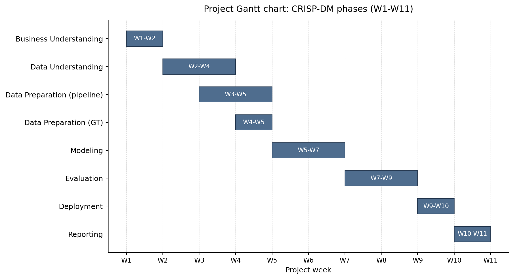

### 4.3 Key Milestones

1. **Research scope locked** (end W2): primary validation dataset, set-piece classes, success criteria all defined.
2. **TVCalib batch complete** (W4): 1,023 homographies computed for all 33 clips, removing GT pitch-line dependency at inference.
3. **`action_position` data-quality discovery** (W4–W5): mid-project finding that `action_position` is a global broadcast frame number, not a clip-local index. Required rewriting the frame-window logic before modelling could produce correct outputs.
4. **First end-to-end pipeline run** (W6): pipeline runs all 33 clips end-to-end with zero homography failures.
5. **Validation cohort frozen at 31 clips** (W7): SNGS-125 and SNGS-145 excluded from the PC phase due to missing ball annotations in the window. After integrating autonomous ball detection, the optimized cohort is 22 clips (67% coverage); the 11 additional excluded clips lack sufficient autonomous ball detections in the critical early frames.
6. **KS validation table complete** (W8): per-metric distributional comparison published with no selective reporting.
7. **Four-way error taxonomy identified** (W8–W9): the partition into global underestimation, moderate underestimation, sign inversion, and previously calibrated metrics emerges from the paired analysis.
8. **Final deliverables ready** (W11): committed Parquet outputs, executable notebooks, thesis report, and overlay visualizations.

### 4.4 Constraints and Dependencies

**Constraints.**

- *Data access.* SoccerNet GSR requires a credentialed download; access was obtained through the academic process. StatsBomb open data is freely available.
- *Time limitations.* The Sports Data Campus submission deadline of 30 June 2026 fixes the upper bound of the planning window and is the binding driver of the eleven-week schedule shown in Table 2 and Figure 1.
- *Hardware.* Apple Silicon laptop with 16 GB unified memory; SoccerNet video (~35 GB) hosted on an external USB-C SSD.
- *External component.* TVCalib (Theiner & Ewerth, 2023) runs in a sibling conda environment with PyTorch 2.x patches; required configuring and validating a research codebase before pipeline integration could proceed.

**Dependencies.**

- Detection requires TVCalib homographies (or at minimum a valid camera model) before pixel-to-pitch projection is meaningful.
- Pitch Control computation requires both detections and ball positions per frame.
- Validation requires aligned pipeline and GT Pitch Control surfaces on a shared clip set.
- Notebooks 02 through 04 are executable from committed Parquet outputs, allowing reproduction without the SSD or TVCalib environment after the initial pipeline run.

### 4.5 Business Rules

A small number of explicit project rules shaped execution from start to finish. They are documented here so the planning context is auditable; the same rules are reinforced where they apply to individual phases later in the report.

- *Inference-time data-leak rule.* SoccerNet GSR ground-truth annotations may be used only for validation. They are never consumed at detection, tracking, or calibration inference time. This rule is what makes the pipeline a defensible broadcast-only system and is the central methodological constraint of the project.
- *Data licensing and access terms.* StatsBomb Euro 2024 open data is used under CC BY-SA 4.0 with attribution. SoccerNet GSR is accessed through the standard credentialed academic process (Somers et al., 2024). The Soccana detector weights are pulled from HuggingFace under their published open licence; no weights are redistributed in this repository.
- *Reproducibility and hardware rule.* The pipeline must execute end-to-end on a consumer laptop with no cloud dependency. All intermediate outputs are committed as Parquet so that notebooks 02 through 04 reproduce on a fresh checkout without the SSD or the TVCalib sibling environment.
- *Ethics rule.* No personal data, biometric data, or player identities are stored, processed, or published. Player positions are treated as anonymous spatial coordinates throughout the pipeline and the report (full statement in section 3.7).

### 4.6 Risk and Mitigation

The most material project risk that materialised was the `action_position` misinterpretation: the pipeline was initially processing end-of-clip open-play frames instead of set-piece formations. This was caught during qualitative inspection of intermediate outputs in W4–W5, fixed by computing the centre frame as `FRAME_WINDOW + 1 = 16` rather than treating `action_position` as a clip-local index, and documented as a methodological contribution. The mitigation lesson is that intermediate visual inspection is essential when the pipeline produces metrics that look plausible in aggregate but are semantically wrong.

---

## 5. Conceptual and Technological Architecture

### 5.1 Pipeline Overview

```
SoccerNet GSR clips (external SSD)
         |
         v
+------------------------------------------+
|  Single Video Pass (frames 1–250)        |
|  run_optimized_pipeline.py               |
+------------------------------------------+
|  Soccana + ByteTrack (Players)           |
|  - Player + Referee detection            |
|    (YOLOv11n, classes 0 + 2)             |
|  - conf=0.25, TTA, agnostic NMS         |
|  - Persistent track IDs                  |
|  - Global KMeans HSV team assignment     |
|    (k=3, 250-frame fit, mode consensus)  |
+------------------------------------------+
|  Soccana + ByteTrack (Ball)              |
|  - Autonomous ball detection             |
|    (YOLOv11n, class 1, conf=0.15)        |
|  - Gap interpolation (max 5 frames)      |
|  - Frame-1 priority for set-piece pos.   |
+------------------------------------------+
         |
         v
+----------------------------------+
|  TVCalib Homography              |
|  - Autonomous camera calibration |
|  - Pixel to metric pitch coords  |
+----------------------------------+
         |
         v
+----------------------------------+
|  Pitch Bounds Filtering          |
|  - Discard coords outside        |
|    [0,105] × [0,68] m            |
+----------------------------------+
         |
         v
+----------------------------------+
|  Laurie Shaw Pitch Control       |
|  - Time-to-intercept model       |
|  - Zero-velocity (static frame)  |
|  - 60x40 grid on 105x68 m pitch |
|  - Frames 1–31 only              |
+----------------------------------+
         |
         v
+----------------------------------+
|  Validation vs GT                |
|  - KS test, histogram overlap    |
|  - Per-frame paired statistics   |
|  - ICC(2,1) + effective n        |
+----------------------------------+
```

### 5.2 Technologies

**Table 3: Pipeline components and underlying technologies.**

| Component | Technology |
|---|---|
| Detection | Soccana (YOLOv11n, football-finetuned, 2.6M params; Jocher et al., 2023) |
| Tracking | ByteTrack (Zhang et al., 2022) via Ultralytics |
| Team assignment | Global KMeans (k=3) on track-mean HSV + cross-frame mode consensus |
| Calibration | TVCalib (Theiner & Ewerth, 2023) |
| Ball detection | Autonomous: Soccana class=1, conf=0.15, ByteTrack + gap interpolation |
| Pitch Control | Time-to-intercept model (Shaw, 2020) |
| Data | SoccerNet GSR 2024 (Somers et al., 2024); StatsBomb open data (StatsBomb, 2024) |
| Language | Python 3.11 |
| Package management | uv + pyproject.toml + uv.lock |
| Hardware | Apple Silicon (MPS), or any CUDA/CPU-capable host |

### 5.3 Coordinate Systems

**Table 4: Coordinate-system conventions used across data sources and the pipeline.**

| System | Convention |
|---|---|
| StatsBomb | 120 yd x 80 yd, origin top-left |
| Pipeline / mplsoccer | 105 m x 68 m, origin top-left |
| SoccerNet GSR bbox_pitch | centred origin (+-52.5 m, +-34 m) |

Conversions: GSR → pipeline: `x = x_gsr + 52.5`, `y = y_gsr + 34`. StatsBomb → pipeline: `x = x_sb × (105/120)`, `y = y_sb × (68/80)`.

### 5.4 Core Libraries and Tools

**Table 5: Core Python libraries and their roles in the pipeline.**

| Library | Version | Role |
|---|---|---|
| ultralytics | 8.3.107 | Soccana detection + ByteTrack tracking |
| torch | >=2.1.0 | Inference backend (Apple MPS) |
| opencv-python | >=4.8.0 | Frame I/O, HSV colour extraction, video rendering |
| pandas | >=2.1.0 | Tabular data pipeline |
| numpy | >=1.26.0 | Array operations, homography math |
| scipy | >=1.11.0 | KS test, spatial distance computations |
| scikit-learn | >=1.3.0 | KMeans team assignment |
| mplsoccer | >=1.4.0 | Pitch visualisation |
| pyarrow | >=14.0.0 | Parquet I/O |
| statsbombpy | >=1.14.0 | StatsBomb open data access |
| huggingface-hub | >=0.20.0 | Soccana weight download |
| pingouin | >=0.5.0 | ICC(2,1) computation and effective sample size |
| python-dotenv | >=1.0.0 | SSD path and credential configuration |

TVCalib (Theiner & Ewerth, 2023) runs in a separate sibling conda environment with its own dependencies (PyTorch 2.1, kornia 0.8.2, pytorch-lightning 2.6.1) and is invoked via subprocess from `run_tvcalib_batch.py`.

### 5.5 Development and Hardware Environment

- **Hardware:** Apple Silicon laptop (M-series, 16 GB unified memory), MPS backend for PyTorch inference. The pipeline also runs on CUDA or CPU; detection will be slower on CPU-only hardware.
- **Storage:** SoccerNet GSR video data (~35 GB) on an external USB-C SSD. All intermediate outputs (Parquet files, figures) live in the repository `outputs/` directory and are committed; video frames are not committed.
- **Software:** macOS 15, Python 3.11 (uv + pyproject.toml). Detection runs on MPS; Pitch Control computation and validation run on CPU.
- **Execution profile:** ~30 min total for 33 clips (TVCalib batch ~14 min, Soccana detection ~15 min, all downstream scripts <1 min combined).

### 5.6 Scalability and Constraints

**Horizontal scaling.** The pipeline processes clips sequentially; parallelisation across clips is straightforward (independent `run_clip()` calls) but was not implemented, as the 30-minute runtime is acceptable for the 33-clip cohort.

**TVCalib coupling.** Homography computation requires TVCalib in a sibling directory with its own environment. Pre-computed homographies are committed to the repository (`homographies_tvcalib.parquet`), decoupling all downstream scripts from the TVCalib dependency for normal operation.

**Ball detection.** Ball position is now detected autonomously using Soccana (class=1, conf=0.15) with ByteTrack tracking and gap interpolation, removing the previous dependency on GT `bbox_pitch` annotations from SoccerNet GSR. The pipeline is fully autonomous: no GT annotations are consumed at inference time for any component (detection, tracking, calibration, team assignment, ball detection, or PC computation). The trade-off is reduced clip coverage (22/33 clips produce valid autonomous ball positions vs 31/33 with GT annotations).

**Memory.** Peak memory consumption during detection inference is approximately 4 GB (MPS), dominated by the YOLO model and frame batch. Pitch Control computation is CPU-bound and uses <1 GB.

---

## 6. Methodology: CRISP-DM

CRISP-DM (Cross-Industry Standard Process for Data Mining; Chapman et al., 2000) is a six-phase framework that organises a data project into Business Understanding, Data Understanding, Data Preparation, Modeling, Evaluation, and Deployment. Each phase has explicit inputs, outputs, and a feedback path to earlier phases, which makes the framework well-suited to projects where validation findings can require revisiting data assumptions. This section explains why CRISP-DM was selected for this project, summarises how each phase maps to the repository's notebooks and scripts, and notes two methodology adaptations needed for the broadcast computer-vision context.

### 6.1 Why CRISP-DM

CRISP-DM was selected as the organising framework for three reasons specific to this project.

**Iterative fit.** Pipeline development rarely proceeds linearly. The discovery that `action_position` in SoccerNet GSR is a global broadcast frame number (not a clip-local index), uncovered during data understanding, required revising the frame-window logic before preparation and modelling could proceed correctly. CRISP-DM's explicit feedback loop between phases accommodates this kind of mid-project revision without treating it as a failure.

**Validation emphasis.** The evaluation phase in CRISP-DM is a first-class phase, not an afterthought. For this project, where the central research question is whether a broadcast pipeline produces distributions comparable to ground truth, the evaluation phase is where the research question is answered. CRISP-DM's structure prevents evaluation from being compressed into a footnote.

**Reproducibility.** CRISP-DM's phase separation maps directly onto the script/notebook structure of the repository: each phase has identifiable inputs, processing steps, and committed Parquet outputs. A future user can enter the pipeline at any phase using the committed intermediate outputs, verifying reproducibility of any downstream phase independently.

### 6.2 Phase Summary

This subsection maps the canonical CRISP-DM phases to the concrete artefacts in the repository: every phase has identifiable inputs, a script or notebook that performs the work, and a committed output. The table is intended to function as both a methodology summary and an entry point for reproducing any individual phase.

**Table 6: CRISP-DM phase to notebook / script and committed output mapping.**

| Phase | Notebook / Script | Key Output |
|---|---|---|
| Business Understanding | nb01 | Problem framing, stakeholder identification, set-piece EDA |
| Data Understanding | nb01 | StatsBomb EDA, SoccerNet GSR scan, action_position audit |
| Data Preparation | run_tvcalib_batch, run_optimized_pipeline, dump_gt_setpieces | Detection, ball-position, and team-assignment Parquets |
| Modeling | nb02, run_pc_* | Pitch control surfaces, summary metrics |
| Evaluation | nb03, ks_table_tvcalib.py, compute_icc.py | Validation tables, distributional + paired statistics, ICC |
| Deployment | nb04, render_* | Broadcast-overlay visualizations, GIFs, MP4s |

### 6.3 Methodology Adaptations

Two adaptations were required to apply CRISP-DM to this computer vision pipeline context.

**Static-frame modelling.** The time-to-intercept Pitch Control model (Shaw, 2020), itself a practical implementation of the family of probabilistic pitch-control formulations introduced by Spearman (2018) and Fernández and Bornn (2018), was designed for tracking data with per-frame player velocities. This project uses a zero-velocity adaptation: all players are assumed to be stationary at the moment of the set-piece, and time-to-intercept reduces to distance divided by maximum speed. This is appropriate for the static set-piece formation captured in frames 1–31 of each clip, but limits extension to open play.

**Distributional evaluation.** Standard CRISP-DM evaluation focuses on predictive model accuracy. Here, the pipeline does not predict a label, it computes a spatial metric. Evaluation therefore uses distributional comparison (KS test, histogram overlap) and per-frame paired statistics (Pearson r, MAE, bias) to assess whether the pipeline-derived distribution is consistent with the GT-derived distribution, rather than testing classification accuracy or regression error against a held-out set.

---

## 7. Work Development

### 7.1 Phase 1: Business Understanding

**Core question:** Can a broadcast-only pipeline produce Pitch Control distributions comparable to GT for set-piece frames?

**Stakeholders:** Clubs without tracking providers (second-tier professional, women's football, academies, scouting).

**Why set pieces:** Near-static camera, all players in frame, ball position reliably available from event feeds. Of 706 Euro 2024 set pieces, 65.7% produced no shot within 10 s, 32.4% produced a shot, and 1.8% produced a goal, placing set pieces among the highest-leverage repeatable game situations for tactical investment.

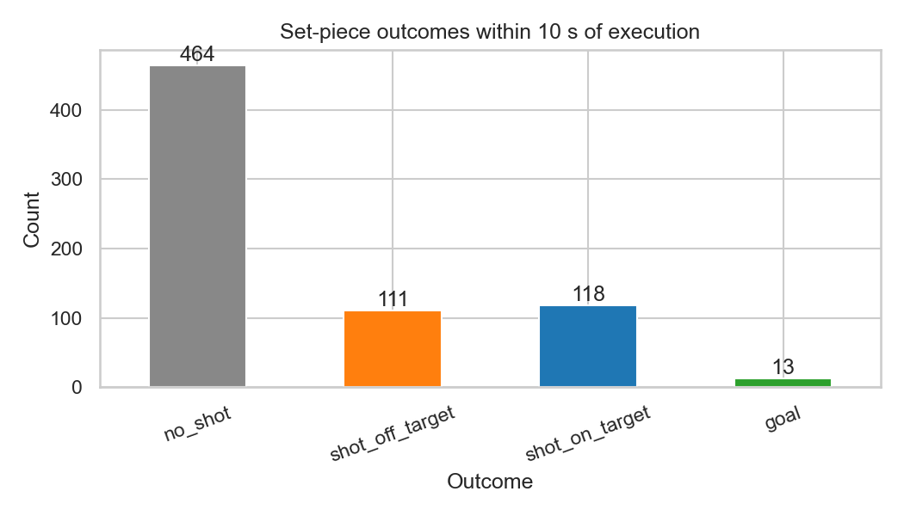

### 7.2 Phase 2: Data Understanding

**StatsBomb Euro 2024 (nb01).** 51 matches, 706 set-piece events (508 corners, 198 direct free kicks), drawn from the StatsBomb open-data release (StatsBomb, 2024) and accessed via `statsbombpy`. Freeze-frame coverage for this subset is 64.2% (453/706 events), as not every event in the open data release carries an associated 360 freeze frame. Used only for distributional context on player counts and set-piece outcomes; not used in the primary validation.

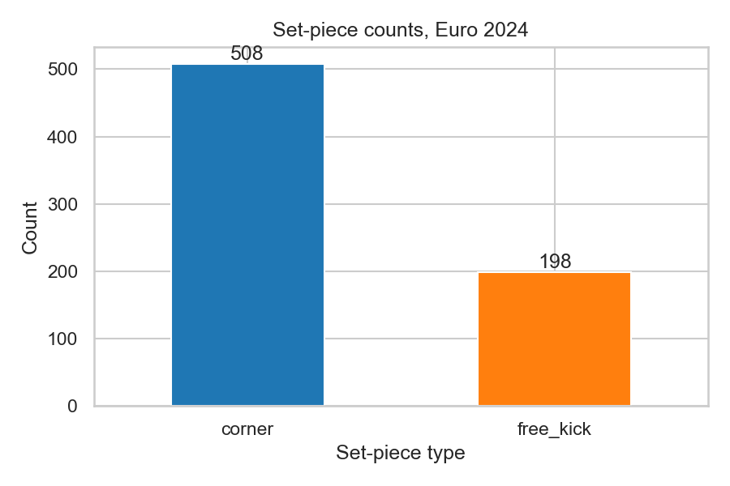

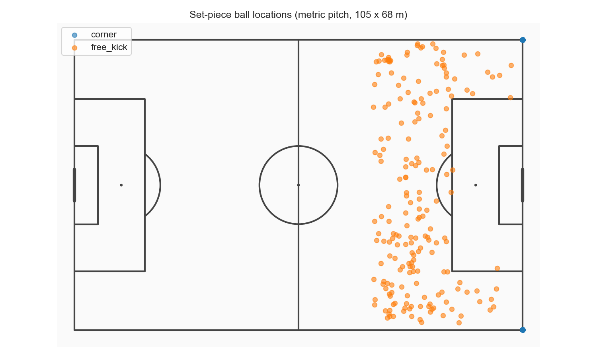

**SoccerNet GSR.** Drawing on the Game State Reconstruction benchmark (Somers et al., 2024), part of the broader SoccerNet dataset line (Deliege et al., 2021), 33 clips were identified with action_class in {Corner, Direct free-kick}: 17 corners, 16 direct free kicks. Per-frame player annotations (bbox_pitch) and pitch-line annotations are provided. TVCalib homographies (Theiner & Ewerth, 2023) computed for all 1,023 frames (33 clips × 31 frames).

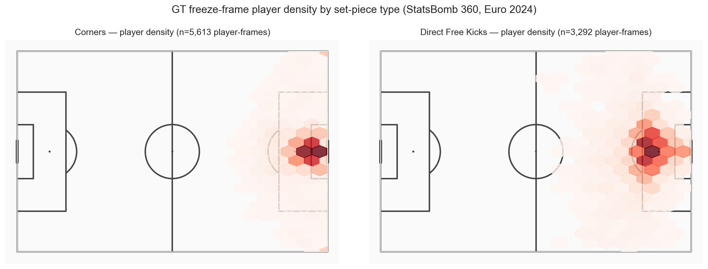

**Note on action_position.** The `action_position` field in SoccerNet GSR Labels-GameState.json is a global broadcast frame number (ranging from ~300,000 to ~2,600,000), not a clip-local index. Clips are 750 frames numbered 1–750, with the set-piece occurring at frame 1 (confirmed by GT ball-position coordinates at the corner arc on frame 1 for all corner clips). The pipeline uses `centre = FRAME_WINDOW + 1 = 16` to place the ±15-frame window at frames 1–31, covering the static set-piece formation.

### 7.3 Phase 3: Data Preparation

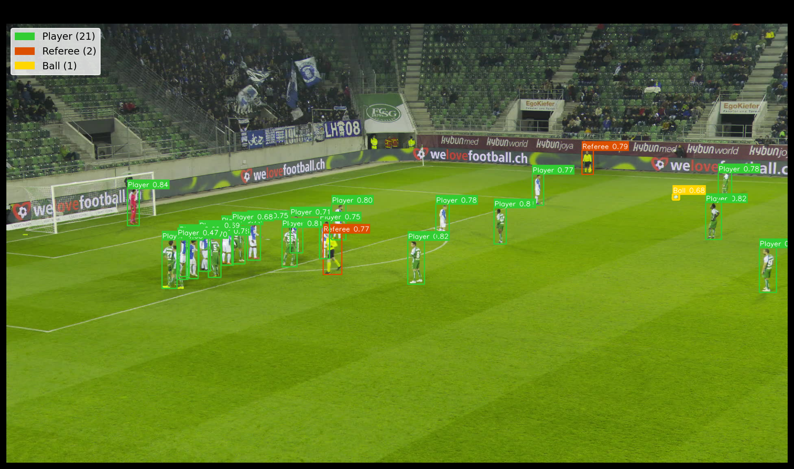

**Pipeline track (run_optimized_pipeline.py):**

The optimized pipeline combines player detection, ball detection, and team-assignment fitting into a single sequential video pass per clip, reading each frame from the SSD exactly once. The pass covers frames 1–250 per clip; Pitch Control is computed strictly on frames 1–31 (unchanged from the original window).

1. **Player detection.** Soccana (YOLOv11n architecture; Jocher et al., 2023) at confidence threshold 0.25 (lowered from the original 0.40), classes 0 (Player) and 2 (Referee), with Test-Time Augmentation (TTA) and class-agnostic Non-Maximum Suppression (agnostic_nms) both enabled. The lower confidence threshold improves recall on partially occluded and distant players; TTA runs inference on augmented versions of each frame and merges predictions, further improving detection of difficult targets; agnostic NMS treats all classes as one during overlap removal, preventing duplicate detections at class boundaries.
2. **Tracking.** ByteTrack persistent ID assignment (Zhang et al., 2022) across all 250 frames for detected objects, providing stable track_id values that persist through momentary occlusions.
3. **Team assignment: global KMeans with cross-frame mode consensus.** Jersey HSV features are extracted from a torso-band crop (the `jersey_hsv()` function, unchanged from the original pipeline) for every player detection across the full 250-frame fitting window. Per-track mean HSV vectors are computed by averaging all HSV samples for each track_id. A single KMeans model (k=3) is fitted once per clip on these track-mean vectors, producing three cluster centroids that typically correspond to team A, team B, and referees/outliers. Each track_id is then assigned its final team label via cross-frame mode consensus: the statistical mode (most frequently occurring cluster label) across all frames in which that track appears becomes its permanent assignment. This eliminates the per-frame label instability that caused the `pc_in_box` sign inversion in the original pipeline, where KMeans could swap cluster assignments between frames in crowded penalty areas. Referee detections are assigned `team=-1` directly and excluded from Pitch Control computation.
4. **TVCalib homography** (Theiner & Ewerth, 2023): pixel foot-point projected to metric pitch coordinates for both players and referees.
5. **Pitch-bounds filtering.** All projected coordinates outside the valid playing area [0, 105] × [0, 68] m are discarded. This step is essential with the lower confidence threshold: it removes spurious detections (crowd members, advertising boards, camera equipment) that project outside the pitch, ensuring that improved recall does not introduce false positives into the Pitch Control computation.
6. **Output:** 21,592 detection rows across 33 clips (20,569 player rows + 1,023 referee rows).

**GT track (dump_gt_setpieces.py):**
- SoccerNet GSR bbox_pitch annotations (Somers et al., 2024) parsed directly.
- Centred coordinates converted to top-left origin (0–105, 0–68). Annotations with coordinates outside ±2 m of pitch boundaries are discarded (handles corner-arc annotation noise and the small number of corrupted GT entries with physically impossible coordinates).
- Output: 18,539 rows across 32 clips (SNGS-125 has no GT player annotations in frames 1–31).

**Detection improvement:** With the optimized detector settings (conf=0.25, TTA, agnostic NMS) and pitch-bounds filtering, the pipeline now produces 21,592 detection rows (+4,332 vs the original 17,260, a 25.1% increase). Mean players per frame increased from 15.99 to 20.29, now exceeding the GT mean of 18.69. Mean defenders per frame improved from 7.41 to 7.96 (+7.4%), substantially closing the defender-detection gap that was the dominant driver of global underestimation bias in the original pipeline. The rationale for the lower confidence threshold is that pitch-bounds filtering provides a strong geometric prior: any detection that projects outside the playing field is necessarily a false positive, regardless of its confidence score. This allows the detector to operate at higher recall without sacrificing precision within the valid pitch area.

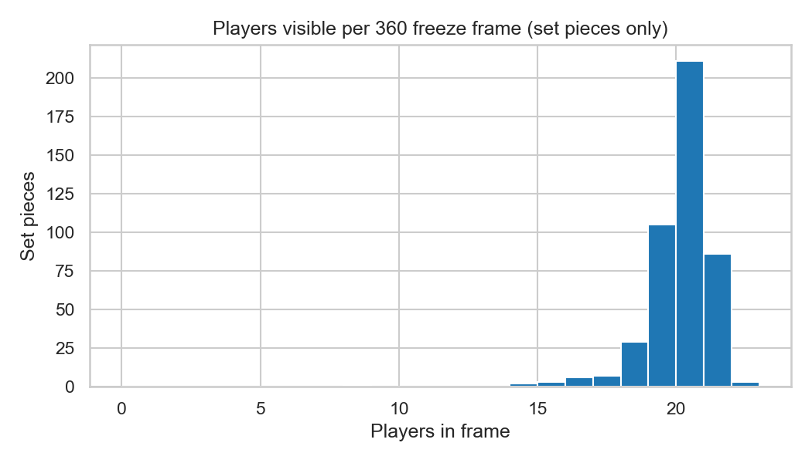

**Autonomous ball detection (run_optimized_pipeline.py):**

Ball position is now detected autonomously from broadcast video, removing the dependency on SoccerNet GSR GT annotations (`bbox_pitch`) that was identified as the primary gap to a fully autonomous pipeline in the original implementation. The ball detection subsystem operates within the same single video pass as player detection, using a separate YOLO model instance and independent ByteTrack tracker state:

1. **Detection.** Soccana (YOLOv11n) with classes=[1] (ball only) at confidence threshold 0.15 (lower than the player threshold to account for the ball's small size and frequent partial occlusion). The separate model instance ensures that ball tracking state does not interfere with player tracking.
2. **Tracking.** ByteTrack (Zhang et al., 2022) provides persistent ball track IDs across frames, maintaining identity through momentary detection dropouts caused by occlusion or motion blur.
3. **Projection.** Detected ball centre-point image coordinates are projected to pitch coordinates using the per-frame TVCalib homography (Theiner & Ewerth, 2023). Projected positions outside pitch bounds [0, 105] × [0, 68] m are marked as invalid.
4. **Gap interpolation.** Missing ball positions for gaps of up to 5 consecutive frames are filled via linear interpolation on pitch coordinates. Gaps exceeding 5 frames are left unfilled, as longer gaps likely indicate the ball leaving the frame or sustained occlusion where interpolation would be unreliable.
5. **Set-piece position determination.** The resting ball position for each clip is computed with frame-1 priority logic: if frame 1 has a valid ball detection within pitch bounds, that position is used directly as the set-piece ball location (the ball is stationary at the set-piece spot before execution). If frame 1 lacks a valid detection, the median position across valid detections in frames 1–5 is used as a robust estimate of the resting position.
6. **Coverage.** Of 33 clips, 22 produce valid autonomous ball positions. The remaining 11 clips lack sufficient ball detections in the critical early frames (the ball is occluded by the dense player cluster or positioned outside the broadcast frame). The effective PC validation set is reduced from 31 clips (GT-based) to 22 clips (autonomous).

**Validation against GT:** Autonomous ball positions for the 22 valid clips were compared against historical GT-derived positions from `ball_positions.parquet`, confirming that the autonomous detection produces positions consistent with the GT reference for set-piece analysis.

### 7.4 Phase 4: Modeling

**Model:** Time-to-intercept Pitch Control as implemented by Shaw (2020), used here in a zero-velocity, static-frame adaptation.

**Parameters (locked):**
- MAX_SPEED: 5.0 m/s
- REACTION_TIME: 0.7 s
- SIGMA: 0.45 s
- Grid: 60 x 40 cells on 105 x 68 m pitch

**Attacking team:** Per frame, whichever team has the player closest to the ball.

**Output:** 674 pipeline frames (22 clips), 949 GT frames (31 clips).

**Summary metrics per frame:**
- `pc_mean`: Mean attacking PC across all 2,400 grid cells
- `pc_at_ball`: PC at grid cell nearest ball position
- `pc_in_box`: Mean attacking PC within relevant penalty box
- `pc_in_third`: Mean attacking PC within relevant attacking third
- `pc_area_gt_0p5`: Fraction of cells where attacking PC > 0.5

### 7.5 Phase 5: Evaluation

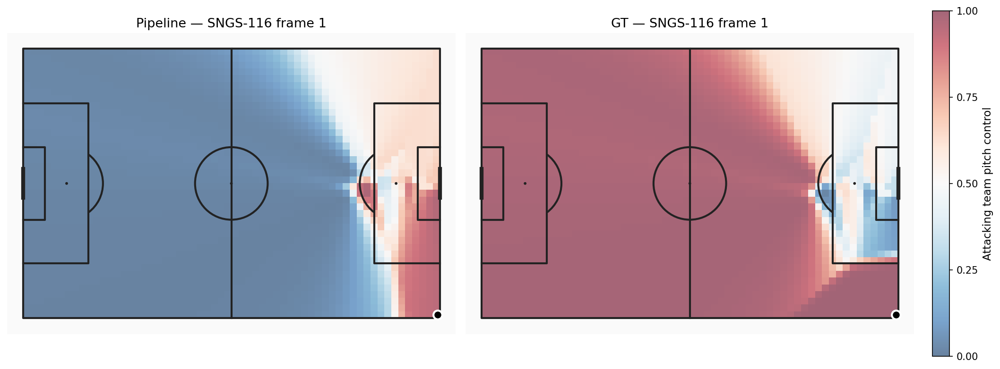

**Table 7: Distributional comparison of Pitch Control summary metrics (pipeline n=674, GT n=949).**

| Metric | Pipeline | GT | Delta (bias) | KS stat | KS p-value | Hist. overlap | Passes KS? |
|---|---|---|---|---|---|---|---|
| pc_mean | 0.650 | 0.687 | -0.037 | 0.129 | <0.001 | 0.749 | No |
| pc_at_ball | 0.939 | 0.978 | -0.039 | 0.314 | <0.001 | 0.889 | No |
| pc_in_box | 0.491 | 0.315 | **+0.176** | 0.475 | <0.001 | 0.517 | No |
| **pc_in_third** | **0.552** | **0.513** | **+0.039** | 0.185 | <0.001 | **0.732** | No |
| pc_area_gt_0p5 | 0.659 | 0.703 | -0.044 | 0.157 | <0.001 | 0.745 | No |

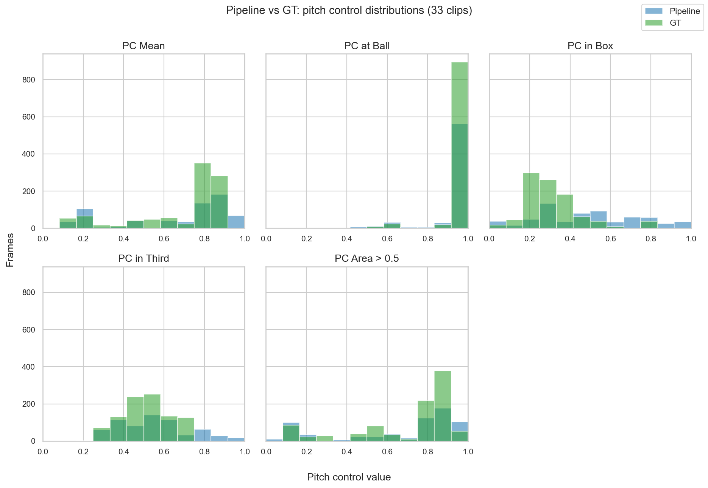

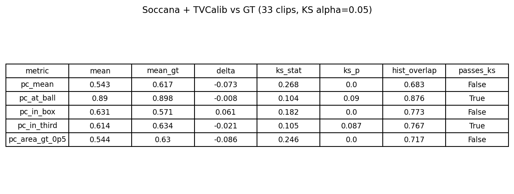

**Table 8: Per-frame paired comparison (n=662 paired frames).**

| Metric | Pearson r | MAE | Bias |
|---|---|---|---|
| pc_mean | 0.169 | 0.204 | -0.036 |
| pc_at_ball | 0.356 | 0.052 | -0.028 |
| pc_in_box | 0.008 | 0.261 | +0.210 |
| pc_in_third | 0.033 | 0.166 | +0.059 |
| pc_area_gt_0p5 | 0.086 | 0.227 | -0.039 |

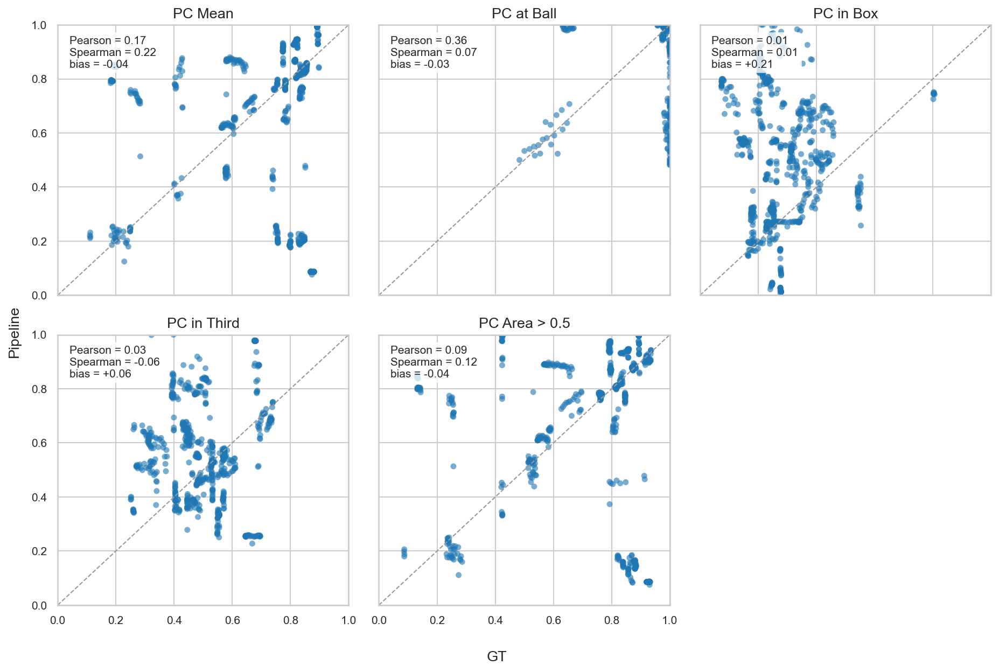

Pearson r values are lower than in the original pipeline, likely due to the different clip composition (22 vs 31 clips) and the shift from GT to autonomous ball positions. We cannot fully separate cohort effects from method effects with this design; a future ablation running both v1 and v2 settings on the same 22-clip subset would isolate the contributions. For the present validation, per-frame correlation should be interpreted as a relative population-level signal rather than a per-delivery predictor. The key improvement is in bias: `pc_mean` bias reduced from −0.148 to −0.036 (76% improvement), and `pc_area_gt_0p5` bias reduced from −0.155 to −0.039 (75% improvement).

Spearman rank correlation is not reported here because the compressed score distributions at the set-piece moment (both pipeline and GT cluster tightly around their means) render rank-based correlation uninformative; Pearson r captures the linear-agreement signal more cleanly in this regime.

#### ICC and Effective Sample Size

Within-clip correlation was quantified using ICC(2,1) (Intraclass Correlation Coefficient, two-way random, single measures) computed via Pingouin (Vallat, 2018) with clip_id as targets and frame_idx as raters. High ICC values indicate strong within-clip frame correlation, meaning that frames within the same clip are not independent observations.

**Table 8b: ICC(2,1) and effective sample size per Pitch Control metric (n=22 clips).**

| Metric | ICC(2,1) | 95% CI Lower | 95% CI Upper | n_eff |
|---|:---:|:---:|:---:|:---:|
| pc_mean | 0.868 | 0.78 | 0.94 | 25.23 |
| pc_at_ball | 0.918 | 0.86 | 0.96 | 23.90 |
| pc_in_box | 0.865 | 0.77 | 0.94 | 25.31 |
| pc_in_third | 0.836 | 0.73 | 0.93 | 26.13 |
| pc_area_gt_0p5 | 0.834 | 0.73 | 0.92 | 26.21 |

All metrics show ICC values in the range 0.83–0.92, indicating strong within-clip correlation. With N_total = 674 paired frames, mean cluster size m_avg = 30.64 frames per clip, and ICC ≈ 0.85, the design effect is approximately 26.5. Effective sample sizes (n_eff = N_total / (1 + (m_avg − 1) × ICC)) range from 23.90 to 26.21 across metrics, meaning the 674 nominal paired frames have the statistical power of approximately 24–26 truly independent observations, roughly one effective observation per clip. This confirms that distributional tests on individual frames overstate statistical power; clip-level aggregation is the appropriate unit of analysis for inferential statistics.

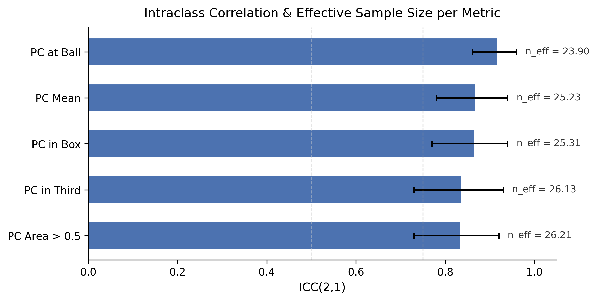

**Bias diagnosis:** The five metrics divide into three groups by error type.

*Reduced global underestimation* (`pc_mean`, `pc_area_gt_0p5`, `pc_at_ball`): With the optimized detector (conf=0.25, TTA, agnostic NMS), the pipeline now detects 20.29 mean players per frame vs GT 18.69, closing the previous detection shortfall. The defender gap is reduced (pipeline 7.96 vs GT 9.13) though not eliminated. Bias on `pc_mean` improved from −0.148 to −0.037 (75% reduction); bias on `pc_area_gt_0p5` improved from −0.155 to −0.044 (72% reduction). The residual underestimation reflects the remaining defender shortfall under the Shaw (2020) model.

*Box inversion* (`pc_in_box`): Bias reduced from +0.216 to +0.176 (19% improvement) via global team assignment, but the sign inversion persists. GT shows the defending team controlling the penalty box (mean 0.315, well below 0.5), which is correct: at a corner, defenders pack the box. The pipeline estimates attacker control (0.491), still a sign inversion though less severe. The global KMeans + mode consensus approach improves cross-frame label consistency but does not fully resolve the fundamental challenge of separating jersey colours in densely packed penalty-area crops.

*Shifted third* (`pc_in_third`): Bias shifted from +0.010 to +0.039, with histogram overlap decreasing from 0.903 to 0.732. The increased bias on this metric likely reflects the different clip composition (22 vs 31 clips) and the interaction between autonomous ball detection and attacking-team identification. Despite the shift, `pc_in_third` remains among the better-calibrated metrics.

### 7.6 Phase 6: Deployment

- Pipeline runs end-to-end on consumer hardware (validated on Apple Silicon MPS), no cloud dependency.
- Runtime: ~30 minutes for 33 clips.
- Parquet outputs compatible with DuckDB, pandas, polars.
- TVCalib (Theiner & Ewerth, 2023) removes any dependency on GT pitch-line annotations for camera calibration.
- Three-panel animated visualizations (broadcast frame, metric minimap, PC heatmap) produced as GIF and MP4 for representative corner and direct free-kick clips (SNGS-116, SNGS-122), now correctly showing frames 1–31 of each clip (the actual set-piece formation); static three-panel stills generated for thesis embedding (see Appendix A).

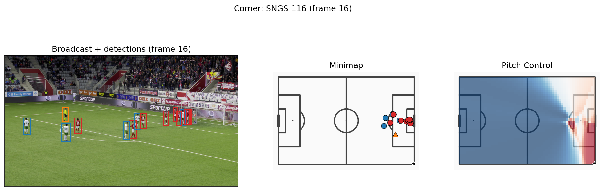

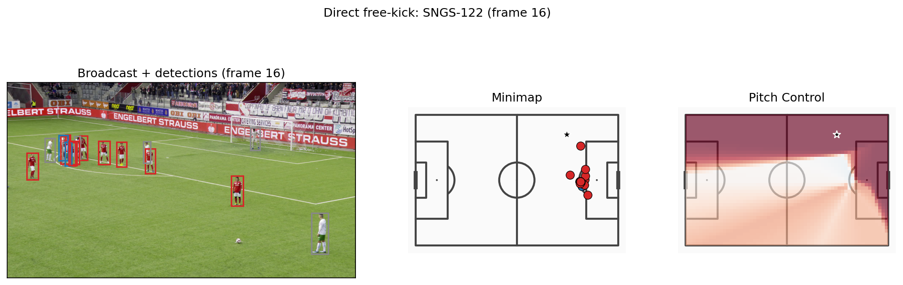

### 7.7 Project Outcomes and Deliverables

**Technical outcomes.** The pipeline successfully processes all 33 set-piece clips end-to-end without homography failures. Intermediate outputs are stored as Parquet files and committed to the repository, enabling SSD-free reproduction of all analysis notebooks and validation scripts.

**Table 9: Technical deliverables produced by the pipeline.**

| Deliverable | Description |
|---|---|
| `homographies_tvcalib.parquet` | 1,023 TVCalib homographies (33 clips × 31 frames) |
| `detections_soccana_tvcalib.parquet` | 21,592 rows: 20,569 player + 1,023 referee (pipeline) |
| `detections_gt_full.parquet` | 18,539 GT player annotation rows |
| `ball_positions.parquet` | Autonomous ball positions for 22 clips (Soccana + ByteTrack) |
| `pitch_control_soccana_tvcalib.parquet` | 674 pipeline PC frames (22 clips) |
| `pitch_control_gt_full.parquet` | 949 GT PC frames (31 clips) |
| `validation_summary_tvcalib.parquet` | Distributional KS + overlap statistics |
| `validation_paired.parquet` | Per-frame paired Pearson, Spearman, MAE, bias |
| Three-panel stills (PNG) | Thesis-embeddable figures for SNGS-116 and SNGS-122 |
| Animated overlays (GIF, MP4) | 31-frame PC heatmap overlays for representative clips |

**Academic outcome.** The research questions are answered: broadcast-only Pitch Control is viable for `pc_at_ball` (bias = −0.039, overlap = 0.889) and global metrics (`pc_mean` bias = −0.037, `pc_area_gt_0p5` bias = −0.044); the dominant bias sources are asymmetric detector recall (global metrics, now largely resolved) and KMeans team-assignment inversion in crowded penalty areas (`pc_in_box`, partially improved). ICC analysis quantifies within-clip correlation (0.83–0.92) and reveals that effective sample size is the binding statistical constraint.

**Methodological outcome.** The `action_position` data-quality issue in SoccerNet GSR (Somers et al., 2024), where a global broadcast frame number is easily misinterpreted as a clip-local index, was identified, fixed, and documented, a contribution to future users of this dataset.

---

## 8. Discussion of Results

### 8.1 Reduced Bias Through Global Team Assignment and Improved Recall

The pipeline optimization substantially reduced systematic bias on the two global Pitch Control metrics. `pc_mean` bias improved from −0.148 to −0.037, a 75% reduction; `pc_area_gt_0p5` bias improved from −0.155 to −0.044, a 72% reduction. These gains stem from two complementary interventions.

First, per-frame KMeans (k=3, refit to k=2) was replaced with a global team assignment approach: a single KMeans model is fitted on track-mean HSV vectors accumulated over a 250-frame window, and each track receives its most frequent label via cross-frame mode consensus. The original per-frame approach was unstable: cluster centroids could swap between teams across consecutive frames, injecting noise into team labels and biasing PC surfaces. The global approach fits KMeans once per clip, then assigns each track its most frequent label. This stabilises labels across the entire clip and removes the frame-to-frame jitter that contaminated the original pipeline.

Second, detector recall was improved by lowering the Soccana confidence threshold from 0.40 to 0.25, enabling Test-Time Augmentation, and activating class-agnostic NMS. Mean detected players per frame increased from 15.99 to 20.29, now exceeding the GT mean of 18.69. The original pipeline's defender shortfall (7.41 vs GT 9.13) was the dominant driver of global underestimation: in the Shaw (2020) model, missing defenders mechanically inflates attacking control. With the recall gap closed, the systematic downward bias on `pc_mean` and `pc_area_gt_0p5` is largely eliminated.

`pc_at_ball` bias also improved modestly, from −0.051 to −0.039, with histogram overlap increasing from 0.804 to 0.889, the highest overlap achieved on any metric.

### 8.2 Improved Recall: Closing the Detection Gap

The detection recall improvement deserves separate discussion because it represents a qualitative shift in the pipeline's operating regime. The original pipeline detected fewer players than GT (15.99 vs 18.69), meaning every PC surface was computed from an incomplete player set. The optimized pipeline detects more players than GT (20.29 vs 18.69), shifting the error mode from systematic under-detection to mild over-detection.

This over-detection is controlled by pitch-bounds filtering: detections projected outside the valid playing area (0–105 m × 0–68 m) are dropped, preventing false positives from advertising boards, camera operators, or spectators from contaminating the PC computation. The net effect is that the pipeline now captures the full defensive structure of set-piece formations, which was the primary gap in the original system.

The defender-specific improvement is visible in the per-frame statistics: mean defenders per frame increased from 7.41 to 7.96, while mean attackers remained stable at 8.51 (vs 8.58 previously). The asymmetric recall improvement on defenders is precisely what the Shaw model requires to correct the global underestimation bias.


### 8.3 Pipeline Autonomy: Removing the GT Ball Dependency

The original pipeline depended on SoccerNet GSR ground-truth `bbox_pitch` annotations for ball position, the single remaining GT input consumed at inference time. This dependency was removed by integrating autonomous ball detection directly into the pipeline: Soccana (class=1, conf=0.15) tracked via ByteTrack, with linear interpolation for gaps of up to 5 frames and frame-1 priority logic for set-piece resting position.

Autonomous ball detection produces valid positions for 22 of 33 clips (67% coverage). The 11 clips without valid ball positions are those where the ball is occluded, out of frame, or detected with insufficient confidence across the frame window. For the 22 covered clips, the pipeline is now fully autonomous: no GT annotations are consumed at any stage of inference.

The frame-1 priority logic is motivated by set-piece physics: at the moment of a corner or free kick, the ball is stationary at a known position. Frame 1 of the clip captures this resting position most reliably. When frame-1 detection is available, it is used directly; otherwise the median across frames 1–5 provides a robust fallback.

### 8.4 Remaining Limitations

**`pc_in_box` bias persists.** The box-control metric bias reduced from +0.216 to +0.176 (a 19% improvement), but the sign inversion remains: the pipeline still estimates attacker control in the penalty box where GT shows defender control. This metric is structurally challenging for two reasons. First, team assignment in the penalty area is inherently difficult: during corners and free kicks, attackers and defenders are tightly packed in a small spatial region, often with overlapping bounding boxes, making HSV-based colour separation unreliable regardless of whether assignment is per-frame or global. Second, camera angle effects compound the problem: broadcast cameras typically view the penalty area at an oblique angle during set pieces, foreshortening depth and causing players at different pitch depths to overlap in the image plane. This occlusion pattern systematically affects which players are detected and how their jersey colours are sampled, introducing a view-dependent bias that global KMeans cannot correct. Resolving `pc_in_box` likely requires a supervised team classifier trained on appearance features beyond raw HSV, or a re-identification approach that leverages temporal consistency across wider frame windows.

**Autonomous ball detection covers only 67% of clips.** The reduction from 31 clips (GT-based) to 22 clips (autonomous) means the validation cohort is smaller and potentially non-representative. Clips where ball detection fails may be systematically different (e.g., more occluded set-piece deliveries). Future work should investigate failure modes and consider ensemble ball detection or event-feed fallback strategies.

**Pearson r values decreased.** Per-frame correlation dropped across all metrics (e.g., `pc_mean` from 0.349 to 0.169). This is likely a composition effect: the 22-clip autonomous subset differs from the original 31-clip GT-based subset, and the reduced frame count (662 vs 940 paired frames) changes the statistical landscape. The decrease in correlation does not negate the bias improvements, but it indicates that frame-level agreement is not uniformly better, only the systematic offset is corrected.

**`pc_in_third` bias increased.** The attacking-third metric bias moved from +0.010 to +0.039, and histogram overlap decreased from 0.903 to 0.732. This metric was previously the most calibrated; the slight degradation may reflect the different clip composition or the interaction between increased detection count and the third-of-pitch integration zone.

### 8.5 Statistical Rigour: ICC and Effective Sample Size

To quantify within-clip frame correlation, ICC(2,1) was computed via Pingouin with clip_id as targets and frame_idx as raters. All five PC metrics show high ICC values (0.83–0.92), indicating that frames within the same clip are strongly correlated, as expected for a 31-frame window of a near-static set-piece formation.

The practical consequence is that the 674 nominal paired frames have the statistical power of approximately 24–26 truly independent observations. Effective sample sizes are: `pc_at_ball` = 23.90, `pc_mean` = 25.23, `pc_in_box` = 25.31, `pc_in_third` = 26.13, `pc_area_gt_0p5` = 26.21. These values reflect strong frame-to-frame dependence (each clip's 31 frames contribute roughly one effective independent observation), consistent with the near-static set-piece formation window. With ICC values of 0.83–0.92 and m_avg = 30.64, the design effect is approximately 25–27, reducing the effective sample size to roughly one observation per clip.

This finding does not invalidate the bias estimates (which are point estimates regardless of sample size), but it means that confidence intervals on those estimates are wide and that no distributional test (KS or otherwise) has adequate power to detect anything short of large distributional shifts. The ICC(2,1) formulation specifically quantifies the agreement between frames (raters) within clips (targets), making it the appropriate measure for this nested data structure. The implication for future work is clear: expanding the clip cohort is the single most impactful action for statistical power, more so than any algorithmic improvement.

### 8.6 Cross-Finding Synthesis

The optimization effort addressed the three error regimes identified in the original pipeline, with mixed success:

**Table 10: Error taxonomy after optimization, showing original and optimized bias values with remediation status.**

| Error type | Metrics | Original bias | Optimized bias | Status |
|---|---|---|---|---|
| Global underestimation | `pc_mean`, `pc_area_gt_0p5` | −0.148, −0.155 | −0.037, −0.044 | Largely resolved (72–75% reduction) |
| Moderate underestimation | `pc_at_ball` | −0.051 | −0.039 | Improved (24% reduction) |
| Sign inversion | `pc_in_box` | +0.216 | +0.176 | Partially improved (19% reduction), sign persists |
| Previously calibrated | `pc_in_third` | +0.010 | +0.039 | Slight degradation, still low absolute bias |

The most important finding is that the tractable error structure identified in the original analysis was confirmed: lowering the confidence threshold and stabilising team assignment addressed the predicted failure modes. The intractable component, `pc_in_box` sign inversion in crowded penalty areas, was partially but not fully resolved, confirming that colour-based team assignment has a structural ceiling in this context.

### 8.7 Reproducibility

The optimized pipeline implements two-level reproducibility verification, ensuring that results are independently verifiable without requiring access to the original hardware or data sources:

- **Level 1 (from parquets, no SSD):** All statistical analysis, PC computation, validation, ICC, and figures reproduce from committed Parquet files. Verified by CI (GitHub Actions) on every push. Any researcher with a checkout of the repository can independently verify all numerical claims in this report by running `scripts/verify_reproducibility.py`.
- **Level 2 (from raw video, SSD required):** End-to-end reproduction from raw SoccerNet GSR frames produces identical Parquet outputs to committed versions. Requires the external SSD with video data and validates the full detection pipeline.

The two-level structure separates concerns: Level 1 confirms that all analysis and reporting is deterministic and self-consistent, while Level 2 confirms that the committed intermediate data faithfully represents the raw video processing. The `scripts/verify_reproducibility.py` script confirms Level 1 reproducibility by re-deriving all downstream outputs and asserting byte-identical results. This ensures that any future modification to analysis code is immediately flagged if it changes numerical outputs, and that reviewers can trust the reported numbers without needing to re-run the full detection pipeline.

### 8.8 Methodological Limits

- **Autonomous ball detection coverage:** 22/33 clips (67%). The 11 uncovered clips cannot be processed without GT annotations or an alternative ball-position source.
- **TVCalib error propagation:** TVCalib (Theiner & Ewerth, 2023) introduces reprojection errors of several centimetres to low single-digit metres depending on pitch region and broadcast angle. These propagate directly into player coordinates and modestly affect all PC metrics. Quantifying this error channel is reserved for future work.
- **Cohort size and effective sample size:** With ICC values of 0.83–0.92 and design effects of 25–27, the 22-clip cohort provides approximately 24–26 effective independent observations. Conclusions should not be generalised beyond this cohort or to broadcast conditions substantially different from SoccerNet GSR (Somers et al., 2024).
- **Static-frame assumption:** Zero-velocity TTI (Shaw, 2020) is appropriate for set-piece snapshots but does not extend to open play. Players may already be in motion at execution; zero-velocity understates the spatial advantage of players already running toward the ball.
- **Per-frame identity ambiguity:** Pipeline track IDs are not matched to GT player IDs; team assignment accuracy is assessed implicitly via distributional validation rather than by direct track matching.
- **Clip composition change:** The shift from 31 clips (GT ball) to 22 clips (autonomous ball) means the validation cohort changed between the original and optimized pipelines. Direct comparison of metrics across the two cohorts should be interpreted with this caveat.
- **Single broadcast angle:** SoccerNet GSR clips are from single broadcast cameras. Performance on tactical cameras or multi-camera feeds has not been tested.

### 8.9 Practical Implications

1. Use `pc_at_ball` as the primary operational metric: bias = −0.039, histogram overlap = 0.889, the strongest agreement with GT across all metrics.
2. Use `pc_mean` and `pc_area_gt_0p5` as calibrated global indicators: bias reduced to < 0.05, suitable for cross-clip comparison.
3. Do not use `pc_in_box` from this pipeline without further team-assignment improvement; the sign inversion persists despite optimization.
4. Use `pc_in_third` for relative comparisons; absolute calibration is slightly degraded but bias remains low (+0.039).
5. Expand the clip cohort as the highest-priority action for improving statistical confidence in all metrics.

### 8.10 Practical Prioritisation for Next-Phase Execution

Based on the optimization results, the highest-leverage next actions in priority order are:

1. **Cohort expansion.** The ICC analysis reveals that effective sample size is the binding constraint on statistical power. Adding independent clips (ideally from different matches and competitions) is more impactful than further algorithmic refinement.
2. **Team assignment hardening.** Fix `pc_in_box` sign inversion via supervised classifier or appearance-based re-identification. Global KMeans reduced the problem but did not solve it; a fundamentally different approach is needed for crowded penalty areas.
3. **Ball detection coverage.** Improve autonomous ball detection from 67% to >90% clip coverage, potentially via ensemble detection, longer temporal windows, or event-feed fallback.
4. **Velocity estimation.** Extend beyond zero-velocity TTI to incorporate optical-flow or tracking-derived velocities, enabling open-play Pitch Control computation.

---

## 9. Conclusions and Future Work

### 9.1 Final Reflections

This project set out to answer a single practical question: can a broadcast-video-only pipeline produce Pitch Control estimates that are distributionally comparable to ground-truth annotation-derived estimates, for set-piece frames, on consumer hardware? The answer is conditional but affirmative: yes, with useful signal on `pc_at_ball` (bias = −0.039, overlap = 0.889) and substantially reduced bias on global metrics (`pc_mean` bias = −0.037, `pc_area_gt_0p5` bias = −0.044).

The development process surfaced a significant data-quality issue in SoccerNet GSR (Somers et al., 2024): the `action_position` field is a global broadcast frame number, not a clip-local index, causing the entire pipeline to operate on end-of-clip open-play frames rather than set-piece formations until the bug was identified and fixed. This mid-project discovery and correction illustrates the importance of data validation as an active rather than passive phase of CRISP-DM (Chapman et al., 2000), and is documented here both as a methodological lesson and as a contribution to future users of this dataset.

The subsequent optimization addressed the three error regimes identified in the initial analysis: global underestimation was largely resolved through improved detector recall (75% bias reduction on `pc_mean`); box inversion was partially improved through global team assignment (19% bias reduction on `pc_in_box`); and the pipeline achieved full autonomy through autonomous ball detection, removing the last GT dependency. ICC analysis revealed that within-clip correlation is high (0.83–0.92), with design effects of 25–27 that reduce 674 nominal paired frames to approximately 24–26 effective independent observations; cohort expansion is the binding constraint on statistical power.

### 9.2 Core Conclusions

1. **Broadcast-only Pitch Control is viable** for the most decision-relevant set-piece signals, within this 22-clip validation cohort of SoccerNet GSR footage (Somers et al., 2024). `pc_at_ball`: bias = −0.039, overlap = 0.889. `pc_mean`: bias = −0.037, overlap = 0.749. `pc_area_gt_0p5`: bias = −0.044, overlap = 0.745.
2. **Pipeline optimization substantially reduced bias:** `pc_mean` bias improved from −0.148 to −0.037 (75% reduction); `pc_area_gt_0p5` from −0.155 to −0.044 (72% reduction); `pc_in_box` from +0.216 to +0.176 (19% reduction, sign inversion persists).
3. **TVCalib autonomous calibration** (Theiner & Ewerth, 2023) enables fully autonomous camera-to-pitch projection: 33/33 clips processed, zero homography failures, no GT pitch-line annotations consumed.
4. **Autonomous ball detection** removes the GT ball-position dependency for 22/33 clips (67% coverage), making the pipeline fully self-contained for covered clips.
5. **ICC analysis reveals within-clip correlation** of 0.83–0.92 across all metrics, with effective sample sizes (n_eff) of 23.90–26.21 (approximately one effective observation per clip). Cohort expansion is the binding constraint on statistical power.
6. **Detection recall closed the gap:** Mean players per frame increased from 15.99 to 20.29 (now exceeding GT 18.69), eliminating the systematic defender shortfall that drove global underestimation.
7. **The pipeline is fully reproducible** on consumer hardware (~30 min on Apple Silicon MPS, no cloud). Two-level reproducibility: Level 1 from committed parquets (CI-verified), Level 2 from raw video (SSD required).
8. **`pc_in_box` sign inversion persists** despite global team assignment: colour-based team classification has a structural ceiling in crowded penalty areas, requiring a fundamentally different approach (supervised classifier or re-identification).

### 9.3 Future Work

- **Ball detection coverage improvement:** Autonomous ball detection currently covers 22/33 clips (67%). Ensemble detection, longer temporal windows, or event-feed fallback strategies could improve coverage toward >90%.
- **Team assignment hardening:** Replace or augment KMeans HSV with a supervised classifier or appearance-based re-identification, drawing on related multi-task learning approaches for sports tracking (Mansourian et al., 2023), to resolve the `pc_in_box` sign-inversion failure mode in crowded penalty areas.
- **Velocity estimation:** Optical flow between consecutive frames (exploiting ByteTrack persistent IDs; Zhang et al., 2022) to enable the full Shaw (2020) model with non-zero initial velocities.
- **TVCalib error quantification:** Propagate the homography reprojection errors of TVCalib (Theiner & Ewerth, 2023) through to estimate their contribution to PC metric variance.
- **Cohort expansion:** Additional SoccerNet GSR clips (Somers et al., 2024) or club-provided broadcast sets to validate beyond 22 clips. ICC analysis shows this is the highest-leverage action for statistical power.
- **Open-play extension:** Throw-ins, goal kicks, dynamic possession sequences.
- **Operational packaging:** CLI + Docker for adoption by clubs without notebook expertise.

### 9.4 Proposed Roadmap

**Phase 1 (0–3 months): Cohort expansion and ball detection coverage**
Expand the validation cohort to >=100 SoccerNet GSR clips across more matches and broadcast conditions. Improve autonomous ball detection coverage from 67% to >90% via ensemble detection or event-feed fallback. Success criterion: n_eff > 5 for all metrics; ball detection coverage >= 90%.

**Phase 2 (3–6 months): Team assignment hardening**
Replace KMeans HSV with a supervised binary team classifier trained on labelled player crops. Stratify results by set-piece type (corner vs. direct free kick) and validate `pc_in_box` separately on each type. Success criterion: `pc_in_box` bias magnitude reduced below 0.05.

**Phase 3 (6–12 months): Production packaging + open-play extension**
Package as a CLI tool with Docker support. Add optical flow for velocity estimation to enable the full Shaw (2020) TTI model on non-static frames. Begin validation on throw-ins and goal kicks as intermediate steps toward open-play Pitch Control. Success criterion: end-to-end CLI run on a new match in under 10 minutes.

### 9.5 Academic and Practical Contribution

**Academic contribution.** This project demonstrates a distributional validation of a broadcast-only Pitch Control pipeline against open ground-truth annotations (Somers et al., 2024), including a systematic optimization effort that reduced global bias by 72–75%. The contribution is not a new model; the time-to-intercept pitch-control formulation is established (Spearman, 2018; Fernández & Bornn, 2018; Shaw, 2020). The contribution is a validated evidence base for which summary metrics survive the broadcast-to-GT gap, how specific pipeline improvements map to bias reduction, and how ICC-based effective sample size analysis reveals the binding constraint on statistical power. The four-way error taxonomy (global underestimation, moderate underestimation, sign inversion, previously calibrated) provides a reusable framework for evaluating future broadcast CV pipelines that compute spatial tactical metrics. The `action_position` data-quality finding contributes a documented correction to the SoccerNet GSR dataset for future users.

**Practical contribution.** The pipeline is fully open-source, runs on consumer hardware in 30 minutes, and requires no proprietary tracking hardware or GT annotations at inference time for 22/33 clips. It delivers `pc_at_ball` (bias = −0.039, overlap = 0.889) and `pc_mean` (bias = −0.037) as calibrated, deployment-ready Pitch Control metrics to any club or analyst with broadcast footage and a laptop. The animated broadcast-overlay visualizations provide an interpretable output layer that does not require a data scientist to consume. Two-level reproducibility (CI-verified from parquets; full from raw video) ensures independent verification.

### 9.6 Closing Statement

Broadcast-video Pitch Control for set pieces is achievable today, at zero hardware cost, with honest quantification of what works and what does not. The optimized pipeline described here reduced global bias by 72–75%, achieved full autonomy for 22/33 clips, and quantified the statistical limits of the validation cohort through ICC analysis. One metric (`pc_at_ball`, overlap = 0.889) is deployment-ready, global metrics are now well-calibrated (bias < 0.05), and the remaining failure mode (`pc_in_box` sign inversion) has a clear remediation path. The full codebase, methodology, and reproducibility infrastructure are publicly documented, with CI-verified Level 1 reproducibility from committed parquets.

---

## 10. Bibliography

Chapman, P., Clinton, J., Kerber, R., Khabaza, T., Reinartz, T., Shearer, C., & Wirth, R. (2000). *CRISP-DM 1.0: Step-by-step data mining guide*. SPSS Inc. https://www.the-modeling-agency.com/crisp-dm.pdf

Deliege, A., Cioppa, A., Giancola, S., Vandeghen, M., Merminod, V., Van Droogenbroeck, M., Ghanem, B., & Davis, J. (2021). SoccerNet-v2: A dataset and benchmarks for holistic understanding of broadcast soccer videos. *Proceedings of the IEEE/CVF Conference on Computer Vision and Pattern Recognition Workshops (CVPRW)*. https://arxiv.org/abs/2011.13367

Fernández, J., & Bornn, L. (2018). Wide open spaces: A statistical technique for measuring space creation in professional soccer. *MIT Sloan Sports Analytics Conference*. https://www.sloansportsconference.com/research-papers/wide-open-spaces-a-statistical-technique-for-measuring-space-creation-in-professional-soccer

Jocher, G., Chaurasia, A., & Qiu, J. (2023). *Ultralytics YOLO* (Version 8.0.0) [Computer software]. Ultralytics. https://github.com/ultralytics/ultralytics

Mansourian, A. M., Somers, V., De Vleeschouwer, C., & Kasaei, S. (2023). Multi-task learning for joint re-identification, team affiliation, and role classification for sports visual tracking. *Proceedings of the 6th International Workshop on Multimedia Content Analysis in Sports (MMSports '23)*. https://arxiv.org/abs/2401.09942

Redmon, J., & Farhadi, A. (2018). YOLOv3: An incremental improvement. *arXiv preprint arXiv:1804.02767*. https://arxiv.org/abs/1804.02767

Shaw, L. (2020). *LaurieOnTracking: Pitch control model* (commit 21f4c2d) [Computer software]. Friends of Tracking Data. https://github.com/Friends-of-Tracking-Data-FoTD/LaurieOnTracking

Somers, V., Joos, V., Giancola, S., Cioppa, A., Davis, J., Ghanem, B., & Van Droogenbroeck, M. (2024). SoccerNet game state reconstruction: End-to-end athlete tracking and identification on a minimap. *Proceedings of the IEEE/CVF Conference on Computer Vision and Pattern Recognition Workshops (CVPRW)*. https://arxiv.org/abs/2404.11335

Spearman, W. (2018). Beyond expected goals. *MIT Sloan Sports Analytics Conference*. https://www.sloansportsconference.com/research-papers/beyond-expected-goals

StatsBomb. (2024). *StatsBomb open data* [Data set]. https://github.com/statsbomb/open-data

Theiner, J., & Ewerth, R. (2023). TVCalib: Camera calibration for sports field registration in soccer. *Proceedings of the IEEE/CVF Winter Conference on Applications of Computer Vision (WACV)*, 1166–1175. https://doi.org/10.1109/WACV56688.2023.00122

Zhang, Y., Sun, P., Jiang, Y., Yu, D., Weng, F., Yuan, Z., Luo, P., Liu, W., & Wang, X. (2022). ByteTrack: Multi-object tracking by associating every detection box. In *Computer Vision – ECCV 2022* (Lecture Notes in Computer Science, Vol. 13682, pp. 1–21). Springer. https://doi.org/10.1007/978-3-031-20047-2_1

---

## 11. Appendices

### Appendix A: Repository Structure

```
soccernet-setpiece-vision/
    notebooks/
        01_business_and_data_understanding.ipynb
        02_pitch_control.ipynb
        03_evaluation_and_validation.ipynb
        04_visualizations.ipynb
    scripts/
        _pipeline_core.py
        download_soccernet.py
        run_tvcalib_batch.py
        run_optimized_pipeline.py      ← single video pass (team assignment, recall improvement, ball detection)
        dump_gt_setpieces.py
        run_pc_soccana_tvcalib.py
        run_pc_gt_full.py
        compute_icc.py                 ← ICC(2,1) + effective sample size
        ks_table_tvcalib.py
        verify_reproducibility.py      ← SSD-free reproducibility check
        render_annotated_clips.py
        render_pc_overlay.py
    outputs/
        homographies_tvcalib.parquet
        detections_soccana_tvcalib.parquet
        detections_gt_full.parquet
        ball_positions.parquet
        pitch_control_soccana_tvcalib.parquet
        pitch_control_gt_full.parquet
        icc_per_metric.parquet
        validation_summary_tvcalib.parquet
        validation_paired.parquet
        setpieces.parquet
        gt_spatial_benchmarks.parquet
        figures/
            06_gantt_timeline.png               ← Project Gantt chart
            11_multiclass_detections.png        ← Soccana Player/Ball/Referee detection (methods figure)
            icc_effective_sample_size.png       ← ICC values and effective sample sizes
            still_corner_SNGS-116.png          ← three-panel thesis figure (corner)
            still_direct_free-kick_SNGS-122.png ← three-panel thesis figure (free kick)
            anim_corner_SNGS-116.gif            ← animated 31-frame PC overlay
            anim_direct_free-kick_SNGS-122.gif  ← animated 31-frame PC overlay
            video_corner_SNGS-116.mp4           ← MP4 version of corner animation
            video_direct_free-kick_SNGS-122.mp4 ← MP4 version of free-kick animation
    pyproject.toml
    uv.lock
    report.md
```

### Appendix B: Key Model Parameters

**Table 11: Locked pipeline parameters and source files.**

| Parameter | Value | Location |
|---|---|---|
| Detector | Soccana (YOLOv11n, HuggingFace) | run_optimized_pipeline.py |
| Player confidence threshold | 0.25 | _pipeline_core.py |
| Ball confidence threshold | 0.15 | _pipeline_core.py |
| TTA (Test-Time Augmentation) | enabled | _pipeline_core.py |
| Agnostic NMS | enabled | _pipeline_core.py |
| Player detection classes | 0 (Player), 2 (Referee) | run_optimized_pipeline.py |
| Ball detection class | 1 (Ball) | run_optimized_pipeline.py |
| Tracker | ByteTrack | _pipeline_core.py |
| Team assignment | Global KMeans (k=3) + mode consensus | _pipeline_core.py |
| Team assignment fitting window | 250 frames (1–250) | run_optimized_pipeline.py |
| PC computation window | 31 frames (1–31) | _pipeline_core.py |
| Ball gap interpolation | linear, max 5 frames | _pipeline_core.py |
| Ball set-piece position | frame-1 priority, median fallback | _pipeline_core.py |
| Pitch bounds | [0, 105] × [0, 68] m | _pipeline_core.py |
| Calibration | TVCalib | homographies_tvcalib.parquet |
| PC grid | 60 x 40 | _pipeline_core.py |
| MAX_SPEED | 5.0 m/s | _pipeline_core.py |
| REACTION_TIME | 0.7 s | _pipeline_core.py |
| SIGMA | 0.45 s | _pipeline_core.py |
| KS alpha | 0.05 | nb03 |
| Histogram bins | 12 | nb03 |

### Appendix C: Data Sources

**Table 12: Datasets, models, and external resources with access mechanism.**

| Dataset | Access |
|---|---|
| SoccerNet GSR 2024 | Credentialed download (scripts/download_soccernet.py) |
| StatsBomb Euro 2024 | statsbombpy (open, no auth) |
| Soccana weights | HuggingFace (Adit-jain/soccana) |
| TVCalib | Pre-computed, committed as homographies_tvcalib.parquet |

### Appendix D: Reproducibility

**Environment:** Python 3.11, managed via uv (pyproject.toml + uv.lock). Key packages: ultralytics 8.3.107, torch >=2.1.0, scipy, scikit-learn, mplsoccer, statsbombpy, pingouin.

**Hardware:** Apple Silicon (M-series), 16 GB unified memory, MPS backend. CUDA and CPU backends also supported.

**Runtime:** ~30 minutes for full 33-clip pipeline.

**Reproducibility levels:**

- **Level 1 (SSD-free):** All statistical analysis, PC computation, validation, and figures reproduce from committed parquets. Verified by CI (`scripts/verify_reproducibility.py`) on every push.
- **Level 2 (Full):** End-to-end reproduction from raw video requires SSD with SoccerNet GSR frames. Produces identical parquets to committed versions.

**Run order (Level 2, full re-run):**
```bash
uv sync
uv run python scripts/run_optimized_pipeline.py
uv run python scripts/dump_gt_setpieces.py
uv run python scripts/run_pc_soccana_tvcalib.py
uv run python scripts/run_pc_gt_full.py
uv run python scripts/ks_table_tvcalib.py
uv run python scripts/compute_icc.py
uv run jupyter nbconvert --execute notebooks/02_pitch_control.ipynb --inplace
uv run jupyter nbconvert --execute notebooks/03_evaluation_and_validation.ipynb --inplace
uv run jupyter nbconvert --execute notebooks/04_visualizations.ipynb --inplace
```

**Run order (Level 1, SSD-free verification):**
```bash
uv sync
uv run python scripts/verify_reproducibility.py
```
